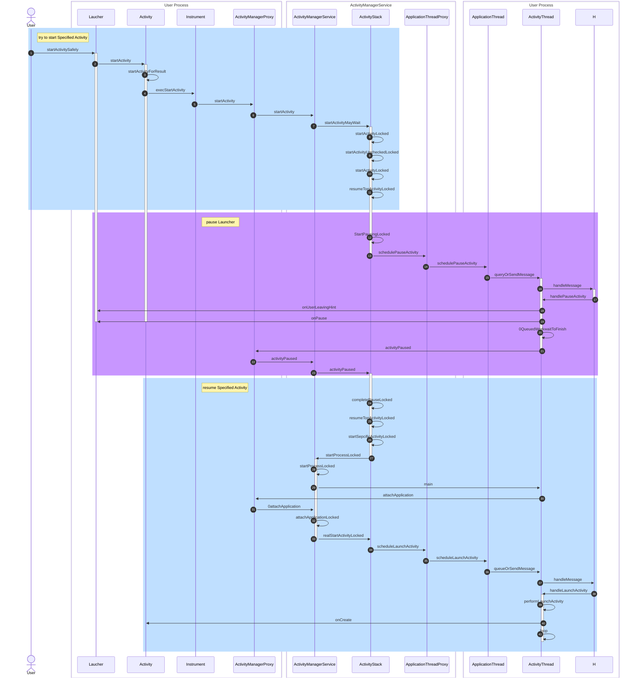

<!-- more -->

## Activity启动流程

```mermaid
sequenceDiagram
    autonumber

    Actor User
    box User Process
    participant Laucher
    participant Activity
    participant Instrument
    participant ActivityManagerProxy
    end
    box ActivityManagerService
    participant ActivityManagerService
    participant ActivityStack
    participant ApplicationThreadProxy
    end
    box User Process
    participant ApplicationThread
    participant ActivityThread
    participant H
    end

    rect rgb(191, 223, 255)
    note right of User: try to start Specified Activity
    User->>+ Laucher: startActivitySafely
    Laucher->>+ Activity: startActivity
    Activity->>Activity: startActivityForResult
    Activity->>+Instrument: execStartActivity
    Instrument->>+ActivityManagerProxy: startActivity
    ActivityManagerProxy->>+ActivityManagerService: startActivity
    ActivityManagerService->>+ActivityStack: startActivityMayWait
    ActivityStack->>ActivityStack: startActivityLocked 
    ActivityStack->>ActivityStack:startActivityUncheckedLocked 
    ActivityStack->>ActivityStack: startActivityLocked 
    ActivityStack->>ActivityStack:  resumeTopActivityLocked
    end
    rect rgb(200, 150, 255)
    note right of Instrument: pause Launcher
    ActivityStack->>ActivityStack:  StartPausingLocked
    ActivityStack->>+ApplicationThreadProxy:  schedulePauseActivity
    deactivate ActivityStack
    ApplicationThreadProxy->>+ApplicationThread: schedulePauseActivity
    ApplicationThread->>+ActivityThread:  queryOrSendMessage
    ActivityThread->>+ H: handleMessage
    H->>-ActivityThread:  handlePauseActivity
    ActivityThread->>Laucher:onUserLeavingHint
    ActivityThread->>Laucher:onPause
    deactivate Laucher
    deactivate Activity
    ActivityThread->>ActivityThread:0QueuedWorkwaitToFinish
    ActivityThread->>-ActivityManagerProxy:activityPaused
    ActivityManagerProxy->>ActivityManagerService:activityPaused
    ActivityManagerService->>+ActivityStack:  activityPaused
    end
    rect rgb(191, 223, 255)
    note right of Instrument: resume Specified Activity
    ActivityStack->>ActivityStack:completePauseLocked
    ActivityStack->>ActivityStack:resumeTopActivityLocked
    ActivityStack->>ActivityStack:startSepcificActivityLocked
    ActivityStack->>+ActivityManagerService:startProcessLocked
    deactivate ActivityStack
    ActivityManagerService->>ActivityManagerService:startProcessLocked
    ActivityManagerService->>+ActivityThread:main
    ActivityThread->>ActivityManagerProxy:attachApplication

    ActivityManagerProxy->>ActivityManagerService:0attachApplication
    ActivityManagerService->>ActivityManagerService:attachApplicationLocked
    ActivityManagerService->>ActivityStack:realStartActivityLocked
    deactivate ActivityManagerService
    ActivityStack->>ApplicationThreadProxy:scheduleLaunchActivity
    ApplicationThreadProxy->>ApplicationThread:scheduleLaunchActivity
    ApplicationThread->>ActivityThread:queueOrSendMessage
    ActivityThread->>H:handleMessage
    H->>+ActivityThread:handleLaunchActivity
    ActivityThread->>ActivityThread:performLaunchActivity
    ActivityThread->>Activity:onCreate

    ActivityThread->>ActivityThread:loop
    deactivate ActivityThread
    end
```