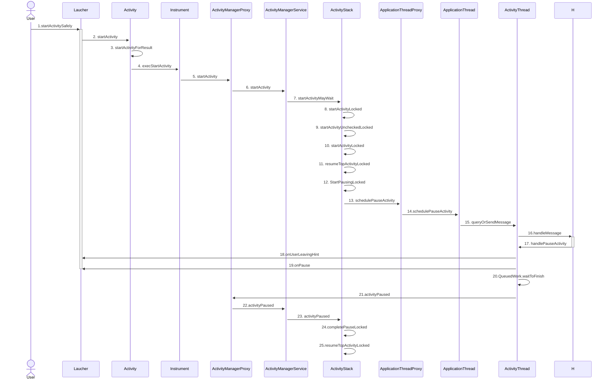

<!-- more -->

## Activity启动流程

```mermaid
sequenceDiagram
    Actor User
    participant Laucher
    participant Activity
    participant Instrument
    participant ActivityManagerProxy
    participant ActivityManagerService
    participant ActivityStack
    participant ApplicationThreadProxy
    participant ApplicationThread
    participant ActivityThread
    participant H


    User->>+ Laucher: 1.startActivitySafely
    Laucher->>+ Activity: 2. startActivity
    Activity->>Activity: 3. startActivityForResult
    Activity->>+Instrument: 4. execStartActivity
    Instrument->>+ActivityManagerProxy: 5. startActivity
    ActivityManagerProxy->>+ActivityManagerService: 6. startActivity
    ActivityManagerService->>+ActivityStack: 7. startActivityMayWait
    ActivityStack->>+ActivityStack: 8. startActivityLocked 
    ActivityStack->>ActivityStack: 9. startActivityUncheckedLocked 
    ActivityStack->>ActivityStack: 10. startActivityLocked 
    ActivityStack->>ActivityStack: 11. resumeTopActivityLocked
    ActivityStack->>ActivityStack: 12. StartPausingLocked
    ActivityStack->>+ApplicationThreadProxy: 13. schedulePauseActivity
    ApplicationThreadProxy->>+ApplicationThread: 14.schedulePauseActivity
    ApplicationThread->>+ActivityThread: 15. queryOrSendMessage
    ActivityThread->>+ H: 16.handleMessage
    H->>-ActivityThread: 17. handlePauseActivity
    ActivityThread->>Laucher:18.onUserLeavingHint
    ActivityThread->>Laucher:19.onPause
    deactivate Laucher
    ActivityThread->>ActivityThread:20.QueuedWork.waitToFinish
    ActivityThread->>ActivityManagerProxy:21.activityPaused
    ActivityManagerProxy->>ActivityManagerService:22.activityPaused
    ActivityManagerService->>ActivityStack: 23. activityPaused
    ActivityStack->>ActivityStack:24.completePauseLocked
    ActivityStack->>ActivityStack:25.resumeTopActivityLocked
```