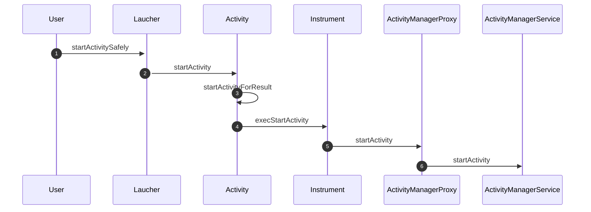
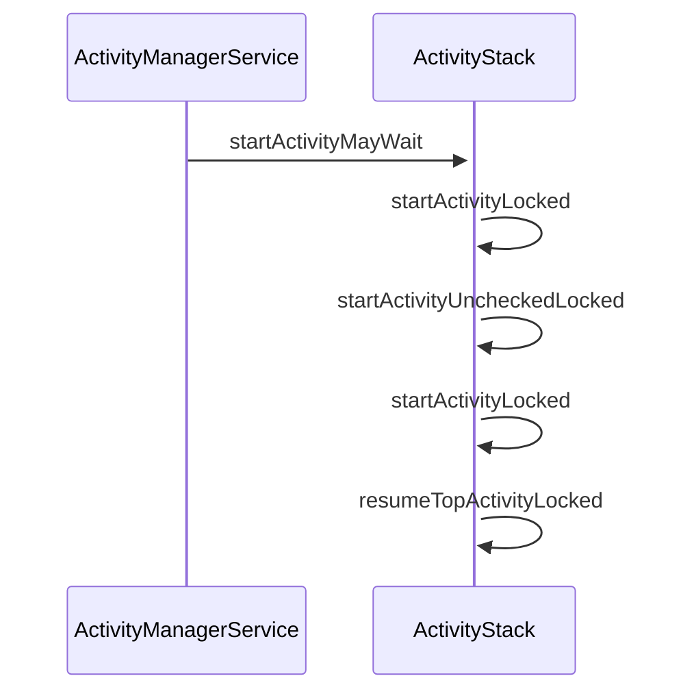
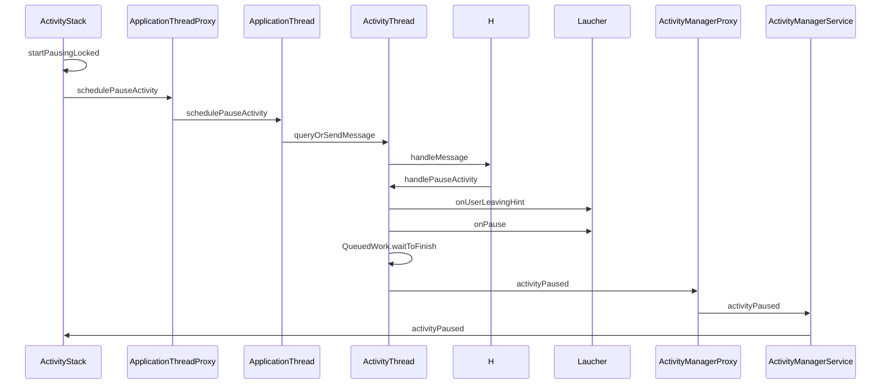
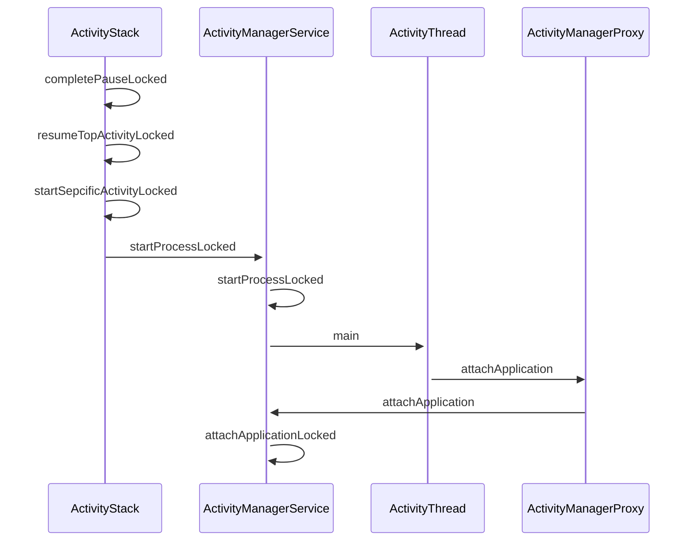
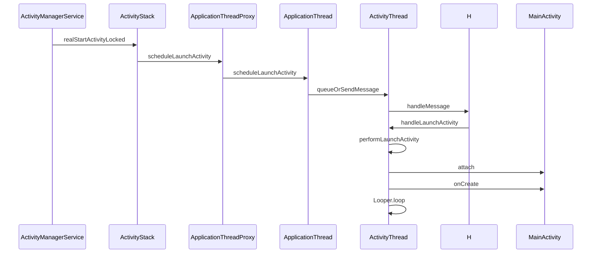
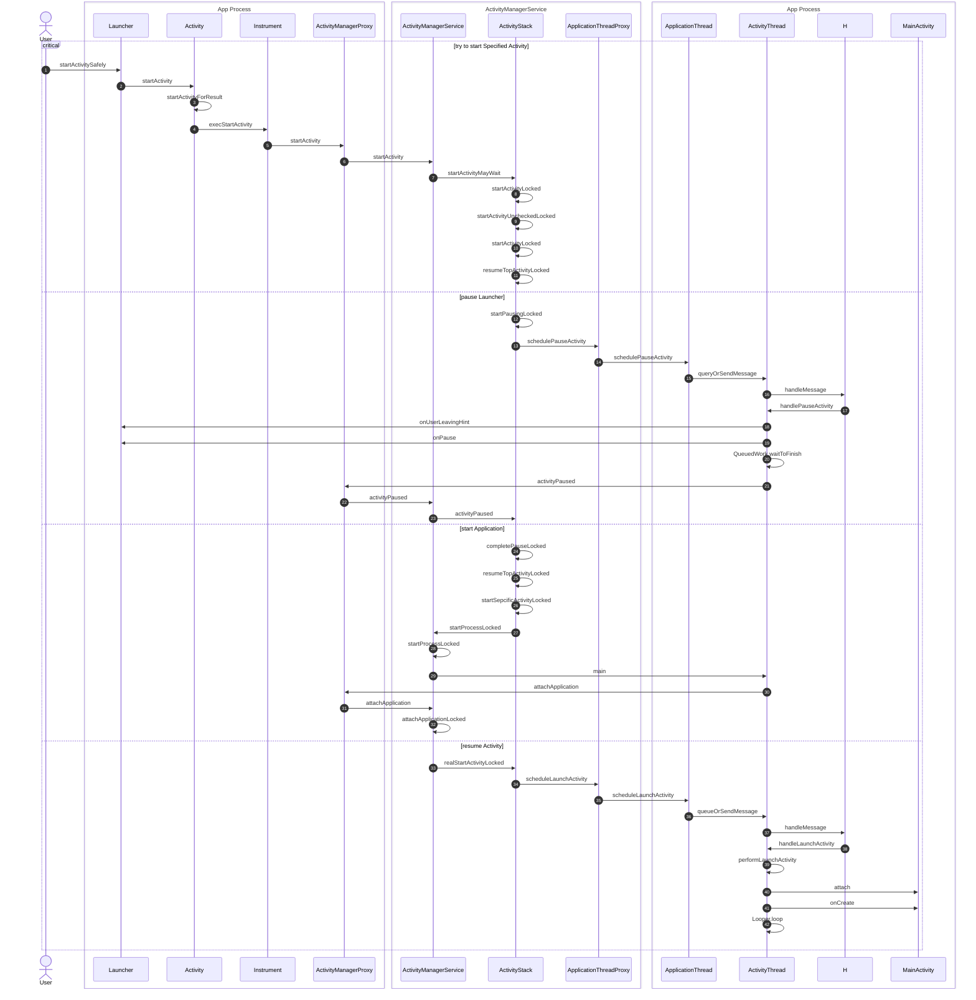
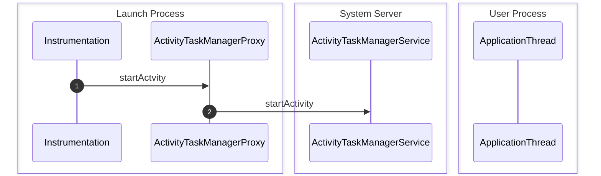

<!-- more -->

## 从Laucher中启动Activity的流程

### 请求启动`Activity`


**step 1** 执行`Laucher`的`startActivitySafely`方法，该方法调用了`Activity`的`startActivity`方法

**step 2** 执行`Activity`的`startActivity`方法：
```java
    public void startActivity(Intent intent, @Nullable Bundle options) {
        ...
        if (options != null) {
            startActivityForResult(intent, -1, options);
        } else {
            startActivityForResult(intent, -1);
        }
    }
```
，该方法调用了`Activity`的`startActivityForResult`方法

**step 3** 执行`startActivityForResult`方法，`Laucher`不存在`mParent`，于是，执行下述语句
```java
    public void startActivityForResult(@RequiresPermission Intent intent, int requestCode,
            @Nullable Bundle options) {
        if (mParent == null) {
            ...
            Instrumentation.ActivityResult ar =
                mInstrumentation.execStartActivity(
                    this, mMainThread.getApplicationThread(), mToken, this,
                    intent, requestCode, options);
            ...
        } else {
            ...
        }
    }
```
，`Activity`的`mInstrumentation`成员为`Instrumentation`类的一个对象，用于和`Activity`交互和监控`Activity`，这里调用了其`execStartActivity`方法

**step 4** 执行`execStartActivity`方法：
```java
    public ActivityResult execStartActivity(
            Context who, IBinder contextThread, IBinder token, Activity target,
            Intent intent, int requestCode, Bundle options) {
        IApplicationThread whoThread = (IApplicationThread) contextThread;
        Uri referrer = target != null ? target.onProvideReferrer() : null;
        ...
        try {
            ...
            int result = ActivityTaskManager.getDefault().startActivity(whoThread,
                    who.getOpPackageName(), who.getAttributionTag(), intent,
                    intent.resolveTypeIfNeeded(who.getContentResolver()), token,
                    target != null ? target.mEmbeddedID : null, requestCode, 0, null, options);
            notifyStartActivityResult(result, options);
            checkStartActivityResult(result, intent);
        } catch (RemoteException e) {
            throw new RuntimeException("Failure from system", e);
        }
        return null;
    }
```
，方法通过`ActivityManager.getService()`方法获取到了`ActivityMangerProxy`的对象，
```java
/**
 * class: ActivityTaskManager
 **/
public static IActivityTaskManager getService() {
        return IActivityTaskManagerSingleton.get();
}
private static final Singleton<IActivityManager> IActivityManagerSingleton =
        new Singleton<IActivityManager>() {
            @Override
            protected IActivityManager create() {
                final IBinder b = ServiceManager.getService(Context.ACTIVITY_SERVICE);
                final IActivityManager am = IActivityManager.Stub.asInterface(b);
                return am;
            }
        };
```
可以看出，返回了一个单例，实现了`IActivityManager`这个接口，用于与`ActivityManagerService`进行交互，并调用`startActivity`方法

**step 5** 执行`startActivity`方法：
```java
      @Override public int startActivity(android.app.IApplicationThread caller, java.lang.String callingPackage, android.content.Intent intent, java.lang.String resolvedType, android.os.IBinder resultTo, java.lang.String resultWho, int requestCode, int flags, android.app.ProfilerInfo profilerInfo, android.os.Bundle options) throws android.os.RemoteException
      {
        android.os.Parcel _data = android.os.Parcel.obtain(asBinder());
        android.os.Parcel _reply = android.os.Parcel.obtain();
        int _result;
        try {
          _data.writeInterfaceToken(DESCRIPTOR);
          _data.writeStrongInterface(caller);
          _data.writeString(callingPackage);
          _data.writeTypedObject(intent, 0);
          _data.writeString(resolvedType);
          _data.writeStrongBinder(resultTo);
          _data.writeString(resultWho);
          _data.writeInt(requestCode);
          _data.writeInt(flags);
          _data.writeTypedObject(profilerInfo, 0);
          _data.writeTypedObject(options, 0);
          boolean _status = mRemote.transact(Stub.TRANSACTION_startActivity, _data, _reply, 0);
          _reply.readException();
          _result = _reply.readInt();
        }
        finally {
          _reply.recycle();
          _data.recycle();
        }
        return _result;
      }
```
，方法包装了一个`Parcel`并通过Binder发送给了`IActivity$Stub`，其code为`Stub.TRANSACTION_startActivity`,`IActivity$Stub`判断code的类型为`Stub.TRANSACTION_startActivity`，并执行：
```java
public boolean onTransact(){
    ...
    switch (code)
      {
        ...
        case TRANSACTION_startActivity:
        {
          android.app.IApplicationThread _arg0;
          _arg0 = android.app.IApplicationThread.Stub.asInterface(data.readStrongBinder());
          java.lang.String _arg1;
          _arg1 = data.readString();
          android.content.Intent _arg2;
          _arg2 = data.readTypedObject(android.content.Intent.CREATOR);
          java.lang.String _arg3;
          _arg3 = data.readString();
          android.os.IBinder _arg4;
          _arg4 = data.readStrongBinder();
          java.lang.String _arg5;
          _arg5 = data.readString();
          int _arg6;
          _arg6 = data.readInt();
          int _arg7;
          _arg7 = data.readInt();
          android.app.ProfilerInfo _arg8;
          _arg8 = data.readTypedObject(android.app.ProfilerInfo.CREATOR);
          android.os.Bundle _arg9;
          _arg9 = data.readTypedObject(android.os.Bundle.CREATOR);
          data.enforceNoDataAvail();
          int _result = this.startActivity(_arg0, _arg1, _arg2, _arg3, _arg4, _arg5, _arg6, _arg7, _arg8, _arg9);
          reply.writeNoException();
          reply.writeInt(_result);
          break;
        }
        ...
      }
    ...
}
```
，方法调用了`Stub`的`startActivity`方法，该方法由`ActivityManagerService`重写`ActivityManagerNative`实现
```java
public final class ActivityManagerService extends ActivityManagerNative
```

### `ActivityManagerService`执行启动程序


**step 6** 调用`ActivityManagerService`的`startActivity`方法：
```java
public final int startActivity(IApplicationThread caller,
        Intent intent, String resolvedType, Uri[] grantedUriPermissions,
        int grantedMode, IBinder resultTo,
        String resultWho, int requestCode, boolean onlyIfNeeded,
        boolean debug) {
    return mMainStack.startActivityMayWait(caller, intent, resolvedType,
            grantedUriPermissions, grantedMode, resultTo, resultWho,
            requestCode, onlyIfNeeded, debug, null, null);
}
```
，方法调用了`mMainStack`的`startActivityMayWait`方法。`mMainStack`是`ActivityStack`的实例，负责管理应用程序的`Activity`和任务栈

**step 7** 执行`ActivityStack.startActivityMayWait`方法:
```java
final int startActivityMayWait(IApplicationThread caller,
        Intent intent, String resolvedType, Uri[] grantedUriPermissions,
        int grantedMode, IBinder resultTo,
        String resultWho, int requestCode, boolean onlyIfNeeded,
        boolean debug, WaitResult outResult, Configuration config) {
    // Refuse possible leaked file descriptors
    ...
    // Collect information about the target of the Intent.
    ...
    synchronized (mService) {
        ... 
        int res = startActivityLocked(caller, intent, resolvedType,
                grantedUriPermissions, grantedMode, aInfo,
                resultTo, resultWho, requestCode, callingPid, callingUid,
                onlyIfNeeded, componentSpecified);
        ...
    }
}
```
，调用了`startActivityLocked`方法

**step 8** 执行`startActivityLocked`方法：
```java
    final int startActivityLocked(IApplicationThread caller,
            Intent intent, String resolvedType,
            Uri[] grantedUriPermissions,
            int grantedMode, ActivityInfo aInfo, IBinder resultTo,
            String resultWho, int requestCode,
            int callingPid, int callingUid, boolean onlyIfNeeded,
            boolean componentSpecified) {
        int err = START_SUCCESS;
        ProcessRecord callerApp = null;
        ...
        ActivityRecord sourceRecord = null;
        ActivityRecord resultRecord = null;
        ...      
        ActivityRecord r = new ActivityRecord(mService, this, callerApp, callingUid,
                intent, resolvedType, aInfo, mService.mConfiguration,
                resultRecord, resultWho, requestCode, componentSpecified);
        ...
        return startActivityUncheckedLocked(r, sourceRecord,
                grantedUriPermissions, grantedMode, onlyIfNeeded, true);
    }
  
```
方法给要创建的`Activity`创建了一个`ActivityRecord`，并设置其`sourceRecord`为`Launcher`，以此调用`startActivityUncheckedLocked`方法

**step 9** 执行`startActivityUnchekedLocked`方法：

```java
final int startActivityUncheckedLocked(ActivityRecord r,
        ActivityRecord sourceRecord, Uri[] grantedUriPermissions,
        int grantedMode, boolean onlyIfNeeded, boolean doResume) {
    ...
    boolean addingToTask = false;
    ...
    boolean newTask = false;
    if (r.resultTo == null && !addingToTask
            && (launchFlags&Intent.FLAG_ACTIVITY_NEW_TASK) != 0) {
        mService.mCurTask++;
        if (mService.mCurTask <= 0) {
            mService.mCurTask = 1;
        }
        ...
        newTask = true;
        if (mMainStack) {
            mService.addRecentTaskLocked(r.task);
        }
        
    } 
    ...
    startActivityLocked(r, newTask, doResume);
    return START_SUCCESS;
}
```
对于要启动的`Activity`而言，`newTask == true`，然后调用重载的`startActivityLocked`方法

**step 10** 执行`startActivityLocked`方法：
```java
    private final void startActivityLocked(ActivityRecord r, boolean newTask,
            boolean doResume) {
        final int NH = mHistory.size();
        int addPos = -1;
        ...
        if (addPos < 0) {
            addPos = NH;
        }
        ...
        mHistory.add(addPos, r);
        ...
        if (doResume) {
            resumeTopActivityLocked(null);
        }
    }
```
，由于启动新`Activity`且`newTask == true`，于是将其`ActivityRecord`插入到栈的顶部，并执行`resumeTopActivityLocked`方法

**step 11** 执行`resumeTopActivityLocked`方法：
```java
final boolean resumeTopActivityLocked(ActivityRecord prev) {
    ...
    final boolean userLeaving = mUserLeaving;
    mUserLeaving = false;
    ...
    // If the top activity is the resumed one, nothing to do.
    if (mResumedActivity == next && next.state == ActivityState.RESUMED) {
        ...
        return false;
    }
    // If we are sleeping, and there is no resumed activity, and the top
    // activity is paused, well that is the state we want.
    if ((mService.mSleeping || mService.mShuttingDown)
            && mLastPausedActivity == next && next.state == ActivityState.PAUSED) {
        ...
        return false;
    }
    ...
    // If we are currently pausing an activity, then don't do anything
    // until that is done.
    if (mPausingActivity != null) {
        ...
        return false;
    }
    
    // We need to start pausing the current activity so the top one
    // can be resumed...
    if (mResumedActivity != null) {
        startPausingLocked(userLeaving, false);
        return true;
    }
    ...
}
```
，在方法中，判断当前的`Activity`是否resumed、是否正在休眠、是否正在停止一个`Activity`，如果都不是，则调用`startPausingLocked`方法停止正在运行的进程

### 暂停当前的Top Activity



**step 12** 执行`startPausingLocked`方法：
```java
private final void startPausingLocked(boolean userLeaving, boolean uiSleeping) {
    ActivityRecord prev = mResumedActivity;
    ...
    mResumedActivity = null;
    mPausingActivity = prev;
    ...
    mLastPausedActivity = prev;
    if (prev.app != null && prev.app.thread != null) {
        try {
            ...
            prev.app.thread.schedulePauseActivity(prev, prev.finishing, userLeaving,
                    prev.configChangeFlags);
            ...

        } catch (Exception e) {
            ...
        }
    } 
    ...
}
```
，调用了`prev.app.thread.schedulePauseActivity`方法，`prev.app.thead`为一个`ApplicationThread$ApplicationThreadProxy`类型的对象

**step 13** 执行`schedulePauseActivity`方法：
```java
public final void schedulePauseActivity(IBinder token, boolean finished,
        boolean userLeaving, int configChanges) throws RemoteException {
    Parcel data = Parcel.obtain();
    data.writeInterfaceToken(IApplicationThread.descriptor);
    data.writeStrongBinder(token);
    data.writeInt(finished ? 1 : 0);
    data.writeInt(userLeaving ? 1 :0);
    data.writeInt(configChanges);
    mRemote.transact(SCHEDULE_PAUSE_ACTIVITY_TRANSACTION, data, null,
            IBinder.FLAG_ONEWAY);
    data.recycle();
}
```
，方法向远程服务发送了一个`SCHEDULE_PAUSE_ACTIVITY_TRANSACTION`的code，远程服务为`ApplicationThreadNative`类型的`Stub`，并实现了`IApplicationThread`接口：
```java
public abstract class ApplicationThreadNative extends Binder implements IApplicationThread 
```
，当`Stub`接受到了请求后，执行`onTransact`方法：
```java
public boolean onTransact(int code, Parcel data, Parcel reply, int flags)
        throws RemoteException {
    switch (code) {
        case SCHEDULE_PAUSE_ACTIVITY_TRANSACTION:
        {
            data.enforceInterface(IApplicationThread.descriptor);
            IBinder b = data.readStrongBinder();
            boolean finished = data.readInt() != 0;
            boolean userLeaving = data.readInt() != 0;
            int configChanges = data.readInt();
            schedulePauseActivity(b, finished, userLeaving, configChanges);
            return true;
        }
    }
}
```
，调用了`schedulePauseActivity`方法

**step 14** 执行`schedulePauseActivity`方法：
```java
public final void schedulePauseActivity(IBinder token, boolean finished,
        boolean userLeaving, int configChanges) {
    queueOrSendMessage(
            finished ? H.PAUSE_ACTIVITY_FINISHING : H.PAUSE_ACTIVITY,
            token,
            (userLeaving ? 1 : 0),
            configChanges);
}
```
，该方法由`ActivityThread$ApplicationThread`中实现，调用`queueOrSendMessage`方法发送`PAUSE_ACTIVITY`的请求

**step 15** 执行`queueOrSendMessage`方法：
```java
...
final H mH = new H();
...
private final void queueOrSendMessage(int what, Object obj, int arg1, int arg2) {
    synchronized (this) {
        if (DEBUG_MESSAGES) Slog.v(
            TAG, "SCHEDULE " + what + " " + mH.codeToString(what)
            + ": " + arg1 + " / " + obj);
        Message msg = Message.obtain();
        msg.what = what;
        msg.obj = obj;
        msg.arg1 = arg1;
        msg.arg2 = arg2;
        mH.sendMessage(msg);
    }
}
```
，向Handler发送了一条`PAUSE_ACTIVITY`的消息

**step 16** `mH`接收到消息后执行`handleMessage`方法:
```java
public void handleMessage(Message msg) {
    ...
    switch (msg.what) {
        case PAUSE_ACTIVITY:
            handlePauseActivity((IBinder)msg.obj, false, msg.arg1 != 0, msg.arg2);
            maybeSnapshot();
            break;
        ...
    }
    ...
}
```
，调用了`ActivityThread`的`handlePauseActivity`方法，`Activity$H`继承了`Handler`类：
```java
private final class H extends Handler
```

**step 17** 执行`handlePauseActivity`方法：
```java
private final void handlePauseActivity(IBinder token, boolean finished,
        boolean userLeaving, int configChanges) {
    ActivityClientRecord r = mActivities.get(token);
    if (r != null) {
        if (userLeaving) {
            performUserLeavingActivity(r);
        }
        Bundle state = performPauseActivity(token, finished, true);
        QueuedWork.waitToFinish();
        
        // Tell the activity manager we have paused.
        try {
            ActivityManagerNative.getDefault().activityPaused(token, state);
        } catch (RemoteException ex) {
        }
    }
}
```
，首先，调用`performUserLeavingActivity`方法，向`Launcher`发送userLeaving

**step 18** 执行`performUserLeavingActivity`方法：
```java
final void performUserLeavingActivity(ActivityClientRecord r) {
    mInstrumentation.callActivityOnUserLeaving(r.activity);
}
```
，方法通过`Instrumentation`向`Laucher`发送userLeaving，执行：
```java
/**
 * class: Instrumentation
 **/
public void callActivityOnUserLeaving(Activity activity) {
    activity.performUserLeaving();
}
```

**step 19** 执行完`performUserLeavingActivity`后，执行`performPauseActivity`方法：
```java
final Bundle performPauseActivity(IBinder token, boolean finished,
        boolean saveState) {
    ActivityClientRecord r = mActivities.get(token);
    return r != null ? performPauseActivity(r, finished, saveState) : null;
}
final Bundle performPauseActivity(ActivityClientRecord r, boolean finished,
        boolean saveState) {
    ...
    try {
        ...
        r.activity.mCalled = false;
        mInstrumentation.callActivityOnPause(r.activity);
        ...
    }
    ...
    r.paused = true;
    return state;
}
```
，该方法设置`Launcher`的`r.mCalled = false`，并调用了`Instrumentation.callActivityOnPause`方法，然后设置`r.paused = true`
```java
public void callActivityOnPause(Activity activity) {
    activity.performPause();
}
```

**step 20** 执行`QueuedWork.waitToFinish`方法：
```java
/**
 * Is called from the Activity base class's onPause(), after
 * BroadcastReceiver's onReceive, after Service command handling,
 **/
public static void waitToFinish() {
    Runnable toFinish;
    while ((toFinish = sPendingWorkFinishers.poll()) != null) {
        toFinish.run();
    }
}
```
，等待前面的任务完成执行

**step 21** 在 **step 17**中，通过`ActivityManagerNative.getDefault()`获取到了`ActivityManagerProxy`对象，并调用其`activityPaused`方法向`ActivityManagerService`通知top `Activity`已经被pause了：
```java
public void activityPaused(IBinder token, Bundle state) throws RemoteException
{
    Parcel data = Parcel.obtain();
    Parcel reply = Parcel.obtain();
    data.writeInterfaceToken(IActivityManager.descriptor);
    data.writeStrongBinder(token);
    data.writeBundle(state);
    mRemote.transact(ACTIVITY_PAUSED_TRANSACTION, data, reply, 0);
    reply.readException();
    data.recycle();
    reply.recycle();
}
```
，方法发送一个code为`ACTIVITY_PAUSED_TRANSACTION`的`Parcel`

**step 22** 收到通信后，`ActivityManagerService`通过:
```java
public boolean onTransact(){
    ...
    switch (code)
    {
        case ACTIVITY_PAUSED_TRANSACTION: {
            data.enforceInterface(IActivityManager.descriptor);
            IBinder token = data.readStrongBinder();
            Bundle map = data.readBundle();
            activityPaused(token, map);
            reply.writeNoException();
            return true;
        }
    }
    ...
}
```
调用`activityPaused`方法：
```java
public final void activityPaused(IBinder token, Bundle icicle) {
    ...
    mMainStack.activityPaused(token, icicle, false);
    ...
}
```
,方法调用`ActivityStack`的`activityPaused`方法

**step 23** 执行`ActivityStack.activityPaused`方法：
```java
final void activityPaused(IBinder token, Bundle icicle, boolean timeout) {
    ...
    ActivityRecord r = null;
    synchronized (mService) {
        int index = indexOfTokenLocked(token);
        if (index >= 0) {
            r = (ActivityRecord)mHistory.get(index);
            ...
            mHandler.removeMessages(PAUSE_TIMEOUT_MSG, r);
            if (mPausingActivity == r) {
                r.state = ActivityState.PAUSED;
                completePauseLocked();
            }
            ...
        }
    }
}
```
，找到`Laucher`对应的`ActivityRecord`，在**step 12**中，语句`mPausingActivity = prev`设置了`mPausingActivity`为`Launcher`，于是，设置`Launcher`的`ActivityRecord.state`为`PAUSED`，并调用`completePauseLocked`方法

**step 24** 执行`completePauseLocked`方法：
```java
private final void completePauseLocked() {
    ActivityRecord prev = mPausingActivity;
    if (prev != null) {
        ...
        mPausingActivity = null;
    }
    if (!mService.mSleeping && !mService.mShuttingDown) {
        resumeTopActivityLocked(prev);
    } 
    ...
    
}
```
，将`mPausingActivity`设置为`null`并再次调用`resumeTopActivityLocked`方法

### pause成功后为新`Activity`启动进程


**step 25** 执行`resumeTopActivityLocked`方法：
```java
final boolean resumeTopActivityLocked(ActivityRecord prev) {
        ...
        if (next.app != null && next.app.thread != null){
            ...
        }
        else {
            ...
            startSpecificActivityLocked(next, true, true);
        }
        return true;
}
```
，此时，`mResumedActivity == null`， 于是调用`startSpecificActivityLocked`方法

**step 26** 执行`startSpecificActivityLocked`方法：
```java
private final void startSpecificActivityLocked(ActivityRecord r,
        boolean andResume, boolean checkConfig) {
    ProcessRecord app = mService.getProcessRecordLocked(r.processName,
            r.info.applicationInfo.uid);
    ...
    if (app != null && app.thread != null) {
        ...
    }
    mService.startProcessLocked(r.processName, r.info.applicationInfo, true, 0,
            "activity", r.intent.getComponent(), false);
}
```
，此时，由于`app == null && app.thread == null`，于是继续执行`mService.startProcessLocked`方法，其中`mService`指向`ActivityManagerService`

**step 27** `ActivityManagerService`执行`startProcessLocked`方法：
```java
final ProcessRecord startProcessLocked(String processName,
        ApplicationInfo info, boolean knownToBeDead, int intentFlags,
        String hostingType, ComponentName hostingName, boolean allowWhileBooting) {
    ProcessRecord app = getProcessRecordLocked(processName, info.uid);
    ...
    
    if (app == null) {
        app = newProcessRecordLocked(null, info, processName);
        mProcessNames.put(processName, info.uid, app);
    } 
    ...
    startProcessLocked(app, hostingType, hostingNameStr);
    return (app.pid != 0) ? app : null;
}
```
，创建一个`ProcessRecord`，并调用`startProcessLocked`方法运行该`Process`

**step 28**
```java
private final void startProcessLocked(ProcessRecord app,
        String hostingType, String hostingNameStr) {
    ...
    try {
        ...
        int pid = Process.start("android.app.ActivityThread",
                mSimpleProcessManagement ? app.processName : null, uid, uid,
                gids, debugFlags, null);
        ...
    } 
    ...
}
```
，查看`Process.start`方法：
```java
    public static final int start(final String processClass,
                                  final String niceName,
                                  int uid, int gid, int[] gids,
                                  int debugFlags,
                                  String[] zygoteArgs)
    {
        ...
        else {
            ...
            Runnable runnable = new Runnable() {
                        public void run() {
                            Process.invokeStaticMain(processClass);
                        }
            };
            
            if (niceName != null) {
                new Thread(runnable, niceName).start();
            } else {
                new Thread(runnable).start();
            }
            return 0;
        }
    }
```
，可以看到，其创建了一个线程，并运行`invokeStaticMain`方法：

```java
private static void invokeStaticMain(String className) {
    Class cl;
    Object args[] = new Object[1];
    args[0] = new String[0];     //this is argv

    try {
        cl = Class.forName(className);
        cl.getMethod("main", new Class[] { String[].class })
                .invoke(null, args);            
    } 
    ...
}
```
，由于之前传入的`processClass`为`"android.app.ActivityThread"`，于是在此通过反射调用其静态`main`方法

**step 29** 执行`main`方法：
```java
public static final void main(String[] args) {
    ...
    ActivityThread thread = new ActivityThread();
    thread.attach(false);
    ...
    Looper.loop();
    ...
}
```
，可以看到，创建了一个`ActivityThread`的实例，并调用了`attach`方法：
```java
    private final void attach(boolean system) {
        sThreadLocal.set(this);
        mSystemThread = system;
        if (!system) {
            ...
            IActivityManager mgr = ActivityManagerNative.getDefault();
            try {
                mgr.attachApplication(mAppThread);
            } catch (RemoteException ex) {
                ...
            }
        }      
        ...
    }
```
，方法调用了`ActivityManagerProxy`的`attachApplication`方法，其中`final ApplicationThread mAppThread = new ApplicationThread()`在创建`ActivityThread`时创建

**step 30** 执行`attachApplication`方法，向`ActivityManagerService`发送`ATTACH_APPLICATION_TRANSACTION`请求：
```java
public void attachApplication(IApplicationThread app) throws RemoteException
{
    Parcel data = Parcel.obtain();
    Parcel reply = Parcel.obtain();
    data.writeInterfaceToken(IActivityManager.descriptor);
    data.writeStrongBinder(app.asBinder());
    mRemote.transact(ATTACH_APPLICATION_TRANSACTION, data, reply, 0);
    reply.readException();
    data.recycle();
    reply.recycle();
}
```

**step 31** `ActivityManagerService`执行`onTransact`方法：
```java
public boolean onTransact(int code, Parcel data, Parcel reply, int flags)
        throws RemoteException {
    switch (code) {
        ...
        case ATTACH_APPLICATION_TRANSACTION: {
            data.enforceInterface(IActivityManager.descriptor);
            IApplicationThread app = ApplicationThreadNative.asInterface(
                    data.readStrongBinder());
            if (app != null) {
                attachApplication(app);
            }
            reply.writeNoException();
            return true;
        }
        ...
    }
    ...
}
```
，调用`attachApplication`方法：
```java
public final void attachApplication(IApplicationThread thread) {
    synchronized (this) {
        int callingPid = Binder.getCallingPid();
        ...
        attachApplicationLocked(thread, callingPid);
        ...
    }
}
```
，调用`attachApplicationLocked`方法

**step 32** 执行`attachApplicationLocked`方法：
```java
private final boolean attachApplicationLocked(IApplicationThread thread,
        int pid) {
    // Find the application record that is being attached
    ProcessRecord app;
    ...
    app.thread = thread;
    ...
    mHandler.removeMessages(PROC_START_TIMEOUT_MSG, app);
    ...
    ActivityRecord hr = mMainStack.topRunningActivityLocked(null);
    if (hr != null && normalMode) {
        if (hr.app == null && app.info.uid == hr.info.applicationInfo.uid
                && processName.equals(hr.processName)) {
            try {
                if (mMainStack.realStartActivityLocked(hr, app, true, true)) {
                    didSomething = true;
                }
            } catch (Exception e) {
                ...
            }
        } else {
            ...
        }
    }
}
```
，从`Handler`中移除`PROC_START_TIMEOUT_MSG`，并检查是否有`Activity`需要启动，于是调用`ActivityStack.realStartActivityLocked`方法

### 启动`Activity`


**step 33** 执行`realStartActivityLocked`方法：
```java
final boolean realStartActivityLocked(ActivityRecord r,
        ProcessRecord app, boolean andResume, boolean checkConfig)
        throws RemoteException {
    ...
    try {
        ...
        app.thread.scheduleLaunchActivity(new Intent(r.intent), r,
                System.identityHashCode(r),
                r.info, r.icicle, results, newIntents, !andResume,
                mService.isNextTransitionForward());
    }
    ...
    return true;
}
```
，调用了`ApplicationThreadProxy`的`scheduleLaunchActivity`方法

**step 34** 执行`scheduleLaunchActivity`方法：
```java
public final void scheduleLaunchActivity(Intent intent, IBinder token, int ident,
        ActivityInfo info, Bundle state, List<ResultInfo> pendingResults,
        List<Intent> pendingNewIntents, boolean notResumed, boolean isForward)
        throws RemoteException {
    Parcel data = Parcel.obtain();
    data.writeInterfaceToken(IApplicationThread.descriptor);
    intent.writeToParcel(data, 0);
    data.writeStrongBinder(token);
    data.writeInt(ident);
    info.writeToParcel(data, 0);
    data.writeBundle(state);
    data.writeTypedList(pendingResults);
    data.writeTypedList(pendingNewIntents);
    data.writeInt(notResumed ? 1 : 0);
    data.writeInt(isForward ? 1 : 0);
    mRemote.transact(SCHEDULE_LAUNCH_ACTIVITY_TRANSACTION, data, null,
            IBinder.FLAG_ONEWAY);
    data.recycle();
}
```
，向`ApplicationThread`发送一个`SCHEDULE_LAUNCH_ACTIVITY_TRANSACTION`类型的请求

**step 35** `ApplicationThread`执行`onTransact`方法：
```java
public boolean onTransact(int code, Parcel data, Parcel reply, int flags)
        throws RemoteException {
    switch(code){
        case SCHEDULE_LAUNCH_ACTIVITY_TRANSACTION:
        {
            data.enforceInterface(IApplicationThread.descriptor);
            Intent intent = Intent.CREATOR.createFromParcel(data);
            IBinder b = data.readStrongBinder();
            int ident = data.readInt();
            ActivityInfo info = ActivityInfo.CREATOR.createFromParcel(data);
            Bundle state = data.readBundle();
            List<ResultInfo> ri = data.createTypedArrayList(ResultInfo.CREATOR);
            List<Intent> pi = data.createTypedArrayList(Intent.CREATOR);
            boolean notResumed = data.readInt() != 0;
            boolean isForward = data.readInt() != 0;
            scheduleLaunchActivity(intent, b, ident, info, state, ri, pi,
                    notResumed, isForward);
            return true;
        }
    }
}
```
，调用`scheduleLaunchActivity`方法:
```java
public final void scheduleLaunchActivity(Intent intent, IBinder token, int ident,
        ActivityInfo info, Bundle state, List<ResultInfo> pendingResults,
        List<Intent> pendingNewIntents, boolean notResumed, boolean isForward) {
    ActivityClientRecord r = new ActivityClientRecord();
    r.token = token;
    r.ident = ident;
    r.intent = intent;
    r.activityInfo = info;
    r.state = state;
    r.pendingResults = pendingResults;
    r.pendingIntents = pendingNewIntents;
    r.startsNotResumed = notResumed;
    r.isForward = isForward;
    queueOrSendMessage(H.LAUNCH_ACTIVITY, r);
}
```
，创建一个`ActivityClientRecord`，并调用`queueOrSendMessage`方法，向Handler发送`LAUNCH_ACTIVITY`信息

**step 36** 执行`queueOrSendMessage`方法，向`ActivityThread`发送`LAUNCH_ACTIVITY`类型的信息

**step 37** 执行`queueOrSendMessage`方法，向`mH`发送`LAUNCH_ACTIVITY`类型的信息

**step 38** `mH`接受到消息后，通过`handleMessage`执行代码：
```java
public void handleMessage(Message msg) {
    if (DEBUG_MESSAGES) Slog.v(TAG, ">>> handling: " + msg.what);
    switch (msg.what) {
        case LAUNCH_ACTIVITY: {
            ActivityClientRecord r = (ActivityClientRecord)msg.obj;
            r.packageInfo = getPackageInfoNoCheck(
                    r.activityInfo.applicationInfo);
            handleLaunchActivity(r, null);
        } break;
    }
}
```
，调用`ActivityThread.handleLaunchActivity`方法： 
```java
private final void handleLaunchActivity(ActivityClientRecord r, Intent customIntent) {
    ...
    Activity a = performLaunchActivity(r, customIntent);
    if (a != null) {
        ...
        handleResumeActivity(r.token, false, r.isForward);
        ...
    } else {
        ...
    }
}
```
，方法首先调用了`performLaunchActivity`方法

**step 39** 执行`performLaunchActivity`方法：
```java
private final Activity performLaunchActivity(ActivityClientRecord r, Intent customIntent) {
    ...
    Activity activity = null;
    try {
        java.lang.ClassLoader cl = r.packageInfo.getClassLoader();
        activity = mInstrumentation.newActivity(
                cl, component.getClassName(), r.intent);
        r.intent.setExtrasClassLoader(cl);
        if (r.state != null) {
            r.state.setClassLoader(cl);
        }
    } catch (Exception e) {
        ...
    }
    try {
        Application app = r.packageInfo.makeApplication(false, mInstrumentation);
        ...
        if (activity != null) {
            ...
            activity.attach(appContext, this, getInstrumentation(), r.token,
                    r.ident, app, r.intent, r.activityInfo, title, r.parent,
                    r.embeddedID, r.lastNonConfigurationInstance,
                    r.lastNonConfigurationChildInstances, config);
            ...
            mInstrumentation.callActivityOnCreate(activity, r.state);
            ...
            r.activity = activity;
            r.stopped = true;
            if (!r.activity.mFinished) {
                activity.performStart();
                r.stopped = false;
            }
            ...
        }
        r.paused = true;
        mActivities.put(r.token, r);
    } 
    ...
    return activity;
}
```
，首先，通过反射创建了一个`Activity`的实例，调用其`attach`到`application`中

**step 40** 执行`attach`方法：
```java
final void attach(Context context, ActivityThread aThread, Instrumentation instr, IBinder token,
        Application application, Intent intent, ActivityInfo info, CharSequence title, 
        Activity parent, String id, Object lastNonConfigurationInstance,
        Configuration config) {
    attach(context, aThread, instr, token, 0, application, intent, info, title, parent, id,
        lastNonConfigurationInstance, null, config);
}

final void attach(Context context, ActivityThread aThread,
        Instrumentation instr, IBinder token, int ident,
        Application application, Intent intent, ActivityInfo info,
        CharSequence title, Activity parent, String id,
        Object lastNonConfigurationInstance,
        HashMap<String,Object> lastNonConfigurationChildInstances,
        Configuration config) {
    attachBaseContext(context);
    //activity信息设置
    ...
}
```

**step 41** 完成`attach`后，通过调用`Instrumentation.callActivityOnCreate`方法：

```java
public void callActivityOnCreate(Activity activity, Bundle icicle) {
    ...
    activity.onCreate(icicle);
    ...
}
```
，调用了`Activity`的`onCreate`方法，至此，完成了Activity的启动

**step 42** 在**step 29**中，执行了`main`方法中的`attach`方法，在`attach`执行完后，执行` Looper.loop()`

### 总结
当从一个进程中（比如` Launcher` ）运行在另一个进程中的`Activity`时，包含以下步骤：
1.  `Launcher `所在进程会通过其所有的` ActivityManagerProxy`对象，向` ActivityManagerService`发起` startActivity`请求
2. ` AcvivityManagerService`接受到该请求后，就会去执行启动` Activity`所需要的动作，创建相应的` Activity`并置于` ActivityStack`的顶端并执行启动` Activity`的后续动作，发现有已经` resumed`的` Activity`，于是向该` Acitivity`即` Launcher`发送pause请求
3. ` Launcher`所在的进程接收到该请求后就执行pause ` Launcher`的动作，并通知` ActivityManagerService`
4. ` ActivityManagerService`接收到该通知后，发现有需要resume 的` Activity`，于是去启动该` Activity`，但是发现其所在的进程没有启动，创建一个进程并调用其` main`方法启动进程
5.  进程启动后，` ActivityManagerService`向该进程发起请求，请求启动相应的`Activity`
6. 进程接收到请求后，启动`Activity`并调用其`onCreate`方法，至此，`Activity`启动成功     




## 从Activity中启动同一进程中的另一Activity

基本与从Laucher中启动Activity的流程相同， 不同的是：
1. 在 **step 9** 中，由于Activity指定的进程为存在，于是
`newTask == false`并设置`r.task = sourceRecord.task`
2. 在 **step 10** 中，在`Activity Stack`中从上至下搜索一个与当前Activity同进程的Activity的位置`i`，并设置插入位置`addPos=i+1`
3. 在 **step 26** 中，由于Activity所在的进程已经启动，于是`app != null && app.thread != null`的结果为`true`，于是执行该选择语句下的`realStartActivityLocked`

## 从Activity中启动另一进程中的另一Activity

与从Laucher中启动Activity的过程一致

## Activity热启动


## 新版本中Activity启动流程的变化

在新版本中`ActivityManagerService`和`Activity`的部分功能都由`ActivityTaskManagerService`代替

### 变更后的部分流程图


**step 1** Instrument 调用ActivityTaskManagerProxy的`startActivity`方法，可以看到：
```java
public static IActivityTaskManager getService() {
        return IActivityTaskManagerSingleton.get();
}
private static final Singleton<IActivityTaskManager> IActivityTaskManagerSingleton =
        new Singleton<IActivityTaskManager>() {
            @Override
            protected IActivityTaskManager create() {
                final IBinder b = ServiceManager.getService(Context.ACTIVITY_TASK_SERVICE);
                return IActivityTaskManager.Stub.asInterface(b);
        }
};
```
通过`getService`方法，获取到了`ActivityTaskManagerProxy`的单例，并调用其`startActivity`方法向`ActivityTaskManagerService`发送启动`Activity`的请求

**step 2** 执行`ActivityTaskManagerProxy`的`startActivity`方法：
```java
    int startActivity(in IApplicationThread caller, in String callingPackage, in Intent intent,
            in String resolvedType, in IBinder resultTo, in String resultWho, int requestCode,
            int flags, in ProfilerInfo profilerInfo, in Bundle options);
    ... 
```
，在新版本中，`ActivityTaskManagerProxy`的服务由`AIDL`编写，系统自动生成了`IActivityManagerService`、`IActivityManagerService$Stub`和`IActivityManagerService$Stub$Proxy`

**step 3** 