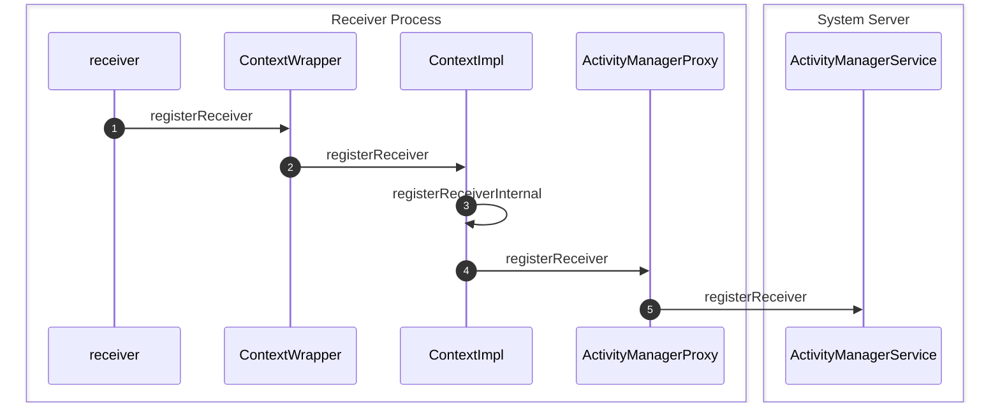

<!-- more -->

## Android的广播机制

Anroid提供了一种消息广播机制，用于向关心相应事件的组件发送通知，通过`ActivityMangerService`，`Activity`和`Service`都可以将`BroadcastReceiver`注册到`ActivityMangerService`中，并监听自己想要的事件，同时提供了静态注册、动态注册和广播优先级等机制


### 注册`BroadcastReceiver`


**step 1** 想要监听某种消息的receiver调用其父类`ContextWrapper`的`registerReceiver`方法：
```java
public Intent registerReceiver(@Nullable BroadcastReceiver receiver, IntentFilter filter) {
    return mBase.registerReceiver(receiver, filter);
}
```
，`mBase`是一个`ContextImpl`类型的对象

**step 2** 执行`ContextImpl`的`registerService`方法：
```java
public Intent registerReceiver(BroadcastReceiver receiver, IntentFilter filter) {
    return registerReceiver(receiver, filter, null, null);
}

public Intent registerReceiver(BroadcastReceiver receiver, IntentFilter filter, String broadcastPermission, Handler scheduler) {
    return registerReceiverInternal(receiver, getUserId(),
            filter, broadcastPermission, scheduler, getOuterContext());
}
```
，调用了`registerReceiverInternal`方法

**step 3** 执行`registerReceiverInternal`方法：
```java
private Intent registerReceiverInternal(BroadcastReceiver receiver, int userId, IntentFilter filter, String broadcastPermission, Handler scheduler, Context context) {
    IIntentReceiver rd = null;
    if (receiver != null) {
        if (mPackageInfo != null && context != null) {
            ...
            rd = mPackageInfo.getReceiverDispatcher(
                receiver, context, scheduler,
                mMainThread.getInstrumentation(), true);
        }else{
            ...
            rd = new LoadedApk.ReceiverDispatcher(
                receiver, context, scheduler, null, true).getIIntentReceiver();
        }
    }
    try {
        return ActivityManagerNative.getDefault().registerReceiver(
                mMainThread.getApplicationThread(), mBasePackageName,
                rd, filter, broadcastPermission, userId);
    } catch (RemoteException e) {
        return null;
    }
}
```
，首先执行`gerReceiverDispatcher`方法，将`receiver`包装成`IIntentReceiver`类型的对象，然后调用`ActivityManagerNative.getDefault()`方法获取一个`ActivityManagerProxy`对象，执行其`registerReceiver`方法，其中`getReceiverDispatcher`方法如下：
```java
public IIntentReceiver getReceiverDispatcher(BroadcastReceiver r,
        Context context, Handler handler,
        Instrumentation instrumentation, boolean registered) {
    synchronized (mReceivers) {
        LoadedApk.ReceiverDispatcher rd = null;
        ArrayMap<BroadcastReceiver, LoadedApk.ReceiverDispatcher> map = null;
        if (registered) {
            map = mReceivers.get(context);
            if (map != null) {
                rd = map.get(r);
            }
        }
        if (rd == null) {
            rd = new ReceiverDispatcher(mActivityThread.getApplicationThread(), r, context,
                    handler, instrumentation, registered);
            if (registered) {
                if (map == null) {
                    map = new ArrayMap<BroadcastReceiver, LoadedApk.ReceiverDispatcher>();
                    mReceivers.put(context, map);
                }
                map.put(r, rd);
            }
        } else {
            rd.validate(context, handler);
        }
        rd.mForgotten = false;
        return rd.getIIntentReceiver();
    }
}
```
，方法通过`receiver`从`mReceivers`的`map`中查询是否存在对应的`ReceiverDispatcher`，如果存在则复用，否则创建一个新的`ReceiverDispatcher rd`并将`<receiver,rd>`存入`map`中

### 向`ActivityManagerService`发送广播

### 从`ActivityMangerService`接收广播
