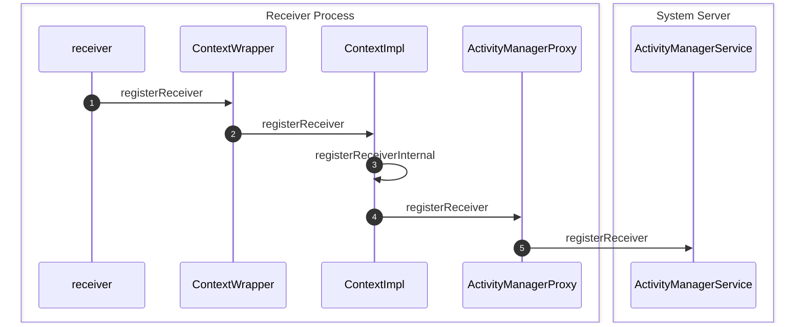
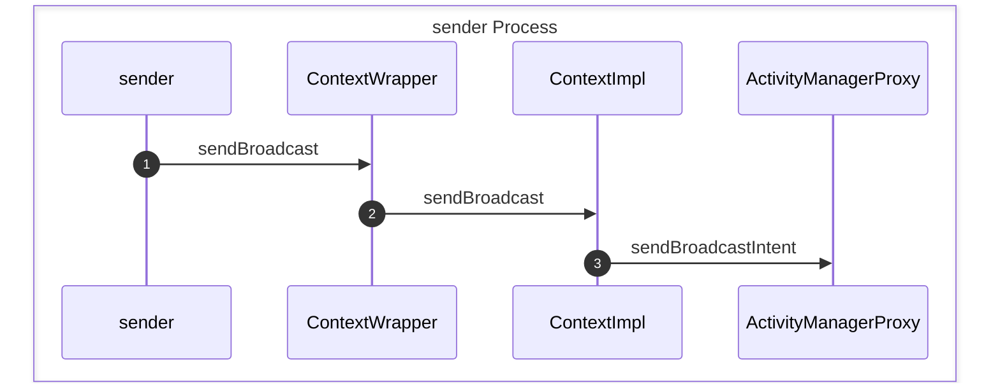
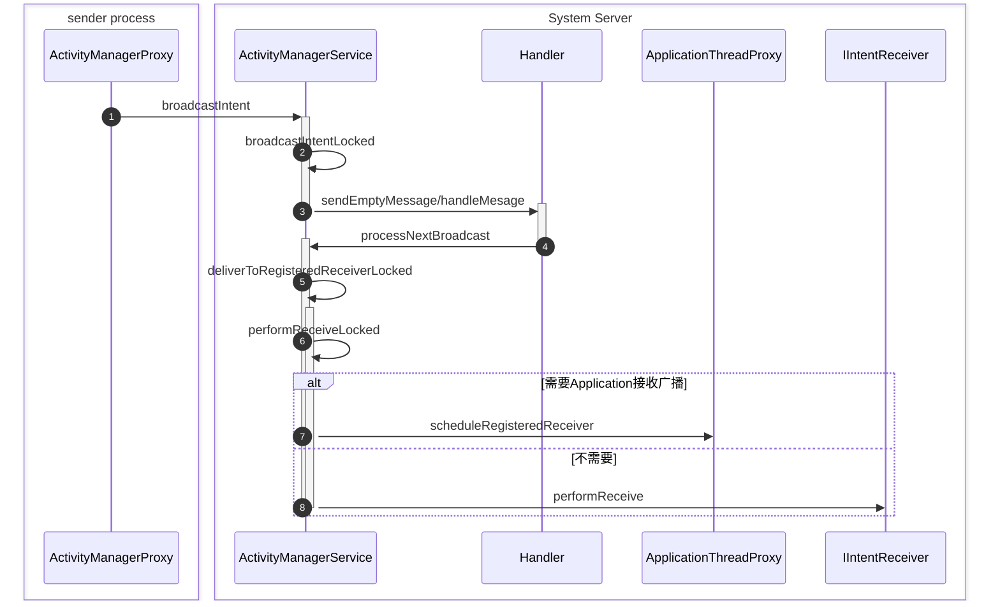
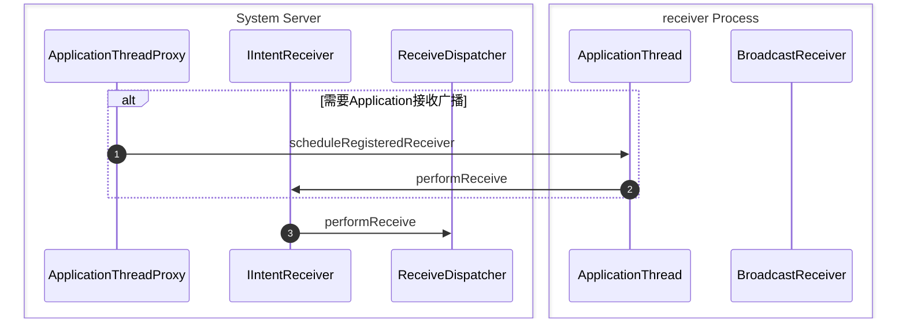

<!-- more -->

## Android的广播机制

Anroid提供了一种消息广播机制，用于向关心相应事件的组件发送通知，通过`ActivityMangerService`，`Activity`和`Service`都可以将`BroadcastReceiver`注册到`ActivityMangerService`中，并监听自己想要的事件，同时提供了静态注册、动态注册和广播优先级等机制


### 注册`BroadcastReceiver`


**step 1** 想要监听某种消息的receiver调用其父类`ContextWrapper`的`registerReceiver`方法：
```java
public Intent registerReceiver(@Nullable BroadcastReceiver receiver, IntentFilter filter) {
    return mBase.registerReceiver(receiver, filter);
}
```
，`mBase`是一个`ContextImpl`类型的对象

**step 2** 执行`ContextImpl`的`registerService`方法：
```java
public Intent registerReceiver(BroadcastReceiver receiver, IntentFilter filter) {
    return registerReceiver(receiver, filter, null, null);
}

public Intent registerReceiver(BroadcastReceiver receiver, IntentFilter filter, String broadcastPermission, Handler scheduler) {
    return registerReceiverInternal(receiver, getUserId(),
            filter, broadcastPermission, scheduler, getOuterContext());
}
```
，调用了`registerReceiverInternal`方法

**step 3** 执行`registerReceiverInternal`方法：
```java
private Intent registerReceiverInternal(BroadcastReceiver receiver, int userId, IntentFilter filter, String broadcastPermission, Handler scheduler, Context context) {
    IIntentReceiver rd = null;
    if (receiver != null) {
        if (mPackageInfo != null && context != null) {
            ...
            rd = mPackageInfo.getReceiverDispatcher(
                receiver, context, scheduler,
                mMainThread.getInstrumentation(), true);
        }else{
            ...
            rd = new LoadedApk.ReceiverDispatcher(
                receiver, context, scheduler, null, true).getIIntentReceiver();
        }
    }
    try {
        return ActivityManagerNative.getDefault().registerReceiver(
                mMainThread.getApplicationThread(), mBasePackageName,
                rd, filter, broadcastPermission, userId);
    } catch (RemoteException e) {
        return null;
    }
}
```
，首先执行`gerReceiverDispatcher`方法，将`receiver`包装成`IIntentReceiver`类型的`Binder`对象，然后调用`ActivityManagerNative.getDefault()`方法获取一个`ActivityManagerProxy`对象，执行其`registerReceiver`方法，其中`getReceiverDispatcher`方法如下：
```java
public IIntentReceiver getReceiverDispatcher(BroadcastReceiver r,
        Context context, Handler handler,
        Instrumentation instrumentation, boolean registered) {
    synchronized (mReceivers) {
        LoadedApk.ReceiverDispatcher rd = null;
        ArrayMap<BroadcastReceiver, LoadedApk.ReceiverDispatcher> map = null;
        if (registered) {
            map = mReceivers.get(context);
            if (map != null) {
                rd = map.get(r);
            }
        }
        if (rd == null) {
            rd = new ReceiverDispatcher(mActivityThread.getApplicationThread(), r, context,
                    handler, instrumentation, registered);
            if (registered) {
                if (map == null) {
                    map = new ArrayMap<BroadcastReceiver, LoadedApk.ReceiverDispatcher>();
                    mReceivers.put(context, map);
                }
                map.put(r, rd);
            }
        } else {
            rd.validate(context, handler);
        }
        rd.mForgotten = false;
        return rd.getIIntentReceiver();
    }
}
```
，方法通过`receiver`从`mReceivers`的`map`中查询是否存在对应的`ReceiverDispatcher`，如果存在则复用，否则创建一个新的`ReceiverDispatcher rd`并将`<receiver,rd>`存入`map`中，然后返回相应的`IIntentReceiver`对象

**step 4** 执行`ActivityManagerProxy::registerReceiver`方法，向`ActivityManagerService`发送一条`REGISTER_RECEIVER_TRANSACTION`类型的指令

**step 5** `ActivityManagerService`侧的`Stub`收到消息后，执行`onTransact`方法，并调用`ActivityManagerService`的`registerReceiver`方法：
```java
public Intent registerReceiver(IApplicationThread caller,
        IIntentReceiver receiver, IntentFilter filter, String permission) {
    synchronized(this) {
        ... 
        //查询粘性广播

        Intent sticky = allSticky != null ? (Intent) allSticky.get(0) : null;
        ReceiverList rl
            = (ReceiverList)mRegisteredReceivers.get(receiver.asBinder());
        if (rl == null) {
            rl = new ReceiverList(this, callerApp,
                    Binder.getCallingPid(),
                    Binder.getCallingUid(), receiver);
            if (rl.app != null) {
                rl.app.receivers.add(rl);
            } else {
                try {
                    receiver.asBinder().linkToDeath(rl, 0);
                } catch (RemoteException e) {
                    return sticky;
                }
                rl.linkedToDeath = true;
            }
            mRegisteredReceivers.put(receiver.asBinder(), rl);
        }
        BroadcastFilter bf = new BroadcastFilter(filter, rl, permission);
        rl.add(bf);
        ...
        mReceiverResolver.addFilter(bf);
        ...
        return sticky;
    }
}
```
，首先查询是否有粘性广播，然后，从`mRegisteredReceivers`中获取一个与`receiver`对应的`ReceiverList r1`，如果不存在则创建一个并将`r1`加入到`r1.app.receivers`中，并向`mRegisteredReceivers`中注册`<receiver, r1>`，此后，创建一个`BroadcastFilter bf`，并加入到`r1`中，并给`mReceiverResovler`添加一个filter `bf`

### 向`ActivityManagerService`发送广播


**step 1** 广播发送者调用`ContextWrapper`的`sendBroadcast`方法：
```java
public void sendBroadcast(Intent intent) {
    mBase.sendBroadcast(intent);
}
```
，`mBase`指向一个`ContextImpl`对象，方法调用了`ContextImpl`的`sendBroadcast`方法

**step 2**  执行`ContextImpl::sendBroadcast`方法：
```java
public void sendBroadcast(Intent intent) {
    String resolvedType = intent.resolveTypeIfNeeded(getContentResolver());
    try {
        ActivityManagerNative.getDefault().broadcastIntent(
            mMainThread.getApplicationThread(), intent, resolvedType, null,
            Activity.RESULT_OK, null, null, null, false, false);
    } catch (RemoteException e) {
    }
}
```
，通过`ActivityMangerNative.getDefault`获取到了`ActivityManagerProxy`，并执行`broadcastIntent`方法

**step 3** 执行 `ActivityManagerProxy::broadcastIntent`方法：

```java
public int broadcastIntent(IApplicationThread caller,
        Intent intent, String resolvedType,  IIntentReceiver resultTo,
        int resultCode, String resultData, Bundle map,
        String requiredPermission, boolean serialized,
        boolean sticky) throws RemoteException{
    ...
    mRemote.transact(BROADCAST_INTENT_TRANSACTION, data, reply, 0);
    ...
}
```
，向`ActivityManagerService`发送了一个`BROADCAST_INTENT_TRANSACTION`的请求


### `ActivityMangerService`转发广播



**step 1** `ActivityManagerService`侧的`Stub`接受到请求后，执行`onTransact`方法，并调用`ActivityManagerService::broadcastIntent`方法，执行`broadcastIntent`方法：
```java
public final int broadcastIntent(IApplicationThread caller,
        Intent intent, String resolvedType, IIntentReceiver resultTo,
        int resultCode, String resultData, Bundle map,
        String requiredPermission, boolean serialized, boolean sticky) {
    synchronized(this) {
        ...
        int res = broadcastIntentLocked(callerApp,
                callerApp != null ? callerApp.info.packageName : null,
                intent, resolvedType, resultTo,
                resultCode, resultData, map, requiredPermission, serialized,
                sticky, callingPid, callingUid);
        ...
        return res;
    }
}
```
，调用了自己的`broadcastIntentLocked`方法

**step 2** 执行`broadcastIntentLocked`方法：
```java
private final int broadcastIntentLocked(ProcessRecord callerApp,
        String callerPackage, Intent intent, String resolvedType,
        IIntentReceiver resultTo, int resultCode, String resultData,
        Bundle map, String requiredPermission,
        boolean ordered, boolean sticky, int callingPid, int callingUid) {
    intent = new Intent(intent);
    ...

    //找到要接受广播的receivers
    List receivers = null;
    List<BroadcastFilter> registeredReceivers = null;
    try {
        if (intent.getComponent() != null) {
            ActivityInfo ai = AppGlobals.getPackageManager().
                getReceiverInfo(intent.getComponent(), STOCK_PM_FLAGS);
            if (ai != null) {
                receivers = new ArrayList();
                ResolveInfo ri = new ResolveInfo();
                ri.activityInfo = ai;
                receivers.add(ri);
            }
        } else {
            if ((intent.getFlags()&Intent.FLAG_RECEIVER_REGISTERED_ONLY)
                         == 0) {
                    receivers =
                        AppGlobals.getPackageManager().queryIntentReceivers(
                                intent, resolvedType, STOCK_PM_FLAGS);
            }
            registeredReceivers = mReceiverResolver.queryIntent(intent, resolvedType, false);
        }
    } 
    ...
    int NR = registeredReceivers != null ? registeredReceivers.size() : 0;
    //如果是无序广播，则优先发送给动态注册的接收者
    if (!ordered && NR > 0) {
        BroadcastRecord r = new BroadcastRecord(intent, callerApp,
                callerPackage, callingPid, callingUid, requiredPermission,
                registeredReceivers, resultTo, resultCode, resultData, map,
                ordered, sticky, false);
        //找到pending的消息并根据`replacePending`标志位判断是否需要替换
        ...
        if (!replaced) {
            mParallelBroadcasts.add(r);
            scheduleBroadcastsLocked();
        }
        registeredReceivers = null;
        NR = 0;
    }
    int ir = 0;
    ...
    //合并动态注册与静态注册的receiver
    while (ir < NR) {
        if (receivers == null) {
            receivers = new ArrayList();
        }
        receivers.add(registeredReceivers.get(ir));
        ir++;
    }
    //发送广播
    if ((receivers != null && receivers.size() > 0)
            || resultTo != null) {
        BroadcastRecord r = new BroadcastRecord(intent, callerApp,
                callerPackage, callingPid, callingUid, requiredPermission,
                receivers, resultTo, resultCode, resultData, map, ordered,
                sticky, false);
        ...
        boolean replaced = false;
        //找到pending的消息并根据`replacePending`标志位判断是否需要替换
        ...
        if (!replaced) {
            mOrderedBroadcasts.add(r);
            scheduleBroadcastsLocked();
        }
    }
    return BROADCAST_SUCCESS;
}
```
，首先，方法找到需要接受广播的所有receiver，分为以下类型：
1. 当`intent`为显式`Intent`时，会通过`AppGlobals.getPackageManager().getReceiverInfo`方法获取到对应的组件
2. 如果`FLAG_RECEIVER_REGISTERED_ONLY`标志位为假，表明广播可以发送给静态注册的receiver，通过`AppGlobals.getPackageManager().queryIntentReceivers`方法找到目标receivers
3. 通过`registeredReceivers`记录所有动态注册的receiver

， 当找到receiver后，发送广播分为两种类型：
1. 当广播不是顺序的时，如果存在动态注册的receiver，则优先将消息发送给动态注册的receiver
2. 然后，合并`receivers`和`registeredReceivers`，并发送广播

在两种发送广播的类型中，都首先会为要发送的广播创建一个`BroadcastRecord`，然后判断是否需要替代pending的广播，最后将record加入到`mParallelBroadcasts`或`mOrderedBroadcasts`中，并调用`scheduleBroadcastLocked`方法

**step 3** 执行`scheduleBroadcastLocked`方法：
```java
private final void scheduleBroadcastsLocked() {
    ...
    if (mBroadcastsScheduled) {
        return;
    }
    mHandler.sendEmptyMessage(BROADCAST_INTENT_MSG);
    mBroadcastsScheduled = true;
}
```
，`mBroadcastsScheduled`表示是否消息已经被处理了，`mHandler`指向了`ActivityManagerService`中重写的一个`Handler`类型对象，并向其发送一个`BROADCAST_INTENT_MSG`类型的消息，`mHandler`执行`Handler::handleMessage`方法：
```java
case BROADCAST_INTENT_MSG: {
    if (DEBUG_BROADCAST) Slog.v(
            TAG, "Received BROADCAST_INTENT_MSG");
    processNextBroadcast(true);
} break;
```
，调用了`ActivityManagerService`的`processNextBroadcast`方法

**step 4** 执行`processNextBroadcast`方法：
```java
private final void processNextBroadcast(boolean fromMsg) {
    synchronized(this) {
        BroadcastRecord r;
        ...
        if (fromMsg) {
            mBroadcastsScheduled = false;
        }
        //对于非顺序广播，直接进行发送
        while (mParallelBroadcasts.size() > 0) {
            r = mParallelBroadcasts.remove(0);
            r.dispatchTime = SystemClock.uptimeMillis();
            final int N = r.receivers.size();
            ...
            for (int i=0; i<N; i++) {
                Object target = r.receivers.get(i);
                ...
                deliverToRegisteredReceiverLocked(r, (BroadcastFilter)target, false);
            }
            addBroadcastToHistoryLocked(r);
            ...
        }
        //对于顺序广播，找到下一个需要发送的广播
        ...
        boolean looped = false;    
        do {
            ...
            r = mOrderedBroadcasts.get(0);
            boolean forceReceive = false;
            int numReceivers = (r.receivers != null) ? r.receivers.size() : 0;
            ...
            if (r.receivers == null || r.nextReceiver >= numReceivers
                    || r.resultAbort || forceReceive) {
                ...
                cancelBroadcastTimeoutLocked();
                ...
                addBroadcastToHistoryLocked(r);
                mOrderedBroadcasts.remove(0);
                r = null;
                looped = true;
                continue;
            }
        } while (r == null);

        int recIdx = r.nextReceiver++;
        r.receiverTime = SystemClock.uptimeMillis();
        ...
        Object nextReceiver = r.receivers.get(recIdx);

        //如果接收者是动态注册的，直接发送消息
        if (nextReceiver instanceof BroadcastFilter) {
            BroadcastFilter filter = (BroadcastFilter)nextReceiver;
            ...
            deliverToRegisteredReceiverLocked(r, filter, r.ordered);
            if (r.receiver == null || !r.ordered) {
                ...
                //说明当前接收者处理完了广播，再次调用scheduleBroadcastLocked方法继续处理广播
                r.state = BroadcastRecord.IDLE;
                scheduleBroadcastsLocked();
            }
            return;
        }


        //如果接收者是静态注册的，那么有可能还没有启动
        ResolveInfo info =
            (ResolveInfo)nextReceiver;
        ...
        String targetProcess = info.activityInfo.processName;
        r.curComponent = new ComponentName(
                info.activityInfo.applicationInfo.packageName,
                info.activityInfo.name);
        r.curReceiver = info.activityInfo;
        ProcessRecord app = getProcessRecordLocked(targetProcess,
                info.activityInfo.applicationInfo.uid);
        if (app != null && app.thread != null) {
            try {
                processCurBroadcastLocked(r, app);
                return;
            } 
            ...
        }
        if ((r.curApp=startProcessLocked(targetProcess,
                info.activityInfo.applicationInfo, true,
                r.intent.getFlags() | Intent.FLAG_FROM_BACKGROUND,
                "broadcast", r.curComponent,
                (r.intent.getFlags()&Intent.FLAG_RECEIVER_BOOT_UPGRADE) != 0))
                        == null) {
            ...
            scheduleBroadcastsLocked();
            r.state = BroadcastRecord.IDLE;
            return;
        }
        mPendingBroadcast = r;
        mPendingBroadcastRecvIndex = recIdx;
    }
}
```
1. 对于非顺序广播，直接调用`deliverToRegisteredReceiverLocked`方法进行发送
2. 对于顺序广播，在`mOrderedBroadcasts`找到一个没有发送完的广播
    - 如果下一个receiver是动态注册的，那么直接调用`deliverToRegisteredReceiverLocked`将消息发送给该receiver
    - 如果下一个receiver是静态注册的，则可能需要启动该组件所在的进程，然后调用`deliverToRegisteredReceiverLocked`发送消息

**step 5** 执行`deliverToRegisteredReceiverLocked`方法：
```java
private final void deliverToRegisteredReceiverLocked(BroadcastRecord r,
        BroadcastFilter filter, boolean ordered) {
    boolean skip = false;
    ...
    //通过filter.requiredPermssion和r.requieredPermission互相判断对方是否有权限
    if (!skip) {
        ...
        try {
            ...
            performReceiveLocked(filter.receiverList.app, filter.receiverList.receiver,
                new Intent(r.intent), r.resultCode,
                r.resultData, r.resultExtras, r.ordered, r.initialSticky);
            if (ordered) {
                r.state = BroadcastRecord.CALL_DONE_RECEIVE;
            }
        } 
        ...
    }
}
```
，调用`performReceiveLocked`方法

**step 6** 执行`ActivityManagerService.performReceiveLocked`方法：
```java
static void performReceiveLocked(ProcessRecord app, IIntentReceiver receiver,
        Intent intent, int resultCode, String data, Bundle extras,
        boolean ordered, boolean sticky) throws RemoteException {
    if (app != null && app.thread != null) {
        app.thread.scheduleRegisteredReceiver(receiver, intent, resultCode,
                data, extras, ordered, sticky);
    } else {
        receiver.performReceive(intent, resultCode, data, extras, ordered, sticky);
    }
}
```
1. 当receiver需要通过其所在的进程来接收消息，则通过其`ApplicationThreadProxy`对象的`scheduleRegisteredReceiver`方法发送广播
2. 否则通过注册的`IIntentReceiver`的`performReceive`方法发送广播

**step 7** 当需要通过进程接收广播时，执行`scheduleRegisteredReceiver`方法：
```java
public void scheduleRegisteredReceiver(IIntentReceiver receiver, Intent intent,
        int resultCode, String dataStr, Bundle extras, boolean ordered, boolean sticky)
        throws RemoteException {
    ...
    mRemote.transact(SCHEDULE_REGISTERED_RECEIVER_TRANSACTION, data, null,
            IBinder.FLAG_ONEWAY);
    ...
}
```
，向`ApplicationThread`发送了一条`SCHEDULE_REGISTERED_RECEIVER_TRANSACTION`类型的请求

**step 8** 当不需要进程接收广播时，执行`performReceive`方法：
```java
oneway interface IIntentReceiver {
    void performReceive(in Intent intent, int resultCode,
            String data, in Bundle extras, boolean ordered, boolean sticky);
}
```
，`IItentReceiver`声明为`oneway`类型的`aidl`，会调用其生成的`Proxy`的`transact`方法向远程的`Stub`发送一个广播请求


### receiver接收广播



**step 1** 执行`scheduleRegisteredReceiver`方法：
```java
public void scheduleRegisteredReceiver(IIntentReceiver receiver, Intent intent,
        int resultCode, String dataStr, Bundle extras, boolean ordered,
        boolean sticky) throws RemoteException {
    receiver.performReceive(intent, resultCode, dataStr, extras, ordered, sticky);
}
```
，调用了`IIntent`的`performReceive`方法，这里调用是通过binder的oneway async队列保证顺序广播的有效性


