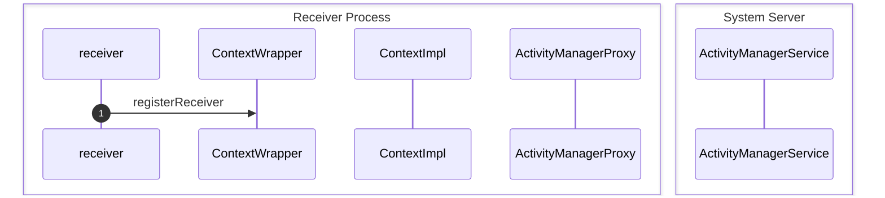

<!-- more -->

## Android的广播机制

Anroid提供了一种消息广播机制，用于向关心相应事件的组件发送通知，通过`ActivityMangerService`，`Activity`和`Service`都可以将`BroadcastReceiver`注册到`ActivityMangerService`中，并监听自己想要的事件，同时提供了静态注册、动态注册和广播优先级等机制


### 注册`BroadcastReceiver`


**step 1** 想要监听某种消息的receiver调用其父类`ContextWrapper`的`registerReceiver`方法：
```java
public Intent registerReceiver(@Nullable BroadcastReceiver receiver, IntentFilter filter) {
    return mBase.registerReceiver(receiver, filter);
}
```
，`mBase`是一个`ContextImpl`类型的对象
