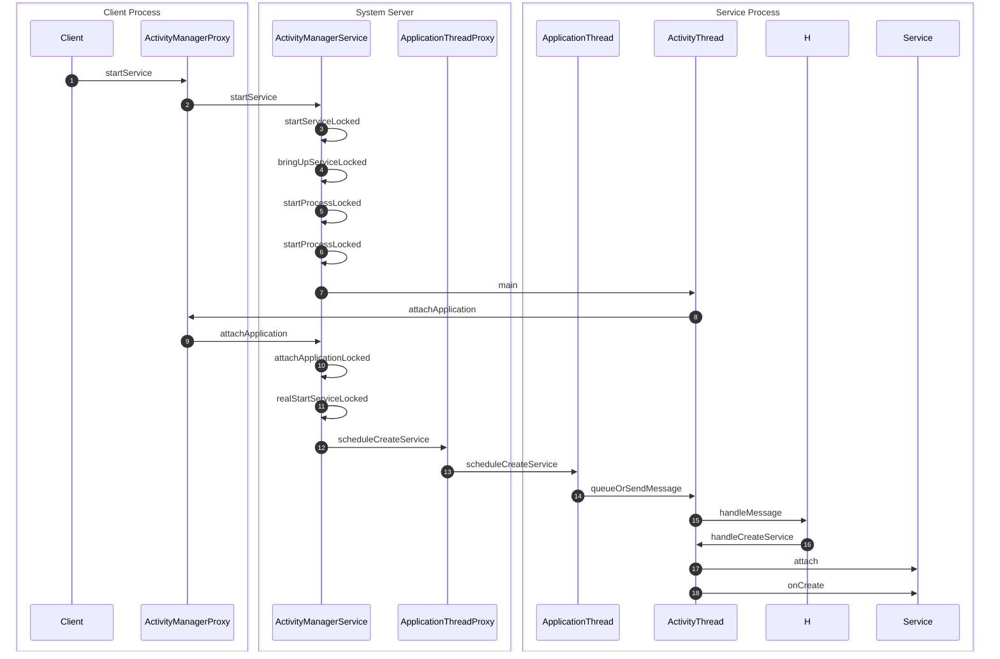

<!-- more -->

## 在新进程中启动Service的过程

### 时序图



### 详细过程

**step 1** 调用`ActivityManagerProxy`的`startService`方法：
```java
public ComponentName startService(IApplicationThread caller, Intent service,
        String resolvedType) throws RemoteException
{
    Parcel data = Parcel.obtain();
    Parcel reply = Parcel.obtain();
    data.writeInterfaceToken(IActivityManager.descriptor);
    data.writeStrongBinder(caller != null ? caller.asBinder() : null);
    service.writeToParcel(data, 0);
    data.writeString(resolvedType);
    mRemote.transact(START_SERVICE_TRANSACTION, data, reply, 0);
    reply.readException();
    ComponentName res = ComponentName.readFromParcel(reply);
    data.recycle();
    reply.recycle();
    return res;
}
```
，向`ActivityManagerService`发送一个`START_SERVICE_TRANSACTION`请求

**step 2** `ActivityManagerSerive`继承了`ActivityManagerNative`，并实现了`Binder`，实现了`onTransact`方法：
```java
public boolean onTransact(int code, Parcel data, Parcel reply, int flags)
        throws RemoteException {
    switch (code) {
        case START_SERVICE_TRANSACTION: {
            data.enforceInterface(IActivityManager.descriptor);
            IBinder b = data.readStrongBinder();
            IApplicationThread app = ApplicationThreadNative.asInterface(b);
            Intent service = Intent.CREATOR.createFromParcel(data);
            String resolvedType = data.readString();
            ComponentName cn = startService(app, service, resolvedType);
            reply.writeNoException();
            ComponentName.writeToParcel(cn, reply);
            return true;
        }
    }
}
```
，调用了`startService`方法：
```java
public ComponentName startService(IApplicationThread caller, Intent service,
        String resolvedType) {
    ...
    synchronized(this) {
        final int callingPid = Binder.getCallingPid();
        final int callingUid = Binder.getCallingUid();
        final long origId = Binder.clearCallingIdentity();
        ComponentName res = startServiceLocked(caller, service,
                resolvedType, callingPid, callingUid);
        Binder.restoreCallingIdentity(origId);
        return res;
    }
}
```
，设置了创建`Service`的进程Pid和用户Uid，并调用`startServiceLocked`方法

**step 3** 执行`startServiceLocked`方法：
```java
ComponentName startServiceLocked(IApplicationThread caller,
        Intent service, String resolvedType,
        int callingPid, int callingUid) {
    synchronized(this) {
        ...
        ServiceLookupResult res =
            retrieveServiceLocked(service, resolvedType,
                    callingPid, callingUid);
        ...
        ServiceRecord r = res.record;
        ...
        if (!bringUpServiceLocked(r, service.getFlags(), false)) {
            return new ComponentName("!", "Service process is bad");
        }
        return r.name;
    }
}
```
，方法首先调用`retieveServiceLocked`查找是否存在`service`对应的`ServiceRecord`，否则就创建一个`ServiceRecord`对象，并调用`bringUpServiceLocked`方法

**step 4** 执行`bringUpServiceLocked`方法：
```java
private final boolean bringUpServiceLocked(ServiceRecord r,
        int intentFlags, boolean whileRestarting) {
    ...
    mRestartingServices.remove(r);
    
    final String appName = r.processName;
    ProcessRecord app = getProcessRecordLocked(appName, r.appInfo.uid);
    ...
    if (startProcessLocked(appName, r.appInfo, true, intentFlags,
            "service", r.name, false) == null) {
        ...
    }
    

    
    return true;
}
```
，由于service声明的进程不存在，于是调用`startProcessLocked`创建一个指定的进程，然后调用`add`方法将`r`保存在`mPendingServices`中，表示其正在等待启动

**step 5** 执行`startProcessLocked`方法：
```java
final ProcessRecord startProcessLocked(String processName,
        ApplicationInfo info, boolean knownToBeDead, int intentFlags,
        String hostingType, ComponentName hostingName, boolean allowWhileBooting) {
    ProcessRecord app = getProcessRecordLocked(processName, info.uid);
    ...
    
    if (app == null) {
        app = newProcessRecordLocked(null, info, processName);
        mProcessNames.put(processName, info.uid, app);
    } 
    ...
    startProcessLocked(app, hostingType, hostingNameStr);
    return (app.pid != 0) ? app : null;
}
```
，创建一个`ProcessRecord`，并调用`startProcessLocked`方法运行该`Process`

**step 6**
```java
private final void startProcessLocked(ProcessRecord app,
        String hostingType, String hostingNameStr) {
    ...
    try {
        ...
        int pid = Process.start("android.app.ActivityThread",
                mSimpleProcessManagement ? app.processName : null, uid, uid,
                gids, debugFlags, null);
        ...
    } 
    ...
}
```
，查看`Process.start`方法：
```java
    public static final int start(final String processClass,
                                  final String niceName,
                                  int uid, int gid, int[] gids,
                                  int debugFlags,
                                  String[] zygoteArgs)
    {
        ...
        else {
            ...
            Runnable runnable = new Runnable() {
                        public void run() {
                            Process.invokeStaticMain(processClass);
                        }
            };
            
            if (niceName != null) {
                new Thread(runnable, niceName).start();
            } else {
                new Thread(runnable).start();
            }
            return 0;
        }
    }
```
，其创建了一个线程，并运行`invokeStaticMain`方法：

```java
private static void invokeStaticMain(String className) {
    Class cl;
    Object args[] = new Object[1];
    args[0] = new String[0];     //this is argv

    try {
        cl = Class.forName(className);
        cl.getMethod("main", new Class[] { String[].class })
                .invoke(null, args);            
    } 
    ...
}
```
，由于之前传入的`processClass`为`"android.app.ActivityThread"`，于是在此通过反向代理调用其静态`main`方法

**step 7** 执行`ActivityThread.main`方法：
```java
public static final void main(String[] args) {
    ...
    ActivityThread thread = new ActivityThread();
    thread.attach(false);
    ...
    Looper.loop();
    ...
}
```
，可以看到，创建了一个`ActivityThread`的实例，并调用了`attach`方法：
```java
    private final void attach(boolean system) {
        sThreadLocal.set(this);
        mSystemThread = system;
        if (!system) {
            ...
            IActivityManager mgr = ActivityManagerNative.getDefault();
            try {
                mgr.attachApplication(mAppThread);
            } catch (RemoteException ex) {
                ...
            }
        }      
        ...
    }
```
，调用了`ActivityManagerProxy`的`attachApplication`方法

**step 8** 执行`attachApplication`方法，向`ActivityManagerService`发送`ATTACH_APPLICATION_TRANSACTION`请求：
```java
public void attachApplication(IApplicationThread app) throws RemoteException
{
    Parcel data = Parcel.obtain();
    Parcel reply = Parcel.obtain();
    data.writeInterfaceToken(IActivityManager.descriptor);
    data.writeStrongBinder(app.asBinder());
    mRemote.transact(ATTACH_APPLICATION_TRANSACTION, data, reply, 0);
    reply.readException();
    data.recycle();
    reply.recycle();
}
```
**step 9** `ActivityManagerService`执行`onTransact`方法：
```java
public boolean onTransact(int code, Parcel data, Parcel reply, int flags)
        throws RemoteException {
    switch (code) {
        ...
        case ATTACH_APPLICATION_TRANSACTION: {
            data.enforceInterface(IActivityManager.descriptor);
            IApplicationThread app = ApplicationThreadNative.asInterface(
                    data.readStrongBinder());
            if (app != null) {
                attachApplication(app);
            }
            reply.writeNoException();
            return true;
        }
        ...
    }
    ...
}
```
，调用`attachApplication`方法：
```java
public final void attachApplication(IApplicationThread thread) {
    synchronized (this) {
        int callingPid = Binder.getCallingPid();
        ...
        attachApplicationLocked(thread, callingPid);
        ...
    }
}
```
，调用`attachApplicationLocked`方法

**step 10** 执行`attachApplicationLocked`方法：

```java
private final boolean attachApplicationLocked(IApplicationThread thread,
            int pid)  {
    ...
    if (!badApp && mPendingServices.size() > 0) {
        ServiceRecord sr = null;
        try {
            for (int i=0; i<mPendingServices.size(); i++) {
                sr = mPendingServices.get(i);
                if (app.info.uid != sr.appInfo.uid
                        || !processName.equals(sr.processName)) {
                    continue;
                }
                mPendingServices.remove(i);
                i--;
                realStartServiceLocked(sr, app);
                didSomething = true;
            }
        } catch (Exception e) {
            Slog.w(TAG, "Exception in new application when starting service "
                    + sr.shortName, e);
            badApp = true;
        }
    }
    ...
}
```
，在`attachApplicationLocked`方法中，会从`mPendingServices`中查找要启动到相应进程的service，并调用`realStartServiceLocked`

**step 11** 执行`realStartServiceLocked`方法：
```java
private final void realStartServiceLocked(ServiceRecord r,
        ProcessRecord app) throws RemoteException {
    if (app.thread == null) {
        throw new RemoteException();
    }
    r.app = app;
    r.restartTime = r.lastActivity = SystemClock.uptimeMillis();
    app.services.add(r);
    ...
    boolean created = false;
    try {
        ...
        app.thread.scheduleCreateService(r, r.serviceInfo);
        r.postNotification();
        created = true;
    } finally {
        ...
    }
    ...
}
```
，调用了`schduleCreateService`方法，`app.thread`为`ApplicationThreadProxy`类型的对象

**step 12** 执行`scheduleCreateService`方法：
```java
public final void scheduleCreateService(IBinder token, ServiceInfo info)
        throws RemoteException {
    Parcel data = Parcel.obtain();
    data.writeInterfaceToken(IApplicationThread.descriptor);
    data.writeStrongBinder(token);
    info.writeToParcel(data, 0);
    mRemote.transact(SCHEDULE_CREATE_SERVICE_TRANSACTION, data, null,
            IBinder.FLAG_ONEWAY);
    data.recycle();
}
```
，向`ApplicatoinThread`发送一个`SCHEDULE_CREATE_SERVICE_TRANSACTION`请求

**step 13** 接受到请求后，`ApplicationThread`执行`ApplicationThreadNatvie::onTransact`方法并调用
```java
public final void scheduleCreateService(IBinder token,
        ServiceInfo info) {
    CreateServiceData s = new CreateServiceData();
    s.token = token;
    s.info = info;
    queueOrSendMessage(H.CREATE_SERVICE, s);
}
```
，向`mH`发送一个`CREATE_SERVICE`请求

**step 14** 执行`queueOrSendMessage`方法：
```java
private final void queueOrSendMessage(int what, Object obj, int arg1, int arg2) {
    synchronized (this) {
        ...
        Message msg = Message.obtain();
        msg.what = what;
        msg.obj = obj;
        msg.arg1 = arg1;
        msg.arg2 = arg2;
        mH.sendMessage(msg);
    }
}
```
，调用`sendMessage`向`mH`发送消息

**step 15** `mH`接受到消息后，执行`handleMessage`方法：
```java
public void handleMessage(Message msg) {
    case CREATE_SERVICE:
    handleCreateService((CreateServiceData)msg.obj);
    break;
}
```
,调用`ActivityThread::handleCreateService`方法

**step 16** 执行`handleCreateService`方法：
```java
private final void handleCreateService(CreateServiceData data) {
    // If we are getting ready to gc after going to the background, well
    // we are back active so skip it.
    unscheduleGcIdler();
    LoadedApk packageInfo = getPackageInfoNoCheck(
            data.info.applicationInfo);
    Service service = null;
    try {
        java.lang.ClassLoader cl = packageInfo.getClassLoader();
        service = (Service) cl.loadClass(data.info.name).newInstance();
    } catch (Exception e) {
        ...
    }
    try {
        ...
        service.attach(context, this, data.info.name, data.token, app,
                ActivityManagerNative.getDefault());
        service.onCreate();
        mServices.put(data.token, service);
        ...
    } catch (Exception e) {
        ...
    }
}
```
，首先通过反射创建了一个`Service`实例，并调用其`attach`方法，然后调用其`onCreate`方法

**step 17** 执行`attach`方法

**step 18** 执行`service.onCreate`方法
