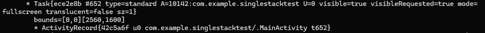

<!-- more -->

## Activity LaunchMode

`Activity`一共有五种`LaunchMode`，分别是：
- `Standard`：标准模式，每启动一个`Activity`都会创建一个新的实例
- `SingleTop`： 栈顶复用模式，如果栈顶存在`Activity`实例，则复用该实例并回调`onNewIntent`方法
- `SingleTask`：栈内复用模式，如果栈内存在一个`Activity`实例，则复用该实例并置于栈顶，回调`onNewIntent`方法
- `SingleInstance`：单实例模式，此模式的`Activity`只能单独位于一个任务栈中，再次启动`Activity`时，均不会再创建`Activity`的实例，并回调`onNewIntent`方法
- `SingleInstancePerTask`：全局共用一个`Activity`，不同于`SingleInstance`模式，该模式允许其栈内运行某些其他实例

## LaunchMode 测试

### 实例

**MainActivity**

```java
public class MainActivity extends Activity implements View.OnClickListener {

    Button mainButton;

    Button subButton;
    TextView view;

    private static int count = 0;

    @Override
    protected void onCreate(@Nullable Bundle savedInstanceState) {
        super.onCreate(savedInstanceState);
        this.setContentView(R.layout.main_activity);
        count += 1;
        mainButton = (Button) this.findViewById(R.id.main_button);
        subButton = (Button) this.findViewById(R.id.sub_button);
        mainButton.setOnClickListener(this);
        subButton.setOnClickListener(this);
        view = this.findViewById(R.id.count_text);
        view.setText("mainActivity "+ count);
    }

    @Override
    public void onClick(View v) {
        if(v.equals(mainButton)){
            Intent intent = new Intent(getBaseContext(),MainActivity.class);
            startActivity(intent);
        }else{
            Intent intent = new Intent(getBaseContext(),SubActivity.class);
            startActivity(intent);
        }
    }
}
```

**SubActivity**

```java
public class MainActivity extends Activity implements View.OnClickListener {

    ... // same with main

    @Override
    protected void onCreate(@Nullable Bundle savedInstanceState) {
        ... // same with main
        view.setText("subActivity "+ count);
    }

    ... // same with main
}

```

### `standard`模式测试

在`manifest`文件中，配置`MainActivity`和`SubActivity`的`launchMode`为`standard`

```xml
...
<activity android:name=".MainActivity" android:exported="true" android:launchMode="standard" android:process=".mainProcess">
    <intent-filter>
        <action android:name="android.intent.action.MAIN"/>
        <category android:name="android.intent.category.LAUNCHER"/>
    </intent-filter>
</activity>
<activity android:name=".SubActivity" android:exported="true" android:launchMode="standard" android:process=".mainProcess"/>
...
</manifest>
```

启动项目后，`MainActivity`显示：


调用一次`startActivity`开启一个新的`MainActivity`显示：


此时，通过`dumpsys activity activities`查看任务栈，显示：


，可以看到，创建了两个不一样的`MainActivity`实例

### `singleTop`模式测试

修改`manifest`文件，设置`LaunchMode`为`singleTop`

```xml
...
<activity android:name=".MainActivity" android:exported="true" android:launchMode="singleTop" android:process=".mainProcess">
    <intent-filter>
        <action android:name="android.intent.action.MAIN"/>
        <category android:name="android.intent.category.LAUNCHER"/>
    </intent-filter>
</activity>
<activity android:name=".SubActivity" android:exported="true" android:launchMode="singleTop" android:process=".mainProcess"/>
...
</manifest>
```
启动项目后，`MainActivity`显示：


再启动一个`MainActivity`，显示：


`dumpsys activity activities`显示：


可以看到，由于`MainActivity`位于栈顶，此时会复用`MainActivity`

启动一次`SubActivity`后再启动`MainActivity`显示：


`dumpsys activity activities`显示：


，可以看到，由于`MainActivity`不在栈顶，会创建一个新的`MainActivity`实例并放入栈顶

### `singleTask`模式测试

修改`AndroidMainfest.xml`文件：
```xml
<activity android:name=".MainActivity" android:exported="true" android:launchMode="singleTask">
    <intent-filter>
        <action android:name="android.intent.action.MAIN"/>
        <category android:name="android.intent.category.LAUNCHER"/>
    </intent-filter>
</activity>
<activity android:name=".SubActivity" android:exported="true" android:launchMode="singleTask"/>
```
启动一次`MainActivity`，显示：


启动一次`SubActivity`，`dumpsys activity activities`显示：


再次启动`MainActivity`，显示：


，`dumpsys activity activities`显示：



，可以看到，`MainActivity`被复用了，同时栈中元素被删除并将`MainActivity`放入了栈顶

再次启动`SubActivity`，显示：


，可以看到，由于`SubActivity`记录被销毁，会重新创建一个`SubActivity`实例

### `singleInstance`模式测试

修改`AndroidMainfest.xml`文件：
```xml
<activity android:name=".MainActivity" android:exported="true" android:launchMode="singleInstance">
    <intent-filter>
        <action android:name="android.intent.action.MAIN"/>
        <category android:name="android.intent.category.LAUNCHER"/>
    </intent-filter>
</activity>
<activity android:name=".SubActivity" android:exported="true" android:launchMode="singleInstance"/>
```

启动`MainActivity`和`SubActivity`，`dumpsys activity activities`显示：


，可以看到，为每个实例单独开启了一个进程

再次启动`MainActivity`，显示：


再次启动`SubActivity`，显示：


，可以看到，`MainActivity`和`SubActivity`都被复用了

修改`AndroidManifest.xml`：
```xml
<activity android:name=".MainActivity" android:exported="true" android:launchMode="singleInstance" android:process=".mainProcess">
    <intent-filter>
        <action android:name="android.intent.action.MAIN"/>
        <category android:name="android.intent.category.LAUNCHER"/>
    </intent-filter>
</activity>
<activity android:name=".SubActivity" android:exported="true" android:launchMode="singleInstance" android:process=".mainProcess"/>
```
，通过`dumpsys activity activities`，可以看到：


，即使指定了相同的process，仍然会运行在不同的task中

### `singleInstancePerTask`测试

修改`AndroidMainfest.xml`文件：
```xml
<activity android:name=".MainActivity" android:exported="true" android:launchMode="singleInstancePerTask">
    <intent-filter>
        <action android:name="android.intent.action.MAIN"/>
        <category android:name="android.intent.category.LAUNCHER"/>
    </intent-filter>
</activity>
<activity android:name=".SubActivity" android:exported="true" />
```
运行一次`MainActivity`和`SubActivity`，`dumpsys`显示：


，可以看到，`SubActivity`可以和`MainActivity`运行在一个task中，如果修改`singleInstance`的manifest如下：
```xml
<activity android:name=".MainActivity" android:exported="true" android:launchMode="singleInstance">
    <intent-filter>
        <action android:name="android.intent.action.MAIN"/>
        <category android:name="android.intent.category.LAUNCHER"/>
    </intent-filter>
</activity>
<activity android:name=".SubActivity" android:exported="true" />
```
查看其`dumpsys`显示：


，可以发现，`SubActivity`不可以与`MainActivity`运行在一个task中

再次启动`SubActivity`，观察`dumpsys`显示：

，可以发现，和`singleTask`相同，同一个栈中的其他记录被删除了，并且将`MainActivity`放入了栈顶

修改`AndroidMainfest.xml`文件：
```xml
<activity android:name=".MainActivity" android:exported="true" android:launchMode="singleInstancePerTask">
    <intent-filter>
        <action android:name="android.intent.action.MAIN"/>
        <category android:name="android.intent.category.LAUNCHER"/>
    </intent-filter>
</activity>
<activity android:name=".SubActivity" android:exported="true" android:launchMode="singleInstancePerTask"/>
```
此时启动`MainActivity`和`SubActivity`，`dumpsys`显示：


，由于`MainActivity`和`SubActivity`都是`singleInstancePerTask`，于是在同一个task中，只能存在他们其中的一个，于是两者运行在了不同的task中

修改manifest文件为：
```xml
<activity android:name=".MainActivity" android:exported="true" android:launchMode="singleTask" android:process=".mainProcess">
    <intent-filter>
        <action android:name="android.intent.action.MAIN"/>
        <category android:name="android.intent.category.LAUNCHER"/>
    </intent-filter>
</activity>
<activity android:name=".SubActivity" android:exported="true" android:launchMode="singleInstancePerTask" android:process=".mainProcess"/>
```

启动`MainActivity`和`SubActivity`，可以看到：


，即使指定了同一个task，`MainActivity`和`SubActivity`还是运行在了不同的task中

但是修改manifest文件为：
```xml
<activity android:name=".MainActivity" android:exported="true" android:launchMode="singleInstancePerTask" android:process=".mainProcess">
    <intent-filter>
        <action android:name="android.intent.action.MAIN"/>
        <category android:name="android.intent.category.LAUNCHER"/>
    </intent-filter>
</activity>
<activity android:name=".SubActivity" android:exported="true" android:launchMode="singleTask" android:process=".mainProcess"/>
```
后，则通过`dumpsys`可以看到：

，两个`Activity`运行在了同一个task中

## 结合`Activity`启动流程看`LaunchMode`

在调用`startActivity`方法时，会调用到`ActivityStarter`的`executeRequest`方法：
```java
private int executeRequest(Request request) {
    ...
    ActivityInfo aInfo = request.activityInfo;
    ...
    final int launchMode = aInfo != null ? aInfo.launchMode : 0;
    ...
    final ActivityRecord r = new ActivityRecord.Builder(mService)
        ...
        .setActivityInfo(aInfo)
        ...
        .build();
    ...
    mLastStartActivityResult = startActivityUnchecked(r, sourceRecord, voiceSession,
        request.voiceInteractor, startFlags, checkedOptions,
        inTask, inTaskFragment, balVerdict, intentGrants, realCallingUid, transition,
        isIndependent);

    ...
}
```
，可以看到，执行该方法会创建一个`ActivityRecord`并设置其`ActivityInfo`为`ainfo`，`ActivityInfo`中包含了`LaunchMode`，之后方法调用了`startActivityUnchecked`方法：

```java
private int startActivityUnchecked(final ActivityRecord r, ActivityRecord sourceRecord,
        IVoiceInteractionSession voiceSession, IVoiceInteractor voiceInteractor,
        int startFlags, ActivityOptions options, Task inTask,
        TaskFragment inTaskFragment,
        BalVerdict balVerdict,
        NeededUriGrants intentGrants, int realCallingUid, Transition transition,
        boolean isIndependentLaunch) {
        ...
        result = startActivityInner(r, sourceRecord, voiceSession, voiceInteractor,
                startFlags, options, inTask, inTaskFragment, balVerdict,
                intentGrants, realCallingUid);
        ...
}
```
，调用了`startActivityInner`方法：

```java
int startActivityInner(final ActivityRecord r, ActivityRecord sourceRecord,
        IVoiceInteractionSession voiceSession, IVoiceInteractor voiceInteractor,
        int startFlags, ActivityOptions options, Task inTask,
        TaskFragment inTaskFragment, BalVerdict balVerdict,
        NeededUriGrants intentGrants, int realCallingUid) {
    setInitialState(r, options, inTask, inTaskFragment, startFlags, sourceRecord,
            voiceSession, voiceInteractor, balVerdict.getCode(), realCallingUid);

    computeLaunchingTaskFlags();
    mIntent.setFlags(mLaunchFlags);

    ...
```
，在方法中，首先调用了`setInitialState`方法：
```java
private void setInitialState(ActivityRecord r, ActivityOptions options, Task inTask,
        TaskFragment inTaskFragment, int startFlags,
        ActivityRecord sourceRecord, IVoiceInteractionSession voiceSession,
        IVoiceInteractor voiceInteractor, @BalCode int balCode, int realCallingUid) {
    reset(false /* clearRequest */);
    ...
    mLaunchMode = r.launchMode;

    mLaunchFlags = adjustLaunchFlagsToDocumentMode(
                r, LAUNCH_SINGLE_INSTANCE == mLaunchMode,
                LAUNCH_SINGLE_TASK == mLaunchMode, mIntent.getFlags());
    
    ...

    if (mLaunchMode == LAUNCH_SINGLE_INSTANCE_PER_TASK) {
        // Adding NEW_TASK flag for singleInstancePerTask launch mode activity, so that the
        // activity won't be launched in source record's task.
        mLaunchFlags |= FLAG_ACTIVITY_NEW_TASK;
    }
    ...
}
```
，在方法中设置了`mLaunchMode`和`mLaunchFlags`，如果`mLaunchMode`为`LAUNCH_SINGLE_INSTANCE_PER_TASK`，则设置`mLaunchFlags`为`FLAG_ACTIVITY_NEW_TASK`，然后`startActivityInner`调用了`computeLauchingTaskFlags`方法：
```java
private void computeLaunchingTaskFlags() {
    ...
    if (mInTask == null) {
        ...
        } else if (mSourceRecord.launchMode == LAUNCH_SINGLE_INSTANCE) {
            mLaunchFlags |= FLAG_ACTIVITY_NEW_TASK;
        } else if (isLaunchModeOneOf(LAUNCH_SINGLE_INSTANCE, LAUNCH_SINGLE_TASK)) {
            mLaunchFlags |= FLAG_ACTIVITY_NEW_TASK;
        }
    }
    ...
}
```
分为下面情况：
1. 如果源`Activity`的启动模式为`LAUCH_SINGLE_INSTANCE`，则需要为新`Activity`创建一个新任务，于是设置`mLaunchFlags |= FLAG_ACTIVITY_NEW_TASK`
2. 如果`Activity`的启动模式为`LAUCH_SINGLE_INSTANCE`或`LAUNCH_SINGLE_TASK`，对于第一种情况，由于目标task为空，于是设置`mLaunchFlags |= FLAG_ACTIVITY_NEW_TASK`

继续到`startActivtyInner`中：

```java

int startActivityInner(final ActivityRecord r, ActivityRecord sourceRecord,
        IVoiceInteractionSession voiceSession, IVoiceInteractor voiceInteractor,
        int startFlags, ActivityOptions options, Task inTask,
        TaskFragment inTaskFragment, BalVerdict balVerdict,
        NeededUriGrants intentGrants, int realCallingUid) {
    
    ...

    final Task prevTopRootTask = mPreferredTaskDisplayArea.getFocusedRootTask();
    final Task prevTopTask = prevTopRootTask != null ? prevTopRootTask.getTopLeafTask() : null;

    final Task reusedTask = resolveReusableTask(includeLaunchedFromBubble);

    ...


    final Task targetTask = reusedTask != null ? reusedTask : computeTargetTask();
    final boolean newTask = targetTask == null;
    mTargetTask = targetTask;

    ...

    return START_SUCCESS;
}
```
方法首先调用了`resolveReusableTask`方法：
```java
private Task resolveReusableTask(boolean includeLaunchedFromBubble) {
    boolean putIntoExistingTask = ((mLaunchFlags & FLAG_ACTIVITY_NEW_TASK) != 0 &&
        (mLaunchFlags & FLAG_ACTIVITY_MULTIPLE_TASK) == 0)
        || isLaunchModeOneOf(LAUNCH_SINGLE_INSTANCE, LAUNCH_SINGLE_TASK);
    
    if (putIntoExistingTask) {
        if (LAUNCH_SINGLE_INSTANCE == mLaunchMode) {
            // There can be one and only one instance of single instance activity in the
            // history, and it is always in its own unique task, so we do a special search.
            intentActivity = mRootWindowContainer.findActivity(mIntent, mStartActivity.info,
                    false /* compareIntentFilters */);
   
            ...
        } ...
        else {
            // Otherwise find the best task to put the activity in.
            intentActivity =
                    mRootWindowContainer.findTask(mStartActivity, mPreferredTaskDisplayArea,
                            includeLaunchedFromBubble);
        }
    }
    ...
    return intentActivity != null ? intentActivity.getTask() : null;
        
}
```
，如果`LaunchFlags`为`FLAG_ACTIVITY_NEW_TASK`且`(LaunchFlags & FLAG_ACTIVITY_MULTIPLE_TASK) == 0`，表示要在一个新进程中创建`Activity`同时不允许`Activity`在多个进程中存在实例，此时需要找到一个可以复用的task，同样，如果`LaunchMode`为`LAUNCH_SINGLE_INSTANCE`或者`LAUNCH_SINGLE_TASK`，如果有现有的包含他们的task，则就要在已存在的task中找到他们所在的task并加入，然后方法会找到`Actiivty`可以复用的task

通过`computeTargetTask`方法，得出启动`Activity`的task：
```java
private Task computeTargetTask() {
    if (mStartActivity.resultTo == null && mInTask == null && !mAddingToTask
            && (mLaunchFlags & FLAG_ACTIVITY_NEW_TASK) != 0) {
        return null;
    } else if (mSourceRecord != null) {
        return mSourceRecord.getTask();
    } else if (mInTask != null) {
        // The task is specified from AppTaskImpl, so it may not be attached yet.
        if (!mInTask.isAttached()) {
            // Attach the task to display area. Ignore the returned root task (though usually
            // they are the same) because "target task" should be leaf task.
            getOrCreateRootTask(mStartActivity, mLaunchFlags, mInTask, mOptions);
        }
        return mInTask;
    } else {
        final Task rootTask = getOrCreateRootTask(mStartActivity, mLaunchFlags, null /* task */,
                mOptions);
        final ActivityRecord top = rootTask.getTopNonFinishingActivity();
        if (top != null) {
            return top.getTask();
        } else {
            // Remove the root task if no activity in the root task.
            rootTask.removeIfPossible("computeTargetTask");
        }
    }
    return null;
}
```
1. 当一个`Activity`不需要添加到任何一个task时，返回`null`，表示需要新建一个task
2. 否则，当源`Activity`存在时，将其添加到源`Activity`的task中
3. 如果指定的task不为空，则将其添加到指定的task中
4. 否则，获取根task，并获取根task的top `Activity`，若不为空，返回该根task


