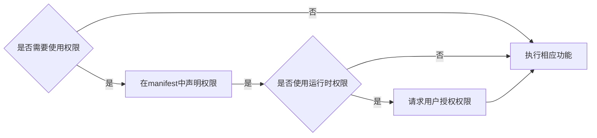

<!-- more -->

## Android权限分类


### 声明安装时权限
使用安装时权限，需要在`AndroidManifest.xml`文件中声明相应的权限：
```xml
<manifest ...>
    <uses-permission android:name="android.permission.***"/>
    <application ...>
        ...
    </application>
</manifest>
```
- `normal`级别的权限，只需要在声明中指定相应的权限就行
- `signature`级别的权限，需要通过系统签名打包APK
- `signature|privileged`级别的权限，不仅需要通过系统签名打包，也需要是系统应用（`/system/app`）或者特权系统应用（`/system/priv-app`），在9.0之后，Android引入了allow-list机制，对于特权应用`priv-app`，需要在`/system, /product, /vendor`等目录下的`/etc/permissions/priv-app/privapp-permissions-xxx.xml`声明应用可以使用的权限：

```xml
<permissions>
    <privapp-permissions package="xxx.xxx.xxx">
    <permission name="android.permission.xxx"/>
    ...
    </privapp-permissions>
    ...
</permissions>
```

### 请求运行时权限


## Android权限工作流



## Android权限机制


### 默认授权机制


<!-- 在`\etc\permissions\platform.xml`中：
```xml
<permissions>
    <permission name="android.permission.BLUETOOTH_ADMIN" >
        <group gid="net_bt_admin" />
    </permission>
    ...
</permissions>
```
，通过上述语句定义了每个权限对应的GID，包启动器在启动时会扫描`platform.xml`文件，并维护<permissions, GID>列表，给安装的包进行授权时，会将权限对应的GID分配给应用的补充GID

在创建一个进程时，每个进程都会从`Zygote`进程`fork`一个`CopyOnWrite`的子进程，在`com_android_internal_os_Zygote.cpp`中，定义了`specializeCommon`方法：
```java
static void SpecializeCommon(JNIEnv* env, uid_t uid, gid_t gid, jintArray gids, ...) {
    ...
    SetGids(env, gids, is_child_zygote, fail_fn);
    ...
}
``` -->
### 
