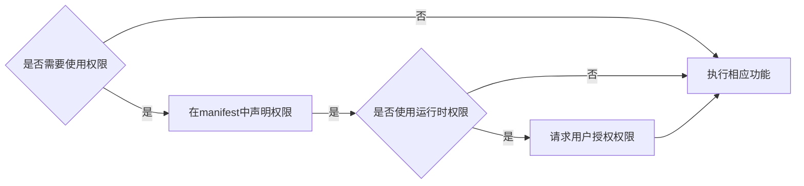

<!-- more -->

## Android权限分类


### 安装时权限
使用安装时权限，需要在`AndroidManifest.xml`文件中声明相应的权限：
```xml
<manifest ...>
    <uses-permission android:name="android.permission.***"/>
    <application ...>
        ...
    </application>
</manifest>
```
- `normal`级别的权限，只需要在声明中指定相应的权限就行
- `signature`级别的权限，需要通过系统签名打包APK
- `signature|normal`级别的权限，不仅需要通过系统签名打包，也需要是系统应用（`/system/app`）或者特权系统应用（`/system/priv-app`），在9.0之后，Android引入了allow-list机制，对于特权应用`priv-app`，需要在`/system, /product, /vendor`等目录下的`/etc/permissions/priv-app/privapp-permissions-xxx.xml`声明应用可以使用的权限：
```xml
<permissions>
    <privapp-permissions package="xxx.xxx.xxx">
    <permission name="android.permission.xxx"/>
    ...
    </privapp-permissions>
    ...
</permissions>
```

## Android权限工作流

