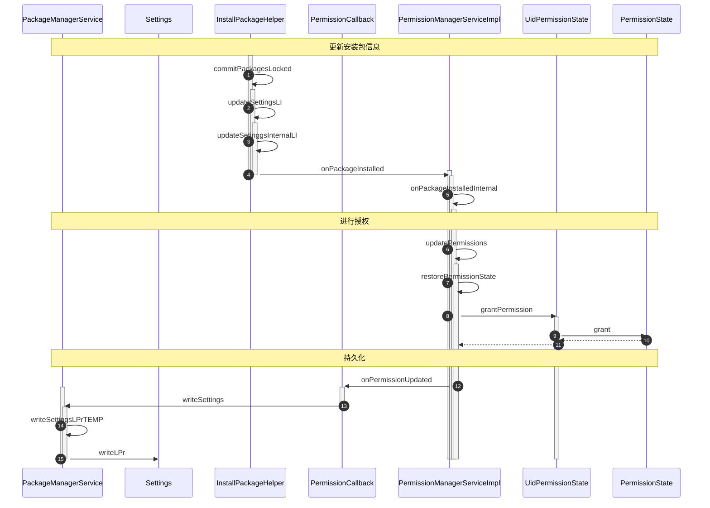

<!-- more -->

## Android权限分类


### 声明安装时权限
使用安装时权限，需要在`AndroidManifest.xml`文件中声明相应的权限：
```xml
<manifest ...>
    <uses-permission android:name="android.permission.***"/>
    <application ...>
        ...
    </application>
</manifest>
```
- `normal`级别的权限，只需要在声明中指定相应的权限就行
- `signature`级别的权限，需要通过系统签名打包APK
- `signature|privileged`级别的权限，不仅需要通过系统签名打包，也需要是系统应用（`/system/app`）或者特权系统应用（`/system/priv-app`），在9.0之后，Android引入了allow-list机制，对于特权应用`priv-app`，需要在`/system, /product, /vendor`等目录下的`/etc/permissions/priv-app/privapp-permissions-xxx.xml`声明应用可以使用的权限：

```xml
<permissions>
    <privapp-permissions package="xxx.xxx.xxx">
    <permission name="android.permission.xxx"/>
    ...
    </privapp-permissions>
    ...
</permissions>
```

### 请求运行时权限


## Android权限工作流


## Android权限机制


### 扫描目录授权

<!-- ```mermaid
sequenceDiagram
autonumber
participant PackageManagerService
participant InitAppsHelper
participant InstallPackageHelper

alt system app
PackageManagerService->> InitAppsHelper: initSystemApps
InitAppsHelper->> InitAppsHelper: scanSystemDirs
loop 扫描overlay包
InitAppsHelper->> InitAppsHelper: scandirTracedLI
end
InitAppsHelper->> InitAppsHelper: scandirTracedLI
loop 扫描特权应用包以及系统应用包
InitAppsHelper->> InitAppsHelper: scandirTracedLI
end
InitAppsHelper->>InstallPackageHelper: installPackagesFromDir
else not system app
PackageManagerService->> InitAppsHelper: initNonSystemApps
end
```
**initSystemApps** 
```java
public OverlayConfig initSystemApps(PackageParser2 packageParser,
            WatchedArrayMap<String, PackageSetting> packageSettings,
            int[] userIds, long startTime) {
    ...
    scanSystemDirs(packageParser, mExecutorService);
    ...
}
```

**scanSystemDirs**
```java
private void scanSystemDirs(PackageParser2 packageParser, ExecutorService executorService) {
    File frameworkDir = new File(Environment.getRootDirectory(), "framework");

    //扫描overlay包
    for (int i = mDirsToScanAsSystem.size() - 1; i >= 0; i--) {
        final ScanPartition partition = mDirsToScanAsSystem.get(i);
        if (partition.getOverlayFolder() == null) {
            continue;
        }
        scanDirTracedLI(partition.getOverlayFolder(),
                mSystemParseFlags, mSystemScanFlags | partition.scanFlag,
                packageParser, executorService, partition.apexInfo);
    }

    //扫描framwork层的包
    scanDirTracedLI(frameworkDir,
            mSystemParseFlags, mSystemScanFlags | SCAN_NO_DEX | SCAN_AS_PRIVILEGED,
            packageParser, executorService, null);
    ...

    for (int i = 0, size = mDirsToScanAsSystem.size(); i < size; i++) {
        final ScanPartition partition = mDirsToScanAsSystem.get(i);
        if (partition.getPrivAppFolder() != null) {
            //扫描特权应用目录下的包
            scanDirTracedLI(partition.getPrivAppFolder(),
                    mSystemParseFlags,
                    mSystemScanFlags | SCAN_AS_PRIVILEGED | partition.scanFlag,
                    packageParser, executorService, partition.apexInfo);
        }
        //扫描普通系统应用目录下的包
        scanDirTracedLI(partition.getAppFolder(),
                mSystemParseFlags, mSystemScanFlags | partition.scanFlag,
                packageParser, executorService, partition.apexInfo);
    }
}
```

**scanDirTracedLI**
```java
private void scanDirTracedLI(File scanDir, int parseFlags, int scanFlags,
        PackageParser2 packageParser, ExecutorService executorService,
        @Nullable ApexManager.ActiveApexInfo apexInfo) {
    ...
    try {
        ...
        mInstallPackageHelper.installPackagesFromDir(scanDir, parseFlags,
                scanFlags, packageParser, executorService, apexInfo);
    } 
    ...
}
```

**installPackagesFromDir**
```java
public void installPackagesFromDir(File scanDir, int parseFlags,
        int scanFlags, PackageParser2 packageParser, ExecutorService executorService,
        @Nullable ApexManager.ActiveApexInfo apexInfo) {
    final File[] files = scanDir.listFiles();
    ...
    ParallelPackageParser parallelPackageParser =
            new ParallelPackageParser(packageParser, executorService);

    int fileCount = 0;
    //通过parallelPackageParser解析目录下的包
    for (File file : files) {
        final boolean isPackage = (isApkFile(file) || file.isDirectory())
                && !PackageInstallerService.isStageName(file.getName());
        ...
        parallelPackageParser.submit(file, parseFlags);
        fileCount++;
    }

    for (; fileCount > 0; fileCount--) {
        ParallelPackageParser.ParseResult parseResult = parallelPackageParser.take();
        Throwable throwable = parseResult.throwable;
        ...
        if (throwable == null) {
            try {
                ...
                addForInitLI(parseResult.parsedPackage, parseFlags, scanFlags,
                        new UserHandle(UserHandle.USER_SYSTEM), apexInfo);
            } 
            ...
        } 
        ...
    }
}
```
**ParallelPackageParser**
```java
public void submit(File scanFile, int parseFlags) {
    mExecutorService.submit(() -> {
        ParseResult pr = new ParseResult();
        ...
        try {
            pr.scanFile = scanFile;
            pr.parsedPackage = parsePackage(scanFile, parseFlags);
        } 
        ...
    });
}

protected ParsedPackage parsePackage(File scanFile, int parseFlags)
        throws PackageManagerException {
    try {
        return mPackageParser.parsePackage(scanFile, parseFlags, true);
    } 
    ...
}
```

**PackageParser2**

```java
public ParsedPackage parsePackage(File packageFile, int flags, boolean useCaches)
        throws PackageParserException {
    ...
    ParseResult<ParsingPackage> result = mParsingUtils.parsePackage(input, packageFile, flags);
    ...
    ParsedPackage parsed = (ParsedPackage) result.getResult().hideAsParsed();
    ...
    return parsed;
}
``` -->

通过解析目录下的文件，解析出来的会是一个`PackageImpl`对象：
```java
public class PackageImpl implements ParsedPackage, AndroidPackageInternal,
        AndroidPackageHidden, ParsingPackage, ParsingPackageHidden, Parcelable {
    ...
    private String sharedUserId;

    private List<ParsedUsesPermission> usesPermissions = emptyList();
}
```


<!-- **addForInitLI**
```java
private AndroidPackage addForInitLI(ParsedPackage parsedPackage,
        @ParsingPackageUtils.ParseFlags int parseFlags,
        @PackageManagerService.ScanFlags int scanFlags,
        @Nullable UserHandle user, @Nullable ApexManager.ActiveApexInfo activeApexInfo)
        throws PackageManagerException {
    ...
    synchronized (mPm.mLock) {
        try {
            ...
            commitReconciledScanResultLocked(reconcileResult.get(0),
                    mPm.mUserManager.getUserIds());
        } 
        ...
    }
    ...
}
``` -->


<!-- 在`\etc\permissions\platform.xml`中：
```xml
<permissions>
    <permission name="android.permission.BLUETOOTH_ADMIN" >
        <group gid="net_bt_admin" />
    </permission>
    ...
</permissions>
```
，通过上述语句定义了每个权限对应的GID，包启动器在启动时会扫描`platform.xml`文件，并维护<permissions, GID>列表，给安装的包进行授权时，会将权限对应的GID分配给应用的补充GID

在创建一个进程时，每个进程都会从`Zygote`进程`fork`一个`CopyOnWrite`的子进程，在`com_android_internal_os_Zygote.cpp`中，定义了`specializeCommon`方法：
```java
static void SpecializeCommon(JNIEnv* env, uid_t uid, gid_t gid, jintArray gids, ...) {
    ...
    SetGids(env, gids, is_child_zygote, fail_fn);
    ...
}
``` -->
### 安装时授权



**onPackageInstalled**
```java
public void onPackageInstalled(@NonNull AndroidPackage pkg, int previousAppId,
        @NonNull PermissionManagerServiceInternal.PackageInstalledParams params,
        @UserIdInt int userId) {
    ...
    onPackageInstalledInternal(pkg, previousAppId, params, userIds);
}
```

**onPackageInstalledInternal**
```java
private void onPackageInstalledInternal(@NonNull AndroidPackage pkg, int previousAppId,
        @NonNull PermissionManagerServiceInternal.PackageInstalledParams params,
        @UserIdInt int[] userIds) {
    ...
    updatePermissions(pkg.getPackageName(), pkg);
    for (final int userId : userIds) {
        addAllowlistedRestrictedPermissionsInternal(pkg,
                params.getAllowlistedRestrictedPermissions(),
                FLAG_PERMISSION_WHITELIST_INSTALLER, userId);
        grantRequestedPermissionsInternal(pkg, params.getPermissionStates(), userId);
    }
}
```

**updatePermissions**
```java
private void updatePermissions(@NonNull String packageName, @Nullable AndroidPackage pkg) {
    final int flags =
            (pkg == null ? UPDATE_PERMISSIONS_ALL | UPDATE_PERMISSIONS_REPLACE_PKG
                    : UPDATE_PERMISSIONS_REPLACE_PKG);
    updatePermissions(
            packageName, pkg, getVolumeUuidForPackage(pkg), flags, mDefaultPermissionCallback);
}

private void updatePermissions(final @Nullable String changingPkgName,
        final @Nullable AndroidPackage changingPkg,
        final @Nullable String replaceVolumeUuid,
        @UpdatePermissionFlags int flags,
        final @Nullable PermissionCallback callback) {
    if ((flags & UPDATE_PERMISSIONS_ALL) != 0) {
        final boolean replaceAll = ((flags & UPDATE_PERMISSIONS_REPLACE_ALL) != 0);
        mPackageManagerInt.forEachPackage((AndroidPackage pkg) -> {
            ...
            restorePermissionState(pkg, replace, changingPkgName, callback,
                    UserHandle.USER_ALL);
        });
    }
    if (changingPkg != null) {
        ...
        restorePermissionState(changingPkg, replace, changingPkgName, callback,
                UserHandle.USER_ALL);
    }
}
```

**restorePermissionState**
```java
private void restorePermissionState(@NonNull AndroidPackage pkg, boolean replace,
        @Nullable String changingPackageName, @Nullable PermissionCallback callback,
        @UserIdInt int filterUserId) {
    final PackageStateInternal ps =
        mPackageManagerInt.getPackageStateInternal(pkg.getPackageName());
    ...

    for (final String permissionName : pkg.getRequestedPermissions()) {
        final Permission permission;
        synchronized (mLock) {
            permission = mRegistry.getPermission(permissionName);
        }
        if (permission == null) {
            continue;
        }
        //如果权限是privileged权限且在allowlist中进行了授权
        if (permission.isPrivileged()
                && checkPrivilegedPermissionAllowlist(pkg, ps, permission)) {
            if (isPrivilegedPermissionAllowlisted == null) {
                isPrivilegedPermissionAllowlisted = new ArraySet<>();
            }
            isPrivilegedPermissionAllowlisted.add(permissionName);
        }
        //如果权限是signature权限
        if (permission.isSignature() && (shouldGrantPermissionBySignature(pkg, permission)
                || shouldGrantPermissionByProtectionFlags(pkg, ps, permission,
                        shouldGrantPrivilegedPermissionIfWasGranted))) {
            if (shouldGrantSignaturePermission == null) {
                shouldGrantSignaturePermission = new ArraySet<>();
            }
            shouldGrantSignaturePermission.add(permissionName);
        }
        //内部权限
        if (permission.isInternal()
                && shouldGrantPermissionByProtectionFlags(pkg, ps, permission,
                        shouldGrantPrivilegedPermissionIfWasGranted)) {
            if (shouldGrantInternalPermission == null) {
                shouldGrantInternalPermission = new ArraySet<>();
            }
            shouldGrantInternalPermission.add(permissionName);
        }
    }

    //特定uid显式请求的权限
    Collection<String> uidRequestedPermissions;
    //特定uid隐式具有的权限
    Collection<String> uidImplicitPermissions;

    ...

    //进行权限授予的操作
    ...

    //调用callback的onPermissionUpdated方法
    if (callback != null) {
        callback.onPermissionUpdated(updatedUserIds,
                (changingPackageName != null && replace && installPermissionsChanged)
                        || runtimePermissionsRevoked, pkg.getUid());
    }
    
}
```
，方法维护了三个列表：` isPrivilegedPermissionAllowlisted`，`shouldGrantSignaturePermission`和`shouldGrantInternalPermission`，表示需要授予包的不同级别的权限，方法同时维护了两个集合：`uidRequestedPermissions`、`uidImplicitPermissions`，表示与应用声明的`sharedUserId`相同的其他应用声明的权限和该`sharedUserId`下的隐式权限

权限授予的逻辑大致如下图：


**grantPermission**

```java
public boolean grantPermission(@NonNull Permission permission) {
    final PermissionState permissionState = getOrCreatePermissionState(permission);
    return permissionState.grant();
}
```

**grant**
```java
public boolean grant() {
    synchronized (mLock) {
        if (mGranted) {
            return false;
        }
        mGranted = true;
        UidPermissionState.invalidateCache();
        return true;
    }
}
```

**onPermissionUpdate**

```java
private final PermissionCallback mDefaultPermissionCallback = new PermissionCallback() {
    ...

    @Override
    public void onInstallPermissionUpdated() {
        mPackageManagerInt.writeSettings(true);
    }
};
```
，`PermissionManagerServiceImpl`中声明了一个`mDefaultPermissionCallback`作为`permission`操作的`callback`调用对象，其`onInstallPermissionUpdated`方法在`restorePermissionState`方法中被调用，并调用`PackageMangerService::writeSettings`方法

**writeSettings & writeSettingsLPrTEMP**

```java
void writeSettings(boolean sync) {
    synchronized (mLock) {
        ...
        writeSettingsLPrTEMP(sync);
        ...
    }
}

void writeSettingsLPrTEMP(boolean sync) {
    snapshotComputer(false);
    mPermissionManager.writeLegacyPermissionsTEMP(mSettings.mPermissions);
    mSettings.writeLPr(mLiveComputer, sync);
}
```
