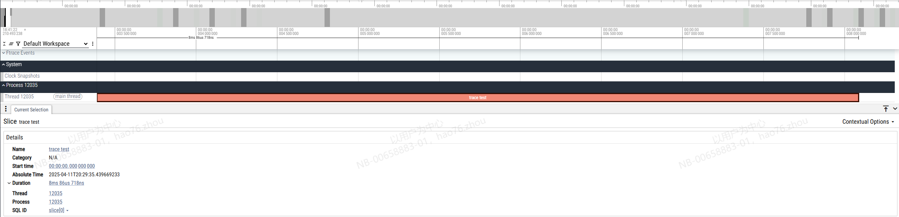
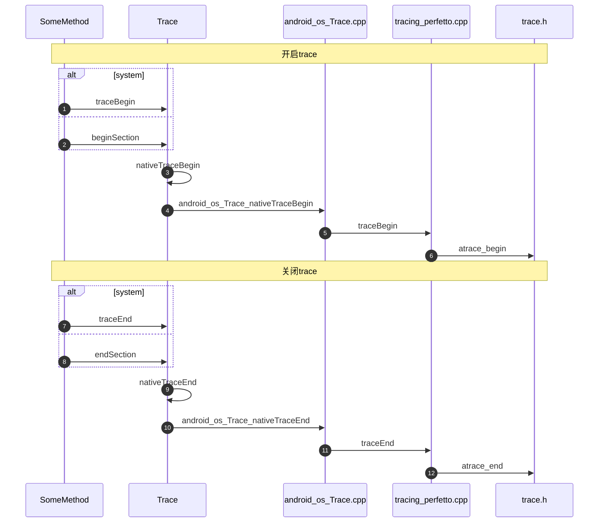

<!-- more -->
## Perfetto

### Perfetto结构


### Perfetto Buffer

#### Buffer 配置
在Perfetto 配置文件中，可以配置Buffer：
```json
buffers {
  size_kb: ...
  fill_policy: RING_BUFFER| DISCARD 
}
// long trace
write_into_file: true
file_write_period_ms: ...
max_file_size_bytes: ...
```
分别配置了buffer的大小和buffer的写入规则，buffer的写入规则分为三种：
1. 写满时停止写： DISCARD
2. 环形缓冲区： RING_BUFFER
3. 环形缓冲区写，被覆盖的数据写入文件 （long trace）：配置`write_into_file, file_write_period_ms, max_file_size_bytes`

#### Buffer 结构

**结构**
每个采集进程都对应一个Shared Memory Buffer，采集的数据都会放到这个Shared Memory Buffer中，在 Tracing Service中，每个Shared Memory Buffer都对应着一个Buffer， 每一个Shared Memory Buffer与Buffer的大小比例为1:1

Shared Memory Buffer 和 Buffer都由一系列Buffer Page组成


**写入流程**

- 当一个数据源需要写数据时，会找到一个空闲的Buffer Page, 将采集的数据写入到Page中，当Page写满后，采集进程会发送一个IPC请求给Tracing Service

- 当Tracing Service接收到IPC请求后，会将Page信息复制到Buffer中的下一个Page中

- 当Tracing Service写完Buffer后，会重新将Shared Memory Buffer中的Page设置为空闲

- 当采集过程结束时，采集进程会发送一个`Flush`命令给所有的数据源，这是所有数据源都会提交写入到Shared Memory Buffer中的数据，并由Tracing Service拷贝到Buffer中

### 使用Perfetto追踪自定义event

在函数中添加`Trace.beginSection(name)/Trace.endSection()`：
```java
private void setVisibleFragment(SettingItem item, SettingItem preItem){
    Trace.beginSection("trace test");
    ...
    Trace.endSection();
}
```
，设置Perfetto Config：
```json
buffers {
  size_kb: 65536
  fill_policy: RING_BUFFER
}
data_sources {
  config {
    name: "linux.ftrace"
    ftrace_config {
      atrace_apps: "com.example.carsettingapplication"
    }
  }
}
duration_ms: 2000
```
，保存到`config.pbtx`并运行命令：
```shell
cat config.pbtx | perfetto -c - --txt -o /data/misc/perfetto-traces/trace.pftrace
```
，导出文件到perfetto ui中：


## Java Trace如何调用atrace并写入ftrace的环形缓冲区

使用perfetto追踪自定义事件或者System Server中的一些事件时，都调用了Trace类中的静态方法，这些方法会将事件写入到ftrace的环形缓冲区中

### Trace调用atrace



**traceBegin/ beginSection**

使用`traceBegin`/`beginSection`方法开启trace，`traceBegin`支持自定义Tag，只能给System App使用，而`beginSection`给其他App使用，Tag默认为`TRACE_TAG_APP =  4096`
```java
@UnsupportedAppUsage
@SystemApi(client = MODULE_LIBRARIES)
public static void traceBegin(long traceTag, @NonNull String methodName) {
    if (isTagEnabled(traceTag)) {
        nativeTraceBegin(traceTag, methodName);
    }
}

public static void beginSection(@NonNull String sectionName) {
    if (isTagEnabled(TRACE_TAG_APP)) {
        ...
        nativeTraceBegin(TRACE_TAG_APP, sectionName);
    }
}
```
，两个方法都调用了`natvieTraceBegin`方法：

**nativeTraceBegin**
```java
private static native void nativeTraceBegin(long tag, String name);
```
，方法对应了一个JNI方法`android_os_Trace_nativeTraceBegin`：

**android_os_Trace_natvieTraceBegin**
```c++
static void android_os_Trace_nativeTraceBegin(JNIEnv* env, jclass,
        jlong tag, jstring nameStr) {
    withString(env, nameStr, [tag](const char* str) { tracing_perfetto::traceBegin(tag, str); });
}
```
，调用了`tracing_perfetto::traceBegin`方法：

**tracing_perfetto::traceBegin**
```c++
void traceBegin(uint64_t category, const char* name) {
  struct PerfettoTeCategory* perfettoTeCategory =
      internal::toPerfettoCategory(category);

  if (internal::shouldPreferAtrace(perfettoTeCategory, category)) {
    atrace_begin(category, name);
  } else if (internal::isPerfettoCategoryEnabled(perfettoTeCategory)) {
    internal::perfettoTraceBegin(*perfettoTeCategory, name);
  }
}
```
，如果`internal::shouldPreferAtrace`为真，则调用`atrace_begin`方法启用`atrace`开始trace

与开启trace相似，结束trace也有System App和其他App两种版本：

**traceEnd/ endSection**
```java
@UnsupportedAppUsage
@SystemApi(client = MODULE_LIBRARIES)
public static void traceEnd(long traceTag) {
    if (isTagEnabled(traceTag)) {
        nativeTraceEnd(traceTag);
    }
}

public static void endSection() {
    if (isTagEnabled(TRACE_TAG_APP)) {
        nativeTraceEnd(TRACE_TAG_APP);
    }
}
```
，都调用了`nativeTraceEnd`方法：

**nativeTraceEdd**

```java
private static native void nativeTraceEnd(long tag);
```
，对应了一个JNI方法`android_os_Trace_nativeTraceEnd`：

**android_os_Trace_nativeTraceEnd**

```c++
static void android_os_Trace_nativeTraceEnd(JNIEnv*, jclass, jlong tag) {
    tracing_perfetto::traceEnd(tag);
}
```
，调用了`tracing_perfetto::traceEnd`方法：

**tracing_perfetto::traceEnd**

```c++
void traceEnd(uint64_t category) {
  struct PerfettoTeCategory* perfettoTeCategory =
      internal::toPerfettoCategory(category);

  if (internal::shouldPreferAtrace(perfettoTeCategory, category)) {
    atrace_end(category);
  } else if (internal::isPerfettoCategoryEnabled(perfettoTeCategory)) {
    internal::perfettoTraceEnd(*perfettoTeCategory);
  }
}
```
，会调用`atrace_end`方法结束trace


### atrace用户空间事件写入到Ring Buffer
**实现方法：** 通过trace_marker 把相关trace 信息从用户空间注入到内核空间


观察`trace.h`中的`atrace_begin`方法：
```c++
static inline void atrace_begin(uint64_t tag, const char* name)
{
    if (CC_UNLIKELY(atrace_is_tag_enabled(tag))) {
        atrace_begin_body(name);
    }
}
```
，调用了`tracedev.cpp`中的`atrace_begin_body`方法：
```c++
void atrace_begin_body(const char* name)
{
    WRITE_MSG("B|%d|", "%s", "", name, "");
}
```
，执行了`trace-dev.inc`中定义的`WRITE_MSG`：
```c++
#define WRITE_MSG(format_begin, format_end, track_name, name, value) { \
    ...
    if (len > 0) { \
        write(atrace_marker_fd, buf, len); \
    } \
}
```
，执行后向`atrace_marker_fd`中写入了一行信息，为`B|pid|name`，表示开始记录trace并记录pid和name

`atrace_end`方法如下：
```c++
static inline void atrace_end(uint64_t tag)
{
    if (CC_UNLIKELY(atrace_is_tag_enabled(tag))) {
        atrace_end_body();
    }
}
```
，调用了`atrace_end_body`方法：
```cpp
void atrace_end_body()
{
    WRITE_MSG("E|%d", "%s", "", "", "");
}
```
，与`atrace_begin`相同，执行了`WRITE_MSG`，此时写入的信息为`E|pid`，表示结束记录trace

`trace_marker`的文件描述符，在`tracedev.cpp`中:
```c++
static void atrace_init_once()
{
    atrace_marker_fd = open("/sys/kernel/tracing/trace_marker", O_WRONLY | O_CLOEXEC);
    if (atrace_marker_fd == -1) {
        atrace_marker_fd = open("/sys/kernel/debug/tracing/trace_marker", O_WRONLY | O_CLOEXEC);
    }
    ...
}
```
，为了兼容不同版本，分别从`/sys/kernel/tracing/trace_marker`和`/sys/kernel/debug/tracing/trace_marker`中打开`trace_marker`文件

在Linux的`kernel/trace/trace.c`中，定义了`trace_marker`文件的写操作函数：
```c++
static ssize_t tracing_mark_write(struct file *filp, const char __user *ubuf,
					size_t cnt, loff_t *fpos)
{
    ...
 else {
		written = write_marker_to_buffer(tr, ubuf, cnt, ip);
	}

	return written;
}
```
，在执行写操作时，会调用`trace.c`的`write_marker_to_buffer`方法：
```c++
static ssize_t write_marker_to_buffer(struct trace_array *tr, const char __user *ubuf,
				      size_t cnt, unsigned long ip)
{
    //对ring buffer上锁，得到buffer中的最后一个事件
    event = __trace_buffer_lock_reserve(buffer, TRACE_PRINT, size,
					    tracing_gen_ctx());
    ...
    //根据最后一个事件得到相应的entry
    entry = ring_buffer_event_data(event);
    ...
    //将数据从user buffer copy 到 ring buffer
    len = __copy_from_user_inatomic(&entry->buf, ubuf, cnt);
    ...
    //提交写入并解锁buffer
    __buffer_unlock_commit(buffer, event);

    ...
}
```
，该方法会将marker写入到环形缓冲区中