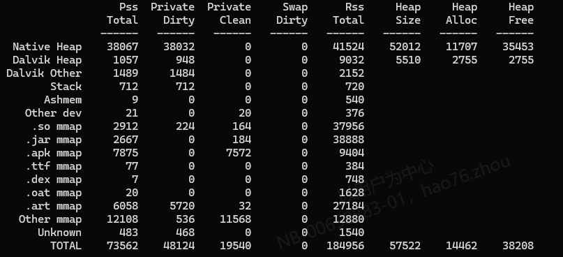
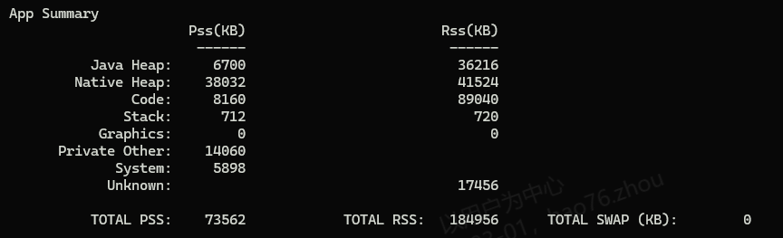
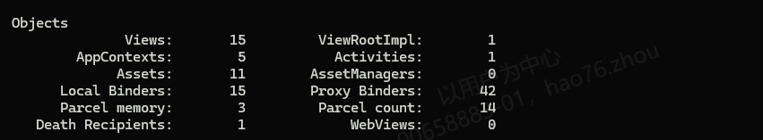
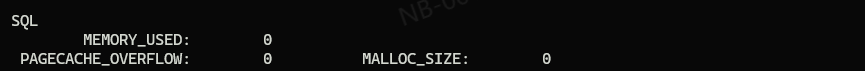
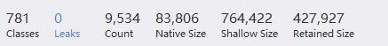
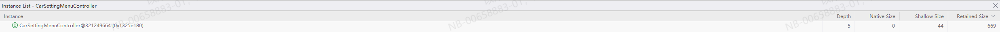

<!-- more -->

## 整体内存分析

使用`dumpsys`命令
```shell
dumpsys meminfo <pacakge-name>
```
包含下列信息：



包含Native的堆信息，Dalvik虚拟机的对信息，栈信息，共享内存Ashmem信息以及一些文件的mmap信息等

Pss和Rss分别表示两种实际使用内存的大小：


在多个进程使用一个共享库时，Rss在计算占用内存时，会将使用的共享库占用的所有内存计算在内，而Pss在计算占用时，则会按比例分配共享库所占用的内存

Private Dirty和Private Clean表示文件映射时内存中的脏数据与干净数据的大小

Swap Dirty表示使用交换内存时的脏数据大小

对于堆内存，还显示了堆内存的大小，分配的堆内存大小与空闲的堆内存大小



除了前述信息外，还对应用的Pss，Rss进行了summary，包含堆内存、代码区、栈、图形等信息




meminfo还对应用中的一些Android对象进行了计数，包括Activity、Binder、BinderProxy、Parcel等信息




还包含了一些SQLite相关的信息

## 堆内存分析

### 导出dump并查看

使用`am`提供的命令
```shell
am dumpheap <pid> <outputfile>
```
输出一个`.hprof`类型的文件，导入`profiler`，包含如下信息：



1. classses：类的数量
2. Leaks： 内存泄漏的次数
3. Count： 对象数量
4. Native Size： native内存的大小
5. Shallow Size：不包含引用对象大小时对象占用的内存
6. Retained Size： 包含引用对象大小时对象占用的内存

具体到每一个类，还包含了depth信息，表示其与GCRoot的距离


### Shallow Size与 Retained Size

一个对象在堆中由四部分组成：[对象头] + [父类成员变量] + [成员变量] + [对齐位]，一个引用类型的成员变量，其所实际占的内存为句柄的大小

在计算Shallow Size时，计算的实际上是所有对象占用的实际内存大小

计算Retained Size时，计算的是可以被同时回收的Shallow Size的大小之和，以下图为例：


计算A的Retained Size时，由于A没有任何的引用对象，于是其Retained Size = Shallow Size

计算B的Retained Size时，由于B引用了对象C，D而对象C由引用了对象E，然而GC Root指向了对象D，于是在垃圾回收B时，同时会回收C和E，B的Retained Size = Shallow Size of A + Shallow Size of C + Shallow Size of E