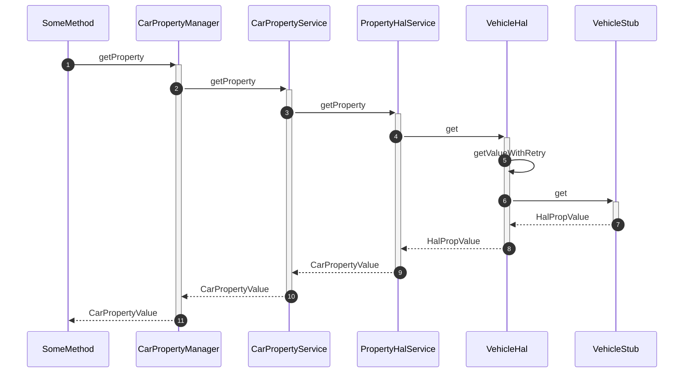
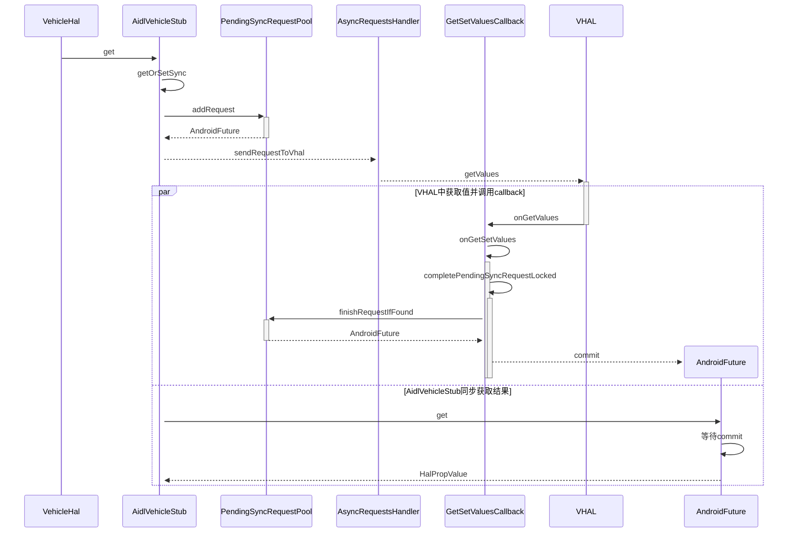
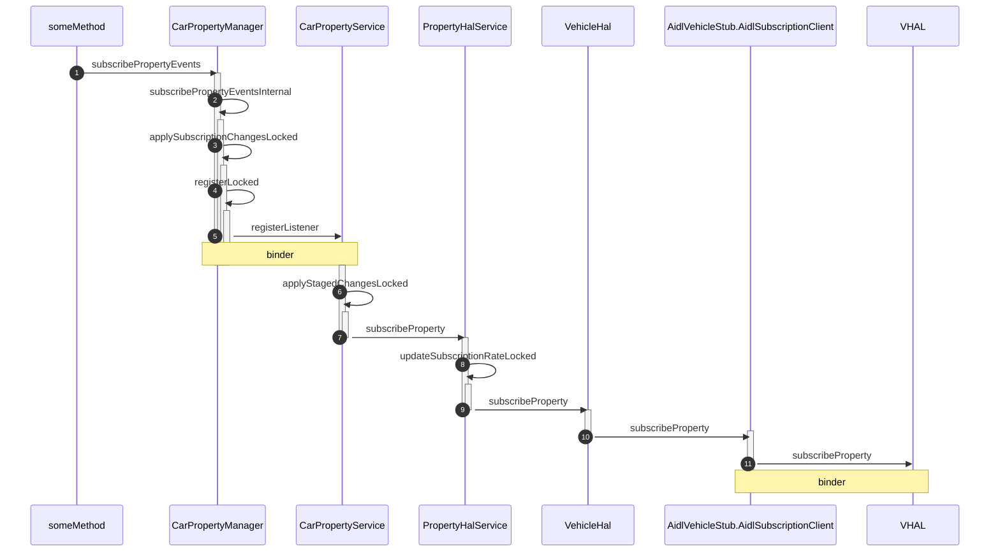
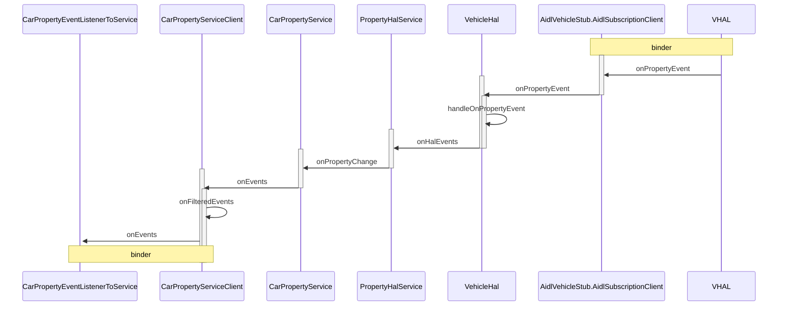
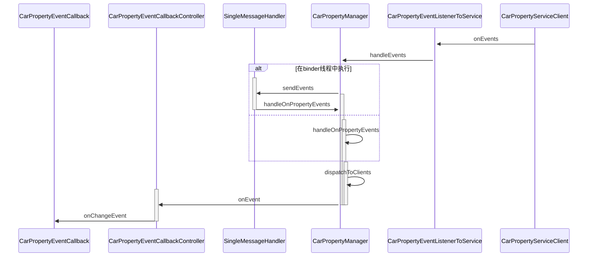
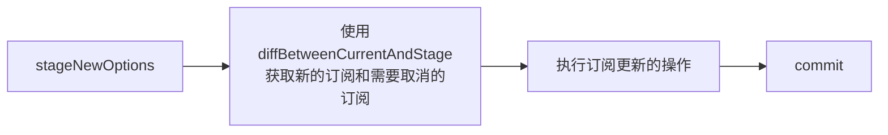
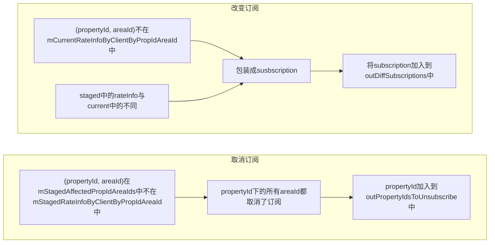

<!-- more -->

## 获取Property值

### 获取Property值的步骤

#### 获取Property直到VehicleStub的步骤


**第1步** 执行`getProperty`方法：

```java
public <E> CarPropertyValue<E> getProperty(int propertyId, int areaId) {
    ...
    try {
        CarPropertyValue<E> carPropertyValue = (CarPropertyValue<E>) (runSyncOperation(() -> {
            return mService.getProperty(propertyId, areaId);
        }));
        ...
        return carPropertyValue;
    }
    ...
}
```
，方法指定了相应的(propertyId, areaId)，并返回一个泛型类`CarPropertyValue`的实例。在方法中，通过同步操作使用了`mService.getProperty`方法调用了`CarPropertyService`的`getProperty`方法

**第2步** 执行`CarPropertyService::getProperty`方法：
```java
public CarPropertyValue getProperty(int propertyId, int areaId)
        throws IllegalArgumentException, ServiceSpecificException {
    ...
    try {
        return runSyncOperationCheckLimit(() -> {
            return mPropertyHalService.getProperty(propertyId, areaId);
        });
    }
    ...
}
```
，仍然通过一个同步操作执行了`PropertyHalService`的`getProperty`方法

**第3步** 执行`PropertyHalService::getProperty`方法：
```java
public CarPropertyValue getProperty(int mgrPropId, int areaId)
        throws IllegalArgumentException, ServiceSpecificException {
    int halPropId = managerToHalPropId(mgrPropId);

    HalPropValue halPropValue;
    HalPropConfig halPropConfig;
    //从cache中获取isStaticAndSystemPropertyLocked的property
    synchronized (mLock) {
        halPropConfig = mHalPropIdToPropConfig.get(halPropId);
        if (isStaticAndSystemPropertyLocked(mgrPropId)) {
            CarPropertyValue carPropertyValue = mStaticPropertyIdAreaIdCache.get(mgrPropId,
                    areaId);
            if (carPropertyValue != null) {
                ...
                return carPropertyValue;
            }
        }
    }
    //从VehicleHal中获取，并将isStaticAndSystemPropertyLocked的property存入cache
    halPropValue = mVehicleHal.get(halPropId, areaId);
    try {
        CarPropertyValue result = halPropValue.toCarPropertyValue(mgrPropId, halPropConfig);
        synchronized (mLock) {
            if (!isStaticAndSystemPropertyLocked(mgrPropId)) {
                return result;
            }
            mStaticPropertyIdAreaIdCache.put(mgrPropId, areaId, result);
            return result;
        }
    }
}
```
，在这一步，`PropertyHalService`主要干了如下几件事：

1. car property id 到 hal property id 的转换，以及 hal property value 到 car property value 的转换
2. 对于满足`isStaticAndSystemPropertyLocked`的property读写mStaticPropertyIdAreaIdCache
3. 从`VehicleHal`中通过`get`获取property值

**第4步** 执行`VehicleHal::get`方法：
```java
public HalPropValue get(int propertyId, int areaId)
        throws IllegalArgumentException, ServiceSpecificException {
    ...
    return getValueWithRetry(mPropValueBuilder.build(propertyId, areaId));
}
```
调用了`getValueWithRetry`方法

**第5步** 执行`getValueWithRetry`方法：
```java
private HalPropValue getValueWithRetry(HalPropValue value) {
    return getValueWithRetry(value, /* maxRetries= */ 0);
}
```
调用了另一个`getValueWithRetry`方法：
```java
private HalPropValue getValueWithRetry(HalPropValue value, int maxRetries) {
    HalPropValue result;
    ...
    try {
        result = invokeRetriable((requestValue) -> {
        ...
            try {
                return mVehicleStub.get(requestValue);
            } 
            ...
        }, "get", value, mMaxDurationForRetryMs, mSleepBetweenRetryMs, maxRetries);
    } 
    ...
    return result;
}
```
，方法调用了
``` java  
private static HalPropValue invokeRetriable(RetriableAction action,
        String operation, HalPropValue requestValue, long maxDurationForRetryMs,
        long sleepBetweenRetryMs, int maxRetries)
        throws ServiceSpecificException, IllegalArgumentException {
    Retrier retrier = new Retrier(action, operation, requestValue, maxDurationForRetryMs,
            sleepBetweenRetryMs, maxRetries);
    HalPropValue result = retrier.invokeAction();
    ...
    return result;
}
```
，传入的参数包括lambda形式的action，对应的value以及与重试相关的参数，并调用了`retrier.invokeAction`方法:
```java
HalPropValue invokeAction()
        throws ServiceSpecificException, IllegalArgumentException {
    mRetryCount++;
    try {
        return mAction.run(mRequestValue);
    }
    ...
}
```
，调用了lambda表达式中定义的run方法，最终调用了`mVehicleStub.get`方法

#### 获取Property从VehicleStub到VHAL的步骤



**第6步** 执行`AidlVehicleStub::get`方法：
```java
public HalPropValue get(HalPropValue requestedPropValue)
        throws RemoteException, ServiceSpecificException {
    long currentTime = System.currentTimeMillis();
    HalPropValue halPropValue = getOrSetSync(requestedPropValue,
            mPendingSyncGetValueRequestPool, new AsyncGetRequestsHandler(),
            (result) -> {
                ... 
                return mPropValueBuilder.build(result.prop);
            });
    ...
    return halPropValue;
}
```
，调用了`getOrSetSync`方法：
```java
private <VhalResultType> HalPropValue getOrSetSync(
        HalPropValue requestedPropValue,
        PendingSyncRequestPool<VhalResultType> pendingSyncRequestPool,
        AsyncRequestsHandler requestsHandler,
        Function<VhalResultType, HalPropValue> resultHandler)
        throws RemoteException, ServiceSpecificException {
    ...
    long vhalRequestId = mRequestId.getAndIncrement();

    //异步调用
    AndroidFuture<VhalResultType> resultFuture = pendingSyncRequestPool.addRequest(
            vhalRequestId);

    requestsHandler.allocateVhalRequestSize(1);
    requestsHandler.addVhalRequest(vhalRequestId, requestedPropValue);
    requestsHandler.sendRequestsToVhal(mAidlVehicle, mGetSetValuesCallback);

    boolean gotResult = false;

    //同步获取异步调用的结果
    try {
        ...
        VhalResultType result = resultFuture.get(mSyncOpTimeoutInMs,
                TimeUnit.MILLISECONDS);
        gotResult = true;
        return resultHandler.apply(result);
    } 
    ...
}
```
，方法通过`requestsHandler`向VHAL发送一个异步请求，并通过`resultFuture.get`这个同步方法获取结果并返回，在向VHAL发送一个异步请求时，传入了一个`mGetSetValuesCallback`，查看其定义：
```java
...
private final GetSetValuesCallback mGetSetValuesCallback;
...
mGetSetValuesCallback = new GetSetValuesCallback();
...
private final class GetSetValuesCallback extends IVehicleCallback.Stub {

    @Override
    public void onGetValues(GetValueResults responses) throws RemoteException {
        AidlVehicleStub.this.onGetValues(responses);
    }
    ...
}
```
，VHAL在执行完获取property值的操作后会调用这个callback的`onGetValues`方法


**第7步** 执行`requestHandler.sendRequestToVhal`方法，根据第6步传入的参数，可以看到`requestHandler`是`AsyncGetRequestHandler`的实例：
```java
public void sendRequestsToVhal(IVehicle iVehicle, GetSetValuesCallback callbackForVhal)
        throws RemoteException, ServiceSpecificException {
    ...
    GetValueRequests largeParcelableRequest = new GetValueRequests();
    largeParcelableRequest.payloads = mVhalRequestItems;
    largeParcelableRequest = (GetValueRequests) LargeParcelable.toLargeParcelable(
            largeParcelableRequest, () -> {
                GetValueRequests newRequests = new GetValueRequests();
                newRequests.payloads = new GetValueRequest[0];
                return newRequests;
    });

    try {
        ...
        iVehicle.getValues(callbackForVhal, largeParcelableRequest);
    } finally {
        LargeParcelable.closeFd(largeParcelableRequest.sharedMemoryFd);
        ...
    }
}
```
，通过binder调用了VHAL层的`getValues`方法

**第8步** VHAL在执行完获取property值的操作后通过binder调用callback的`onGetValues`方法：
```java
private void onGetValues(GetValueResults responses) {
    GetValueResults origResponses = (GetValueResults)
            LargeParcelable.reconstructStableAIDLParcelable(responses,
                    /* keepSharedMemory= */ false);
    ...
    onGetSetValues(origResponses.payloads, new AsyncGetResultsHandler(mPropValueBuilder),
            mPendingSyncGetValueRequestPool);
}
```
，调用了`onGetSetValues`方法

**第9步** 执行`onGetSetValues`方法：
```java
private <VhalResultType> void onGetSetValues(VhalResultType[] vhalResults,
        AsyncResultsHandler asyncResultsHandler,
        PendingSyncRequestPool<VhalResultType> pendingSyncRequestPool) {
    synchronized (mLock) {
        for (VhalResultType result : vhalResults) {
            long vhalRequestId = asyncResultsHandler.getVhalRequestId(result);
            //由于是同步调用，于是mPendingAsyncRequestPool不存在该条requestId
            if (!mPendingAsyncRequestPool.contains(vhalRequestId)) {
                    completePendingSyncRequestLocked(pendingSyncRequestPool, vhalRequestId, result);
                    continue;
            }
            ...
        }
    }
}
```
**第10步** 这一步执行`completePendingSyncRequestLocked`方法：
```java
private <VhalResultType> void completePendingSyncRequestLocked(
        PendingSyncRequestPool<VhalResultType> pendingSyncRequestPool, long vhalRequestId,
        VhalResultType result) {
    ...
    AndroidFuture<VhalResultType> pendingRequest =
            pendingSyncRequestPool.finishRequestIfFound(vhalRequestId);
    ...
    pendingRequest.complete(result);
    ...
}
```
，这一步首先调用`finishRequestIfFound`方法，设置相应的requestId的状态为执行完毕

**第11步** 执行`finishRequestIfFound`方法：
```java
@Nullable AndroidFuture<VhalResultType> finishRequestIfFound(long vhalRequestId) {
    synchronized (mSyncRequestPoolLock) {
        AndroidFuture<VhalResultType> pendingRequest =
                mPendingRequestsByVhalRequestId.get(vhalRequestId);
        mPendingRequestsByVhalRequestId.remove(vhalRequestId);
        return pendingRequest;
    }
}
```
，这一步会从`mPendingRequestsByVhalRequestId`移除相应的key并返回一个`AndroidFuture`

**第12步** 这一步通过`AndroidFuture`的`complete`方法设置result

**第9步** 在执行完`sendRequestToVhal`方法后，调用了`resultFuture.get`方法用来同步获取result

## 设置Property

**第1步** 执行`setProperty`方法：
```java
public <E> void setProperty(@NonNull Class<E> clazz, int propertyId, int areaId,
        @NonNull E val) {
    ...
    try {
        runSyncOperation(() -> {
            mService.setProperty(new CarPropertyValue<>(propertyId, areaId, val),
                    mCarPropertyEventToService);
            return null;
        });
    }
    ...
}
```

## 订阅Property

要订阅CarProperty属性，需要实现一个`CarPropertyEventCallback`接口的实例：
```java
private final CarPropertyManager.CarPropertyEventCallback XXX = new CarPropertyManager.CarPropertyEventCallback() {
    @Override
    public void onChangeEvent(CarPropertyValue carPropertyValue) {
        ...
    }
};
```
，其中定义了一个回调函数`onChangeEvent`，用于根据改变后的Property值进行相应的操作

下图展示了订阅Property事件所使用的类与一些成员对象：


### 注册call back

#### 时序图



#### 详细步骤

**第1步** 一个车辆设置的方法中使用`subscribePropertyEvents`方法注册一个callback，通常包含下述四种方法：

```java
//不指定area id，不指定update rate
public boolean subscribePropertyEvents(int propertyId,
        @NonNull CarPropertyEventCallback carPropertyEventCallback) {
    return subscribePropertyEvents(List.of(
            new Subscription.Builder(propertyId).setUpdateRateHz(DEFAULT_UPDATE_RATE_HZ)
            .build()), /* callbackExecutor= */ null, carPropertyEventCallback);
}

//不指定area id，指定update rate
public boolean subscribePropertyEvents(int propertyId,
        @FloatRange(from = 0.0, to = 100.0) float updateRateHz,
        @NonNull CarPropertyEventCallback carPropertyEventCallback) {
    return subscribePropertyEvents(List.of(
            new Subscription.Builder(propertyId).setUpdateRateHz(updateRateHz).build()),
            /* callbackExecutor= */ null, carPropertyEventCallback);
}

//指定area id，不指定update rate
public boolean subscribePropertyEvents(int propertyId, int areaId,
        @NonNull CarPropertyEventCallback carPropertyEventCallback) {
    return subscribePropertyEvents(List.of(
            new Subscription.Builder(propertyId).addAreaId(areaId).setUpdateRateHz(1f)
                    .build()),
            /* callbackExecutor= */ null, carPropertyEventCallback);
}

//指定area id，指定update rate
public boolean subscribePropertyEvents(int propertyId, int areaId,
        @FloatRange(from = 0.0, to = 100.0) float updateRateHz,
        @NonNull CarPropertyEventCallback carPropertyEventCallback) {
    Subscription subscription = new Subscription.Builder(propertyId).addAreaId(areaId)
            .setUpdateRateHz(updateRateHz).build();
    return subscribePropertyEvents(List.of(subscription), /* callbackExecutor= */ null,
            carPropertyEventCallback);
}
```
，一些参数的含义如下表：
|参数| |含义|
|-|-|-|
|propertyId|必选|需要监听的属性id|
|areaId|可选|车辆区域id|
|updateRateHz|可选，不选时设置为默认值|监听的频率|
|carPropertyEventCallback|必选|监听的回调入口|

，无论是哪种方法，最终都会被构造成一个`Subscription`类的实例，并调用下面的`subscribePropertyEvents`方法：

```java
public boolean subscribePropertyEvents(@NonNull List<Subscription> subscriptions,
        @Nullable @CallbackExecutor Executor callbackExecutor,
        @NonNull CarPropertyEventCallback carPropertyEventCallback) {
    requireNonNull(subscriptions);
    List<CarSubscription> subscribeOptions = convertToCarSubscribeOptions(subscriptions);
    return subscribePropertyEventsInternal(subscribeOptions, callbackExecutor,
            carPropertyEventCallback);
}
```

在上述方法中，首先会调用`convertToCarSubscirbeOptions`方法，将`Subcription`转化成`CarSubscription`：

```java
private List<CarSubscription> convertToCarSubscribeOptions(List<Subscription> subscriptions) {
    List<CarSubscription> carSubscribeOptions = new ArrayList<>();
    for (int i = 0; i < subscriptions.size(); i++) {
        Subscription clientOption = subscriptions.get(i);
        CarSubscription internalOption = new CarSubscription();
        internalOption.propertyId = clientOption.getPropertyId();
        internalOption.areaIds = clientOption.getAreaIds();
        internalOption.updateRateHz = clientOption.getUpdateRateHz();
        internalOption.enableVariableUpdateRate = clientOption.isVariableUpdateRateEnabled();
        internalOption.resolution = clientOption.getResolution();
        carSubscribeOptions.add(internalOption);
    }
    return carSubscribeOptions;
}
```
，在执行完`convertToCarSubscripbeOptions`方法后，调用`subscribePropertyEventsInternal`方法

**第2步** 执行`subscribePropertyEventsInternal`方法：

```java
private boolean subscribePropertyEventsInternal(List<CarSubscription> subscribeOptions,
        @Nullable @CallbackExecutor Executor callbackExecutor,
        CarPropertyEventCallback carPropertyEventCallback) {
    ...

    //初始化回调函数的Executor，若为空则设置为Car car的main executor
    if (callbackExecutor == null) {
        callbackExecutor = mExecutor;
    }

    List<CarSubscription> sanitizedSubscribeOptions;

    ...

    List<CarSubscription> updatedSubscribeOptions;

    synchronized (mLock) {

        CarPropertyEventCallbackController cpeCallbackController =
                mCpeCallbackToCpeCallbackController.get(carPropertyEventCallback);
        ...

        mSubscriptionManager.stageNewOptions(carPropertyEventCallback, sanitizedSubscribeOptions);
        /**
         * 这一步向CarPropertyService注册carPropertyEventCallback
         **/
        var maybeUpdatedCarSubscriptions = applySubscriptionChangesLocked();
        ...
        updatedSubscribeOptions = maybeUpdatedCarSubscriptions.get();

        //给callback指定一个controller
        if (cpeCallbackController == null) {
            cpeCallbackController =
                    new CarPropertyEventCallbackController(carPropertyEventCallback,
                            callbackExecutor);
            mCpeCallbackToCpeCallbackController.put(carPropertyEventCallback,
                    cpeCallbackController);
        }

        //向controller中添加要监听的property
        for (int i = 0; i < sanitizedSubscribeOptions.size(); i++) {
            CarSubscription option = sanitizedSubscribeOptions.get(i);
            int propertyId = option.propertyId;
            float sanitizedUpdateRateHz = option.updateRateHz;
            int[] areaIds = option.areaIds;

            //如果监听类型是变化时回调
            if (sanitizedUpdateRateHz == 0) {
                cpeCallbackController.addOnChangeProperty(propertyId, areaIds);
            } else {
            //如果监听类型是定时回调
                cpeCallbackController.addContinuousProperty(propertyId, areaIds,
                        sanitizedUpdateRateHz, option.enableVariableUpdateRate,
                        option.resolution);
            }
            //添加controller到Property的controller set中
            ArraySet<CarPropertyEventCallbackController> cpeCallbackControllerSet =
                    mPropIdToCpeCallbackControllerList.get(propertyId);
            if (cpeCallbackControllerSet == null) {
                cpeCallbackControllerSet = new ArraySet<>();
                mPropIdToCpeCallbackControllerList.put(propertyId, cpeCallbackControllerSet);
            }
            cpeCallbackControllerSet.add(cpeCallbackController);
        }
    }
    ...
    return true;
}
```

方法主要完成如下动作：

- 设置回调的执行线程池
- 创建一个CarPropertyEventCallbackController，指定对应的call back，对controller进行设置并加入到相应的map或者set中
- 调用`applySubscriptionChangesLocked`方法向`CarPropertyService`中注册call back

在`CarPropertyManager`，维护了两个map，分别是`mCpeCallbackToCpeCallbackController`和`mPropIdToCpeCallbackControllerList`


如上图所示，`mCpeCallbackToCpeCallbackController`保存了call back到controller的映射关系，以`CarPropertyEventCallback`为入口，映射为一个`CarPropertyCallbackController`对象

`mPropIdToCpeCallbackControllerList`保存了`propertyId`到`cpeCallbackControllerSet`的映射，而`cpeCallbackControllerSet`是一个`ArraySet`类的实例，其中保存了不同的`CarPropertyEventCallbackController`对象

**第3步** 执行`applySubscriptionChangesLocked`方法：

```java
@GuardedBy("mLock")
private Optional<List<CarSubscription>> applySubscriptionChangesLocked() {
    List<CarSubscription> updatedCarSubscriptions = new ArrayList<>();
    List<Integer> propertiesToUnsubscribe = new ArrayList<>();

    mSubscriptionManager.diffBetweenCurrentAndStage(updatedCarSubscriptions,
            propertiesToUnsubscribe);

    ...

    try {
        //需要注册的subscription
        if (!updatedCarSubscriptions.isEmpty()) {
            if (!registerLocked(updatedCarSubscriptions)) {
                ...
                mSubscriptionManager.dropCommit();
                return Optional.empty();
            }
        }

        ...
    } 
    ...

    mSubscriptionManager.commit();
    return Optional.of(updatedCarSubscriptions);
}
```
，调用了`registerLocked`方法

**第4步**，调用`registerLocked`方法，该方法通过binder调用`CarPropertyService`的`registerListener`方法

```java
private boolean registerLocked(List<CarSubscription> options) {
    try {
        mService.registerListener(options, mCarPropertyEventToService);
    } 
    ...
}
```
，方法向`CarPropertyService`注册了一个`mCarPropertyEventToService`对象，其定义如下：
```java
private static class CarPropertyEventListenerToService extends ICarPropertyEventListener.Stub {
    private final WeakReference<CarPropertyManager> mCarPropertyManager;

    CarPropertyEventListenerToService(CarPropertyManager carPropertyManager) {
        mCarPropertyManager = new WeakReference<>(carPropertyManager);
    }

    @Override
    public void onEvent(List<CarPropertyEvent> carPropertyEvents) throws RemoteException {
        CarPropertyManager carPropertyManager = mCarPropertyManager.get();
        if (carPropertyManager != null) {
            carPropertyManager.handleEvents(carPropertyEvents);
        }
    }
}
```
，可以看到，其继承了`ICarPropertyEventListener.Stub`，说明`registerListener`方法向`CarPropertyService`传递了一个binder对象


**第5步** 调用`CarPropertyService::registerListener`方法：

```java
public void registerListener(List<CarSubscription> carSubscriptions,
        ICarPropertyEventListener carPropertyEventListener)
        throws IllegalArgumentException, ServiceSpecificException {
    ...
    List<CarSubscription> sanitizedOptions =
            validateAndSanitizeSubscriptions(carSubscriptions);
    CarPropertyServiceClient finalClient;
    synchronized (mLock) {
        //创建一个client对象
        CarPropertyServiceClient client = getOrCreateClientForBinderLocked(
                carPropertyEventListener);
        if (client == null) {
            return;
        }
        ...
        //写入stage
        mSubscriptionManager.stageNewOptions(client, sanitizedOptions);

        //stage写入current
        try {
            applyStagedChangesLocked();
        } 
        ...
        mSubscriptionManager.commit();
        //设置client监听的property
        for (int i = 0; i < sanitizedOptions.size(); i++) {
            CarSubscription option = sanitizedOptions.get(i);
            if (option.updateRateHz != 0) {
                client.addContinuousProperty(
                        option.propertyId, option.areaIds, option.updateRateHz,
                        option.enableVariableUpdateRate, option.resolution);
            } else {
                client.addOnChangeProperty(option.propertyId, option.areaIds);
            }
        }
        finalClient = client;
    }
    ...
}
```
，在方法中，创建了一个`CarPropertyServiceClient`对象与传入的`carPropertyEventListener`对应
，在`CarPropertyService`中，存在一个map：`mClientMap`，保存了`carPropertyEventListener.mRemote`到`CarPropertyServiceClient`的映射


**第6步** 执行`applyStagedChangesLocked`方法：

```java
void applyStagedChangesLocked() throws ServiceSpecificException {
    List<CarSubscription> filteredSubscriptions = new ArrayList<>();
    List<Integer> propertyIdsToUnsubscribe = new ArrayList<>();
    mSubscriptionManager.diffBetweenCurrentAndStage(/* out */ filteredSubscriptions,
            /* out */ propertyIdsToUnsubscribe);
    ...
    if (!filteredSubscriptions.isEmpty()) {
        try {
            mPropertyHalService.subscribeProperty(filteredSubscriptions);
        } 
        ...
    }
    ...
}
```
，调用了`PropertyHalService::susbscribeProperty`方法

**第7步** 执行`PropertyHalService::susbscribeProperty`方法：

```java
public void subscribeProperty(List<CarSubscription> carSubscriptions)
        throws ServiceSpecificException {
    synchronized (mLock) {
        for (int i = 0; i < carSubscriptions.size(); i++) {
            ...
            mSubManager.stageNewOptions(new ClientType(CAR_PROP_SVC_REQUEST_ID),
                    List.of(newCarSubscription(halPropId, areaIds, updateRateHz,
                    carSubscription.enableVariableUpdateRate, carSubscription.resolution)));
        }
        try {
            updateSubscriptionRateLocked();
        }
        ...
    }
}
```
，调用了`updateSubscriptionRateLocked`方法

**第8步** 执行`updateSubscriptionRateLocked`方法：

```java
private void updateSubscriptionRateLocked() throws ServiceSpecificException {
    ArrayList<CarSubscription> diffSubscribeOptions = new ArrayList<>();
    List<Integer> propIdsToUnsubscribe = new ArrayList<>();
    mSubManager.diffBetweenCurrentAndStage(diffSubscribeOptions, propIdsToUnsubscribe);
    try {
        if (!diffSubscribeOptions.isEmpty()) {
            ...
            mVehicleHal.subscribeProperty(this, toHalSubscribeOptions(diffSubscribeOptions));
        }
        ...
        mSubManager.commit();
    }
    ...
}
```
，调用了`VehicleHal::subscribeProperty`方法，传入的参数包含`this`，观察`PropertyHalService`的定义：
```java
public class PropertyHalService extends HalServiceBase 
```
，继承了`HalServiceBase`类

**第9步** 执行`VehicleHal::subscribeProperty`方法，方法创建了一个数组`SubscribeOptions[] subscribeOptions`用于记录监听选项

```java
public void subscribeProperty(HalServiceBase service, List<HalSubscribeOptions>
        halSubscribeOptions) throws IllegalArgumentException, ServiceSpecificException {
    synchronized (mLock) {
        PairSparseArray<RateInfo> previousState = cloneState(mRateInfoByPropIdAreaId);
        SubscribeOptions[] subscribeOptions = createVhalSubscribeOptionsLocked(
                service, halSubscribeOptions);
        ...
        try {
            mSubscriptionClient.subscribe(subscribeOptions);
        }
        ...
    }
}
```
，然后调用了`mSubscriptionClient.subscribe`方法，`mSubscriptionClient`的定义与赋值语句如下：
```java
private final SubscriptionClient mSubscriptionClient;
```
```java
mVehicleStub = vehicle;
mSubscriptionClient = vehicle.newSubscriptionClient(this);
```
，传入的参数为`this`，观察`VehicleHal`的类定义：
```java
public class VehicleHal implements VehicleHalCallback, CarSystemService
```
，可以看到，其实现了`VehicleHalCallBack`接口
，`SubscriptionClient`类定义如下：
```java
public abstract class VehicleStub {
    public interface SubscriptionClient {
        void subscribe(SubscribeOptions[] options) throws RemoteException, ServiceSpecificException;
        void unsubscribe(int prop) throws RemoteException, ServiceSpecificException;
        void registerSupportedValuesChange(List<PropIdAreaId> propIdAreaIds);
        void unregisterSupportedValuesChange(List<PropIdAreaId> propIdAreaIds);
    }
    ...
}
```
，如果使用AIDL与HAL层交互，则`mVehicleStub`为`AidlVehicleStub`类的实例，有：
```java
public SubscriptionClient newSubscriptionClient(VehicleHalCallback callback) {
    return new AidlSubscriptionClient(callback, mPropValueBuilder);
}

private class AidlSubscriptionClient extends IVehicleCallback.Stub
        implements SubscriptionClient {
    private final VehicleHalCallback mCallback;
    private final HalPropValueBuilder mBuilder;

    AidlSubscriptionClient(VehicleHalCallback callback, HalPropValueBuilder builder) {
        mCallback = callback;
        mBuilder = builder;
    }
    ...
}
```
，可以看到`AidlSubscriptionClient`继承了`IVehicleCallback#Stub`类，并实现了`SubscriptionClient`接口


**第10步** 执行`AidlSubscriptionClient::subscribe`方法，调用了`mAidlVehicle.subscribe`方法
```java
public void subscribe(SubscribeOptions[] options)
        throws RemoteException, ServiceSpecificException {
    mAidlVehicle.subscribe(this, options, /* maxSharedMemoryFileCount= */ 2);
}
```
`mAidlVehicle`的定义如下：
```java
private final IVehicle mAidlVehicle;
```
，`IVehicle`为AIDL自动生成的接口，对应的AIDL定义如下：
```java
interface IVehicle {
    const long INVALID_MEMORY_ID = 0;
    const int MAX_SHARED_MEMORY_FILES_PER_CLIENT = 3;
    ...
    void subscribe(in IVehicleCallback callback, in SubscribeOptions[] options,
            int maxSharedMemoryFileCount);
}
```
，说明使用binder调用了VHAL层的`subscribe`方法

### VHAL

观察`IVehicle.aidl`内容：
```java
interface IVehicle {
    void subscribe(in IVehicleCallback callback, in SubscribeOptions[] options,
            int maxSharedMemoryFileCount);
    ...
}
```
，其中定义了订阅property的接口。观察`IVehicleCallback.aidl`内容：
```java
interface IVehicleCallback {
    oneway void onPropertyEvent(in VehiclePropValues propValues, int sharedMemoryFileCount);
    ...
}
```
，可以看到，其中定义了一个oneway的调用`onPropertyEvent`，用于返回执行callback方法

### 回调call back

#### 在VHAL和car system service中的步骤


**第1步** 对于VHAL而言，`AidlSubscriptionClient`是一个实现了`IVehicleCallback`接口的远程binder对象，通过`binder`调用其`onPropertyEvent`方法：
```java
public void onPropertyEvent(VehiclePropValues propValues, int sharedMemoryFileCount)
        throws RemoteException {
    VehiclePropValues origPropValues = (VehiclePropValues)
            LargeParcelable.reconstructStableAIDLParcelable(propValues,
                    /* keepSharedMemory= */ false);
    ArrayList<HalPropValue> values = new ArrayList<>(origPropValues.payloads.length);
    for (VehiclePropValue value : origPropValues.payloads) {
        values.add(mBuilder.build(value));
    }
    mCallback.onPropertyEvent(values);
}
```
，方法首先将`VehiclePropValues`转换成了`HalPropValue`的列表，然后调用了`mCallback.onPropertyEvent`方法

**第2步** 对于`AidlSubscriptionClient`而言，`VehicleHal`是一个`VehicleHalCallback`类型的对象`mCallback`，于是，执行其`onPropertyEvent`方法：
```java
public void onPropertyEvent(ArrayList<HalPropValue> propValues) {
    mHandler.post(() -> handleOnPropertyEvent(propValues));
}
```
，通过handler线程的looper执行`handleOnPropertyEvent`方法

**第3步** 执行`handleOnPropertyEvent`方法：
```java
private void handleOnPropertyEvent(List<HalPropValue> propValues) {
    synchronized (mLock) {
        //将service需要接收的property value加入到service的dispatch list中
        //将需要通知的service加入到mServicesToDispatch列表
        for (int i = 0; i < propValues.size(); i++) {
            HalPropValue v = propValues.get(i);
            int propId = v.getPropId();
            HalServiceBase service = mPropertyHandlers.get(propId);
            ...
            service.getDispatchList().add(v);
            mServicesToDispatch.add(service);
            ...
        }
    }
    //回调service的onHalEvents方法，并清空对应的dispatch list
    for (HalServiceBase s : mServicesToDispatch) {
        s.onHalEvents(s.getDispatchList());
        s.getDispatchList().clear();
    }
    //清空 mServicesToDispatch
    mServicesToDispatch.clear();
}
```
，可以看到，方法从`mPropertyHandlers`中获取了`propertyId`对应的`HalServiceBase`，并将property的新值放入到其dispatch list中，查看`mPropertyHandlers`的定义：
```java
private final SparseArray<HalServiceBase> mPropertyHandlers = new SparseArray<>();
```
，可以看到其是一个`SpraseArray`类型的对象，存储了`propertyId`到`HalServiceBase`的映射。然后，方法会调用每个`HalServiceBase`的`onHalEvents`方法进行回调，并对dispatch list 和 `mServicesToDispatch`进行清空

**第4步**对于`VehicleHal`而言，`PropertyHalService`是一个`HalServiceBase`的实例，执行其`onHalEvents`方法：
```java
public void onHalEvents(List<HalPropValue> halPropValues) {

    List<CarPropertyEvent> eventsToDispatch = new ArrayList<>();

    ...
    Map<VehicleStubCallback, List<GetSetValueResultWrapper>> callbackToSetValueResults =
            new ArrayMap<>();

    synchronized (mLock) {
        for (HalPropValue halPropValue : halPropValues) {
            ...
            //获取propId并从hal的propId转换为manager的propId
            int halPropId = halPropValue.getPropId();
            ...
            int mgrPropId = halToManagerPropId(halPropId);
            ...
            try {
                //将halPropertyValue转换为carPropertyValue
                CarPropertyValue<?> carPropertyValue = halPropValue.toCarPropertyValue(
                        mgrPropId, halPropConfig);
                //创建一个Event对象
                CarPropertyEvent carPropertyEvent = new CarPropertyEvent(
                        CarPropertyEvent.PROPERTY_EVENT_PROPERTY_CHANGE, carPropertyValue);
                eventsToDispatch.add(carPropertyEvent);
                ...
            }
            ...
        }
        ...
    }

    PropertyHalListener propertyHalListener;
    synchronized (mLock) {
        propertyHalListener = mPropertyHalListener;
    }
    //执行回调
    if (propertyHalListener != null) {
        propertyHalListener.onPropertyChange(eventsToDispatch);
    }
    ...
}
```
，将VHAL的property转换为对应的Car property并调用`propertyHalListener.onPropertyChange`方法执行回调，其中`propertyHalListener`与`mPropertyHalListener`为同一引用，都指向了`CarPropertyService`（`PropertyHalService`视其为`PropertyHalListener`的一个实例）

**第5步** 执行`onPropertyChange`方法：
```java
public void onPropertyChange(List<CarPropertyEvent> events) {
    Map<CarPropertyServiceClient, List<CarPropertyEvent>> eventsToDispatch = new ArrayMap<>();
    synchronized (mLock) {
        for (int i = 0; i < events.size(); i++) {
            CarPropertyEvent event = events.get(i);
            int propId = event.getCarPropertyValue().getPropertyId();
            int areaId = event.getCarPropertyValue().getAreaId();

            //获取与(propId, areaId)对应的CarPropertyServiceCLient实例
            Set<CarPropertyServiceClient> clients = mSubscriptionManager.getClients(
                    propId, areaId);
            ...
            //将CarPropertyServiceCLient实例与event列表的对应关系保存到eventsToDispatch中
            for (CarPropertyServiceClient client : clients) {
                List<CarPropertyEvent> eventsForClient = eventsToDispatch.get(client);
                if (eventsForClient == null) {
                    eventsToDispatch.put(client, new ArrayList<CarPropertyEvent>());
                }
                eventsToDispatch.get(client).add(event);
            }
        }
    }
    //执行回调
    for (CarPropertyServiceClient client : eventsToDispatch.keySet()) {
        try {
            client.onEvent(eventsToDispatch.get(client));
        }
        ...
    }
}
```
，获取(propId, areaId)对应的`CarPropertyServiceClient`后，将event与client的对应关系存储到一个map中，然后调用`client.onEvent`方法执行回调

**第6步** 执行`CarPropertyServiceClient::onEvent`方法：
```java
public void onEvent(List<CarPropertyEvent> events) throws RemoteException {
    List<CarPropertyEvent> filteredEvents = new ArrayList<>();
    ...
    onFilteredEvents(filteredEvents);
}
```
，调用了`onFilteredEvents`方法

**第7步** 执行`onFilteredEvents`方法：
```java
public void onFilteredEvents(List<CarPropertyEvent> events) throws RemoteException {
    if (!events.isEmpty()) {
        mListener.onEvent(events);
    }
}
```
，`mListener`保存了对`CarPropertyManager`中`mCarPropertyToService`的binder引用，通过binder调用了其`onEvent`方法

#### 在CarPropertyManager中的步骤



**第8步** 执行`CarPropertyManager#CarPropertyEventListenerToService::onEvent`方法：
```java
public void onEvent(List<CarPropertyEvent> carPropertyEvents) throws RemoteException {
    CarPropertyManager carPropertyManager = mCarPropertyManager.get();
    if (carPropertyManager != null) {
        carPropertyManager.handleEvents(carPropertyEvents);
    }
}
```
，方法调用了`CarPropertyManager`的`handleEvents`方法

**第9步** 执行`handleEvents`方法：
```java
private void handleEvents(List<CarPropertyEvent> carPropertyEvents) {
    if (mHandler == null) {
        ...
        return;
    }
    if (mFeatureFlags.handlePropertyEventsInBinderThread()) {
        handleCarPropertyEvents(carPropertyEvents);
    } else {
        mHandler.sendEvents(carPropertyEvents);
    }
}
```
，分为两种情况，如果设置在binder线程中执行回调，则直接调用`handleCarPropertyEvents`方法，否则，执行`mHandler.sendEvents`发送事件

**第10步** 观察`mHandler`的定义：
```java
mHandler = new SingleMessageHandler<>(eventHandler.getLooper(), MSG_GENERIC_EVENT) {
    @Override
    protected void handleEvent(CarPropertyEvent carPropertyEvent) {
        handleCarPropertyEvents(List.of(carPropertyEvent));
    }
};
```
，可以看到其最终也调用到了`handleCarProperyEvents`方法：
```java
private void handleCarPropertyEvents(List<CarPropertyEvent> carPropertyEvents) {
    SparseArray<List<CarPropertyEvent>> carPropertyEventsByPropertyId = new SparseArray<>();
    ...

    var eventsDispatchList = new EventDispatchList();


    //根据property id将CarPropertyEventCallbackController与event集合对应起来，并加入到`eventsDispatchList`中
    synchronized (mLock) {
        for (int i = 0; i < carPropertyEventsByPropertyId.size(); i++) {
            int propertyId = carPropertyEventsByPropertyId.keyAt(i);
            List<CarPropertyEvent> eventsForPropertyId =
                    carPropertyEventsByPropertyId.valueAt(i);
            ArraySet<CarPropertyEventCallbackController> cpeCallbackControllerSet =
                    mPropIdToCpeCallbackControllerList.get(propertyId);
            if (cpeCallbackControllerSet == null) {
                ...
                return;
            }
            for (int j = 0; j < cpeCallbackControllerSet.size(); j++) {
                var callback = cpeCallbackControllerSet.valueAt(j);
                eventsDispatchList.addEvents(callback, eventsForPropertyId);
            }
        }
    }

    ...
    //执行回调
    eventsDispatchList.dispatchToClients();
}
```
，并调用了`EventDispatchList::dispatchToClients`方法

**第11步** 执行`dispatchToClients`方法：
```java
public void dispatchToClients() {
    for (int i = 0; i < mEventsByClient.size(); i++) {
        ...
        dispatchToClient(mEventsByClient.keyAt(i), mEventsByClient.valueAt(i));
    }
    mEventsByClient.clear();
}
```
，调用了另一个`dispatchToClient`方法：
```java
private static class EventDispatchList extends
        DispatchList<CarPropertyEventCallbackController, CarPropertyEvent> {
    @Override
    protected void dispatchToClient(CarPropertyEventCallbackController client,
            List<CarPropertyEvent> events) {
        for (int j = 0; j < events.size(); j++) {
            client.onEvent(events.get(j));
        }
    }
}
```
，调用了`CarPropertyEventCallbackController`的`onEvent`方法

**第12步** 执行`CarPropertyEventCallbackController`的`onEvent`方法：
```java
public void onEvent(CarPropertyEvent carPropertyEvent) {
    ...
    CarPropertyEvent updatedCarPropertyEvent;
    ...
    switch (updatedCarPropertyEvent.getEventType()) {
        case CarPropertyEvent.PROPERTY_EVENT_PROPERTY_CHANGE:
            mExecutor.execute(() -> mCarPropertyEventCallback.onChangeEvent(carPropertyValue));
            break;
        case CarPropertyEvent.PROPERTY_EVENT_ERROR:
            ...
        default:
            ...
    }
}
```
，可以看到，在这一步中，通过在注册call back时设置的回调函数执行线程池`mExecutor`执行`CarPropertyEventCallback`的`onChangeEvent`方法

### SubscriptionManager：Property订阅管理（API $\geq$ 35）

结合上述流程可以看到，在`CarPropertyManager`、`CarPropertySerivce`和`PropertyHalService`中，都使用了`SubscriptionManager`，用于管理Property订阅的状态，使用的流程如下：


在`SubscriptionManager`中，定义了两个map和一个set：
```java
public final class SubscriptionManager<ClientType> {
    ...
    PairSparseArray<RateInfoForClients<ClientType>> mCurrentRateInfoByClientByPropIdAreaId =
        new PairSparseArray<>();
    PairSparseArray<RateInfoForClients<ClientType>> mStagedRateInfoByClientByPropIdAreaId =
        new PairSparseArray<>();
    ArraySet<int[]> mStagedAffectedPropIdAreaIds = new ArraySet<>();
    ...
}
```
，其中，`mCurrentRateInfoByClientByPropIdAreaId`和`mStagedRateInfoByClientByPropIdAreaId`记录了`ProperId & areaId`与`RateInfoForClients`的映射关系，`RateInfoClients`的定义如下：
```java
private static final class RateInfoForClients<ClientType> {
    private final ArrayMap<ClientType, RateInfo> mRateInfoByClient;
    private final TreeSet<Float> mUpdateRatesHz;
    private final ArrayMap<Float, Integer> mClientCountByUpdateRateHz;
    private final TreeSet<Float> mResolutions;
    private final ArrayMap<Float, Integer> mClientCountByResolution;
    ...
}
```
，通过一个map映射了`ClientType`与`RateInfo`，一个map记录了不同频率下的`ClientType`数，一个map记录了不同resolution下的`ClientType`数，并使用两个Treeset记录了不同的频率和resolution


#### stageNewOptions

```java
public void stageNewOptions(ClientType client, List<CarSubscription> options) {
    cloneCurrentToStageIfClean();
    for (int i = 0; i < options.size(); i++) {
        CarSubscription option = options.get(i);
        int propertyId = option.propertyId;
        for (int areaId : option.areaIds) {
            mStagedAffectedPropIdAreaIds.add(new int[]{propertyId, areaId});
            if (mStagedRateInfoByClientByPropIdAreaId.get(propertyId, areaId) == null) {
                mStagedRateInfoByClientByPropIdAreaId.put(propertyId, areaId,
                        new RateInfoForClients<>());
            }
            mStagedRateInfoByClientByPropIdAreaId.get(propertyId, areaId).add(
                    client, option.updateRateHz, option.enableVariableUpdateRate,
                    option.resolution);
        }
    }
}
```
，首先通过
```java
private void cloneCurrentToStageIfClean() {
    if (!mStagedAffectedPropIdAreaIds.isEmpty()) {
        return;
    }

    mStagedRateInfoByClientByPropIdAreaId = new PairSparseArray<>();
    for (int i = 0; i < mCurrentRateInfoByClientByPropIdAreaId.size(); i++) {
        int[] keyPair = mCurrentRateInfoByClientByPropIdAreaId.keyPairAt(i);
        mStagedRateInfoByClientByPropIdAreaId.put(keyPair[0], keyPair[1],
                new RateInfoForClients<>(
                        mCurrentRateInfoByClientByPropIdAreaId.valueAt(i)));
    }
}
```
将` mCurrentRateInfoByClientByPropIdAreaId`中的数据拷贝到空的`mStagedRateInfoByClientByPropIdAreaId`中，然后根据`options`中的内容插入到`mStagedRateInfoByClientByPropIdAreaId`中

#### diffBetweenCurrentAndStage

```java
public void diffBetweenCurrentAndStage(List<CarSubscription> outDiffSubscriptions,
        List<Integer> outPropertyIdsToUnsubscribe) {
    //如果没有staged则直接返回
    if (mStagedAffectedPropIdAreaIds.isEmpty()) {
        ...
        return;
    }
    ArraySet<Integer> possiblePropIdsToUnsubscribe = new ArraySet<>();
    PairSparseArray<RateInfo> diffRateInfoByPropIdAreaId = new PairSparseArray<>();
    for (int i = 0; i < mStagedAffectedPropIdAreaIds.size(); i++) {
        int[] propIdAreaId = mStagedAffectedPropIdAreaIds.valueAt(i);
        int propertyId = propIdAreaId[0];
        int areaId = propIdAreaId[1];

        //如果staged的map中没有记录(propertyId, areaId)对应的内容，则加入可能取消订阅的属性列表
        if (!mStagedRateInfoByClientByPropIdAreaId.contains(propertyId, areaId)) {
            ...
            possiblePropIdsToUnsubscribe.add(propertyId);
            continue;
        }

        RateInfo newCombinedRateInfo = mStagedRateInfoByClientByPropIdAreaId
                .get(propertyId, areaId).getCombinedRateInfo();

        //如果在current的map中没有记录(propertyId, areaId)对应的内容
        // 或者记录的rateInfo与staged中的rateInfo不同
        // 则是需要改变订阅状态的propertyId
        if (!mCurrentRateInfoByClientByPropIdAreaId.contains(propertyId, areaId)
                || !(mCurrentRateInfoByClientByPropIdAreaId
                        .get(propertyId, areaId).getCombinedRateInfo()
                        .equals(newCombinedRateInfo))) {
            ...
            diffRateInfoByPropIdAreaId.put(propertyId, areaId, newCombinedRateInfo);
            continue;
        }
    }
    outDiffSubscriptions.addAll(getCarSubscription(diffRateInfoByPropIdAreaId));
    //当且仅当一个propertyId下所有的areaId都被取消订阅，才取消对propertyId的订阅
    for (int i = 0; i < possiblePropIdsToUnsubscribe.size(); i++) {
        int possiblePropIdToUnsubscribe = possiblePropIdsToUnsubscribe.valueAt(i);
        if (mStagedRateInfoByClientByPropIdAreaId.getSecondKeysForFirstKey(
                possiblePropIdToUnsubscribe).isEmpty()) {
            ...
            outPropertyIdsToUnsubscribe.add(possiblePropIdToUnsubscribe);
        }
    }
}
```
方法`diffBetweenCurrentAndStage`用于比较`current`和`staged`中的不同并更新两个列表：`outDiffSubscriptions`和`outPropertyIdsToUnsubscribe`，前者用于记录需要改变订阅状态的propertyId，后者用于记录需要取消订阅的propertyId，相关的判断条件如下：


#### commit 和 dropCommit

```java
public void commit() {
    if (mStagedAffectedPropIdAreaIds.isEmpty()) {
        ...
        return;
    }
    mCurrentRateInfoByClientByPropIdAreaId = mStagedRateInfoByClientByPropIdAreaId;
    mStagedAffectedPropIdAreaIds.clear();
}

public void dropCommit() {
    if (mStagedAffectedPropIdAreaIds.isEmpty()) {
        ...
        return;
    }
    mStagedRateInfoByClientByPropIdAreaId = mCurrentRateInfoByClientByPropIdAreaId;
    mStagedAffectedPropIdAreaIds.clear();
}
```
，`commit`方法将` mStagedRateInfoByClientByPropIdAreaId`写入`mCurrentRateInfoByClientByPropIdAreaId`并清空`mStagedAffectedPropIdAreaIds`，相反，`dropCommit`方法将`mCurrentRateInfoByClientByPropIdAreaId`写入` mStagedRateInfoByClientByPropIdAreaId`并清空`mStagedAffectedPropIdAreaIds`

