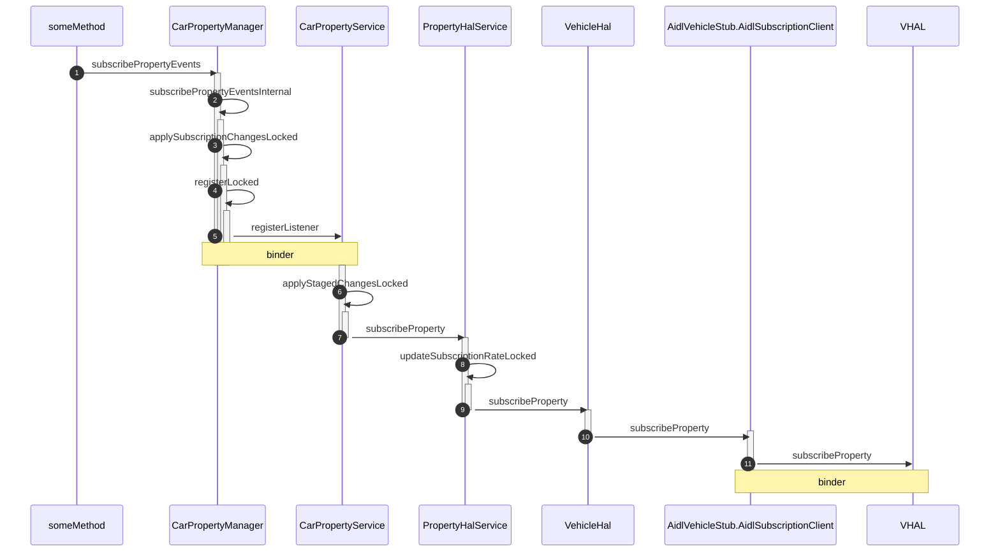
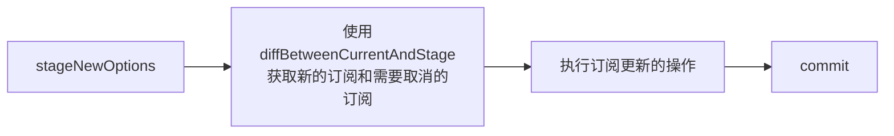

<!-- more -->

## 订阅Property


### 注册Property监听回调接口

#### 时序图



#### 详细步骤

**第1步** 一个车辆设置的方法中使用`subscribePropertyEvents`方法注册一个callback，通常包含下述四种方法：

```java
//不指定area id，不指定update rate
public boolean subscribePropertyEvents(int propertyId,
        @NonNull CarPropertyEventCallback carPropertyEventCallback) {
    return subscribePropertyEvents(List.of(
            new Subscription.Builder(propertyId).setUpdateRateHz(DEFAULT_UPDATE_RATE_HZ)
            .build()), /* callbackExecutor= */ null, carPropertyEventCallback);
}

//不指定area id，指定update rate
public boolean subscribePropertyEvents(int propertyId,
        @FloatRange(from = 0.0, to = 100.0) float updateRateHz,
        @NonNull CarPropertyEventCallback carPropertyEventCallback) {
    return subscribePropertyEvents(List.of(
            new Subscription.Builder(propertyId).setUpdateRateHz(updateRateHz).build()),
            /* callbackExecutor= */ null, carPropertyEventCallback);
}

//指定area id，不指定update rate
public boolean subscribePropertyEvents(int propertyId, int areaId,
        @NonNull CarPropertyEventCallback carPropertyEventCallback) {
    return subscribePropertyEvents(List.of(
            new Subscription.Builder(propertyId).addAreaId(areaId).setUpdateRateHz(1f)
                    .build()),
            /* callbackExecutor= */ null, carPropertyEventCallback);
}

//指定area id，指定update rate
public boolean subscribePropertyEvents(int propertyId, int areaId,
        @FloatRange(from = 0.0, to = 100.0) float updateRateHz,
        @NonNull CarPropertyEventCallback carPropertyEventCallback) {
    Subscription subscription = new Subscription.Builder(propertyId).addAreaId(areaId)
            .setUpdateRateHz(updateRateHz).build();
    return subscribePropertyEvents(List.of(subscription), /* callbackExecutor= */ null,
            carPropertyEventCallback);
}
```
，一些参数的含义如下表：
|参数| |含义|
|-|-|-|
|propertyId|必选|需要监听的属性id|
|areaId|可选|车辆区域id|
|updateRateHz|可选，不选时设置为默认值|监听的频率|
|carPropertyEventCallback|必选|监听的回调入口|

，无论是哪种方法，最终都会被构造成一个`Subscription`类的实例，并调用下面的`subscribePropertyEvents`方法：

```java
public boolean subscribePropertyEvents(@NonNull List<Subscription> subscriptions,
        @Nullable @CallbackExecutor Executor callbackExecutor,
        @NonNull CarPropertyEventCallback carPropertyEventCallback) {
    requireNonNull(subscriptions);
    List<CarSubscription> subscribeOptions = convertToCarSubscribeOptions(subscriptions);
    return subscribePropertyEventsInternal(subscribeOptions, callbackExecutor,
            carPropertyEventCallback);
}
```

在上述方法中，首先会调用`convertToCarSubscirbeOptions`方法，将`Subcription`转化成`CarSubscription`：

```java
private List<CarSubscription> convertToCarSubscribeOptions(List<Subscription> subscriptions) {
    List<CarSubscription> carSubscribeOptions = new ArrayList<>();
    for (int i = 0; i < subscriptions.size(); i++) {
        Subscription clientOption = subscriptions.get(i);
        CarSubscription internalOption = new CarSubscription();
        internalOption.propertyId = clientOption.getPropertyId();
        internalOption.areaIds = clientOption.getAreaIds();
        internalOption.updateRateHz = clientOption.getUpdateRateHz();
        internalOption.enableVariableUpdateRate = clientOption.isVariableUpdateRateEnabled();
        internalOption.resolution = clientOption.getResolution();
        carSubscribeOptions.add(internalOption);
    }
    return carSubscribeOptions;
}
```
，在执行完`convertToCarSubscripbeOptions`方法后，调用`subscribePropertyEventsInternal`方法

**第2步** 执行`subscribePropertyEventsInternal`方法：

```java
private boolean subscribePropertyEventsInternal(List<CarSubscription> subscribeOptions,
        @Nullable @CallbackExecutor Executor callbackExecutor,
        CarPropertyEventCallback carPropertyEventCallback) {
    ...

    //初始化回调函数的Executor，若为空则设置为Car car的main executor
    if (callbackExecutor == null) {
        callbackExecutor = mExecutor;
    }

    List<CarSubscription> sanitizedSubscribeOptions;

    ...

    List<CarSubscription> updatedSubscribeOptions;

    synchronized (mLock) {

        CarPropertyEventCallbackController cpeCallbackController =
                mCpeCallbackToCpeCallbackController.get(carPropertyEventCallback);
        ...

        mSubscriptionManager.stageNewOptions(carPropertyEventCallback, sanitizedSubscribeOptions);
        /**
         * 这一步向CarPropertyService注册carPropertyEventCallback
         **/
        var maybeUpdatedCarSubscriptions = applySubscriptionChangesLocked();
        ...
        updatedSubscribeOptions = maybeUpdatedCarSubscriptions.get();

        //给callback指定一个controller
        if (cpeCallbackController == null) {
            cpeCallbackController =
                    new CarPropertyEventCallbackController(carPropertyEventCallback,
                            callbackExecutor);
            mCpeCallbackToCpeCallbackController.put(carPropertyEventCallback,
                    cpeCallbackController);
        }

        //向controller中添加要监听的property
        for (int i = 0; i < sanitizedSubscribeOptions.size(); i++) {
            CarSubscription option = sanitizedSubscribeOptions.get(i);
            int propertyId = option.propertyId;
            float sanitizedUpdateRateHz = option.updateRateHz;
            int[] areaIds = option.areaIds;

            //如果监听类型是变化时回调
            if (sanitizedUpdateRateHz == 0) {
                cpeCallbackController.addOnChangeProperty(propertyId, areaIds);
            } else {
            //如果监听类型是定时回调
                cpeCallbackController.addContinuousProperty(propertyId, areaIds,
                        sanitizedUpdateRateHz, option.enableVariableUpdateRate,
                        option.resolution);
            }
            //添加controller到Property的controller set中
            ArraySet<CarPropertyEventCallbackController> cpeCallbackControllerSet =
                    mPropIdToCpeCallbackControllerList.get(propertyId);
            if (cpeCallbackControllerSet == null) {
                cpeCallbackControllerSet = new ArraySet<>();
                mPropIdToCpeCallbackControllerList.put(propertyId, cpeCallbackControllerSet);
            }
            cpeCallbackControllerSet.add(cpeCallbackController);
        }
    }

    ...

    //触发initial value事件
    try {
        mService.getAndDispatchInitialValue(getInitialValuePropIdAreaIds,
                mCarPropertyEventToService);
    }

    ...

    return true;
}
```

方法主要完成如下动作：

- 设置回调的执行线程池
- 创建一个CarPropertyEventCallbackController，指定对应的call back，对controller进行设置并加入到相应的map或者set中
- 调用`applySubscriptionChangesLocked`方法向`CarPropertyService`中注册call back

在`CarPropertyManager`，维护了两个map，分别是`mCpeCallbackToCpeCallbackController`和`mPropIdToCpeCallbackControllerList`


如上图所示，`mCpeCallbackToCpeCallbackController`保存了call back到controller的映射关系，以`CarPropertyEventCallback`为入口，映射为一个`CarPropertyCallbackController`对象

`mPropIdToCpeCallbackControllerList`保存了`propertyId`到`cpeCallbackControllerSet`的映射，而`cpeCallbackControllerSet`是一个`ArraySet`类的实例，其中保存了不同的`CarPropertyEventCallbackController`对象

**第3步** 执行`applySubscriptionChangesLocked`方法：

```java
@GuardedBy("mLock")
private Optional<List<CarSubscription>> applySubscriptionChangesLocked() {
    List<CarSubscription> updatedCarSubscriptions = new ArrayList<>();
    List<Integer> propertiesToUnsubscribe = new ArrayList<>();

    mSubscriptionManager.diffBetweenCurrentAndStage(updatedCarSubscriptions,
            propertiesToUnsubscribe);

    ...

    try {
        //需要注册的subscription
        if (!updatedCarSubscriptions.isEmpty()) {
            if (!registerLocked(updatedCarSubscriptions)) {
                ...
                mSubscriptionManager.dropCommit();
                return Optional.empty();
            }
        }

        ...
    } 
    ...

    mSubscriptionManager.commit();
    return Optional.of(updatedCarSubscriptions);
}
```
，调用了`registerLocked`方法

**第4步**，调用`registerLocked`方法，该方法通过binder调用`CarPropertyService`的`registerListener`方法

```java
private boolean registerLocked(List<CarSubscription> options) {
    try {
        mService.registerListener(options, mCarPropertyEventToService);
    } 
    ...
}
```
，方法向`CarPropertyService`注册了一个`mCarPropertyEventToService`对象，其定义如下：
```java
private static class CarPropertyEventListenerToService extends ICarPropertyEventListener.Stub {
    private final WeakReference<CarPropertyManager> mCarPropertyManager;

    CarPropertyEventListenerToService(CarPropertyManager carPropertyManager) {
        mCarPropertyManager = new WeakReference<>(carPropertyManager);
    }

    @Override
    public void onEvent(List<CarPropertyEvent> carPropertyEvents) throws RemoteException {
        CarPropertyManager carPropertyManager = mCarPropertyManager.get();
        if (carPropertyManager != null) {
            carPropertyManager.handleEvents(carPropertyEvents);
        }
    }
}
```
，可以看到，其继承了`ICarPropertyEventListener.Stub`，说明`registerListener`方法向`CarPropertyService`传递了一个binder对象


**第5步** 调用`CarPropertyService::registerListener`方法：

```java
public void registerListener(List<CarSubscription> carSubscriptions,
        ICarPropertyEventListener carPropertyEventListener)
        throws IllegalArgumentException, ServiceSpecificException {
    ...
    List<CarSubscription> sanitizedOptions =
            validateAndSanitizeSubscriptions(carSubscriptions);
    CarPropertyServiceClient finalClient;
    synchronized (mLock) {
        //创建一个client对象
        CarPropertyServiceClient client = getOrCreateClientForBinderLocked(
                carPropertyEventListener);
        if (client == null) {
            return;
        }
        ...
        //写入stage
        mSubscriptionManager.stageNewOptions(client, sanitizedOptions);

        //stage写入current
        try {
            applyStagedChangesLocked();
        } 
        ...
        mSubscriptionManager.commit();
        //设置client监听的property
        for (int i = 0; i < sanitizedOptions.size(); i++) {
            CarSubscription option = sanitizedOptions.get(i);
            if (option.updateRateHz != 0) {
                client.addContinuousProperty(
                        option.propertyId, option.areaIds, option.updateRateHz,
                        option.enableVariableUpdateRate, option.resolution);
            } else {
                client.addOnChangeProperty(option.propertyId, option.areaIds);
            }
        }
        finalClient = client;
    }
    ...
}
```
，在方法中，创建了一个`CarPropertyServiceClient`对象与传入的`carPropertyEventListener`对应
，在`CarPropertyService`中，存在一个map：`mClientMap`，保存了`carPropertyEventListener.mRemote`到`CarPropertyServiceClient`的映射


**第6步** 执行`applyStagedChangesLocked`方法：

```java
void applyStagedChangesLocked() throws ServiceSpecificException {
    List<CarSubscription> filteredSubscriptions = new ArrayList<>();
    List<Integer> propertyIdsToUnsubscribe = new ArrayList<>();
    mSubscriptionManager.diffBetweenCurrentAndStage(/* out */ filteredSubscriptions,
            /* out */ propertyIdsToUnsubscribe);
    ...
    if (!filteredSubscriptions.isEmpty()) {
        try {
            mPropertyHalService.subscribeProperty(filteredSubscriptions);
        } 
        ...
    }
    ...
}
```
，调用了`PropertyHalService::susbscribeProperty`方法

**第7步** 执行`PropertyHalService::susbscribeProperty`方法：

```java
public void subscribeProperty(List<CarSubscription> carSubscriptions)
        throws ServiceSpecificException {
    synchronized (mLock) {
        for (int i = 0; i < carSubscriptions.size(); i++) {
            ...
            mSubManager.stageNewOptions(new ClientType(CAR_PROP_SVC_REQUEST_ID),
                    List.of(newCarSubscription(halPropId, areaIds, updateRateHz,
                    carSubscription.enableVariableUpdateRate, carSubscription.resolution)));
        }
        try {
            updateSubscriptionRateLocked();
        }
        ...
    }
}
```
，调用了`updateSubscriptionRateLocked`方法

**第8步** 执行`updateSubscriptionRateLocked`方法：

```java
private void updateSubscriptionRateLocked() throws ServiceSpecificException {
    ArrayList<CarSubscription> diffSubscribeOptions = new ArrayList<>();
    List<Integer> propIdsToUnsubscribe = new ArrayList<>();
    mSubManager.diffBetweenCurrentAndStage(diffSubscribeOptions, propIdsToUnsubscribe);
    try {
        if (!diffSubscribeOptions.isEmpty()) {
            ...
            mVehicleHal.subscribeProperty(this, toHalSubscribeOptions(diffSubscribeOptions));
        }
        ...
        mSubManager.commit();
    }
    ...
}
```
，调用了`VehicleHal::subscribeProperty`方法，传入的参数包含`this`，观察`PropertyHalService`的定义：
```java
public class PropertyHalService extends HalServiceBase 
```
，继承了`HalServiceBase`类

**第9步** 执行`VehicleHal::subscribeProperty`方法，方法创建了一个数组`SubscribeOptions[] subscribeOptions`用于记录监听选项

```java
public void subscribeProperty(HalServiceBase service, List<HalSubscribeOptions>
        halSubscribeOptions) throws IllegalArgumentException, ServiceSpecificException {
    synchronized (mLock) {
        PairSparseArray<RateInfo> previousState = cloneState(mRateInfoByPropIdAreaId);
        SubscribeOptions[] subscribeOptions = createVhalSubscribeOptionsLocked(
                service, halSubscribeOptions);
        ...
        try {
            mSubscriptionClient.subscribe(subscribeOptions);
        }
        ...
    }
}
```
，然后调用了`mSubscriptionClient.subscribe`方法，`mSubscriptionClient`的定义与赋值语句如下：
```java
private final SubscriptionClient mSubscriptionClient;
```
```java
mVehicleStub = vehicle;
mSubscriptionClient = vehicle.newSubscriptionClient(this);
```
，传入的参数为`this`，观察`VehicleHal`的类定义：
```java
public class VehicleHal implements VehicleHalCallback, CarSystemService
```
，可以看到，其实现了`VehicleHalCallBack`接口
，`SubscriptionClient`类定义如下：
```java
public abstract class VehicleStub {
    public interface SubscriptionClient {
        void subscribe(SubscribeOptions[] options) throws RemoteException, ServiceSpecificException;
        void unsubscribe(int prop) throws RemoteException, ServiceSpecificException;
        void registerSupportedValuesChange(List<PropIdAreaId> propIdAreaIds);
        void unregisterSupportedValuesChange(List<PropIdAreaId> propIdAreaIds);
    }
    ...
}
```
，如果使用AIDL与HAL层交互，则`mVehicleStub`为`AidlVehicleStub`类的实例，有：
```java
public SubscriptionClient newSubscriptionClient(VehicleHalCallback callback) {
    return new AidlSubscriptionClient(callback, mPropValueBuilder);
}

private class AidlSubscriptionClient extends IVehicleCallback.Stub
        implements SubscriptionClient {
    private final VehicleHalCallback mCallback;
    private final HalPropValueBuilder mBuilder;

    AidlSubscriptionClient(VehicleHalCallback callback, HalPropValueBuilder builder) {
        mCallback = callback;
        mBuilder = builder;
    }
    ...
}
```
，可以看到`AidlSubscriptionClient`继承了`IVehicleCallback#Stub`类，并实现了`SubscriptionClient`接口


**第10步** 执行`AidlSubscriptionClient::subscribe`方法，调用了`mAidlVehicle.subscribe`方法
```java
public void subscribe(SubscribeOptions[] options)
        throws RemoteException, ServiceSpecificException {
    mAidlVehicle.subscribe(this, options, /* maxSharedMemoryFileCount= */ 2);
}
```
`mAidlVehicle`的定义如下：
```java
private final IVehicle mAidlVehicle;
```
，`IVehicle`为AIDL自动生成的接口，对应的AIDL定义如下：
```java
interface IVehicle {
    const long INVALID_MEMORY_ID = 0;
    const int MAX_SHARED_MEMORY_FILES_PER_CLIENT = 3;
    ...
    void subscribe(in IVehicleCallback callback, in SubscribeOptions[] options,
            int maxSharedMemoryFileCount);
}
```
，说明使用binder调用了VHAL层的`subscribe`方法

### SubscriptionManager：Property订阅管理

结合上述流程可以看到，在`CarPropertyManager`、`CarPropertySerivce`和`PropertyHalService`中，都使用了`SubscriptionManager`，用于管理Property订阅的状态，使用的流程如下：


在`SubscriptionManager`中，定义了两个map和一个set：
```java
public final class SubscriptionManager<ClientType> {
    ...
    PairSparseArray<RateInfoForClients<ClientType>> mCurrentRateInfoByClientByPropIdAreaId =
        new PairSparseArray<>();
    PairSparseArray<RateInfoForClients<ClientType>> mStagedRateInfoByClientByPropIdAreaId =
        new PairSparseArray<>();
    ArraySet<int[]> mStagedAffectedPropIdAreaIds = new ArraySet<>();
    ...
}
```
，其中，`mCurrentRateInfoByClientByPropIdAreaId`和`mStagedRateInfoByClientByPropIdAreaId`记录了`ProperId & areaId`与`RateInfoForClients`的映射关系，`RateInfoClients`的定义如下：
```java
private static final class RateInfoForClients<ClientType> {
    private final ArrayMap<ClientType, RateInfo> mRateInfoByClient;
    private final TreeSet<Float> mUpdateRatesHz;
    private final ArrayMap<Float, Integer> mClientCountByUpdateRateHz;
    private final TreeSet<Float> mResolutions;
    private final ArrayMap<Float, Integer> mClientCountByResolution;
    ...
}
```
，通过一个map映射了`ClientType`与`RateInfo`，一个map记录了不同频率下的`ClientType`数，一个map记录了不同resolution下的`ClientType`数，并使用两个Treeset记录了不同的频率和resolution


#### stageNewOptions


```java
public void stageNewOptions(ClientType client, List<CarSubscription> options) {
    cloneCurrentToStageIfClean();
    for (int i = 0; i < options.size(); i++) {
        CarSubscription option = options.get(i);
        int propertyId = option.propertyId;
        for (int areaId : option.areaIds) {
            mStagedAffectedPropIdAreaIds.add(new int[]{propertyId, areaId});
            if (mStagedRateInfoByClientByPropIdAreaId.get(propertyId, areaId) == null) {
                mStagedRateInfoByClientByPropIdAreaId.put(propertyId, areaId,
                        new RateInfoForClients<>());
            }
            mStagedRateInfoByClientByPropIdAreaId.get(propertyId, areaId).add(
                    client, option.updateRateHz, option.enableVariableUpdateRate,
                    option.resolution);
        }
    }
}
```
，首先通过
```java
private void cloneCurrentToStageIfClean() {
    if (!mStagedAffectedPropIdAreaIds.isEmpty()) {
        return;
    }

    mStagedRateInfoByClientByPropIdAreaId = new PairSparseArray<>();
    for (int i = 0; i < mCurrentRateInfoByClientByPropIdAreaId.size(); i++) {
        int[] keyPair = mCurrentRateInfoByClientByPropIdAreaId.keyPairAt(i);
        mStagedRateInfoByClientByPropIdAreaId.put(keyPair[0], keyPair[1],
                new RateInfoForClients<>(
                        mCurrentRateInfoByClientByPropIdAreaId.valueAt(i)));
    }
}
```
将` mCurrentRateInfoByClientByPropIdAreaId`中的数据拷贝到空的`mStagedRateInfoByClientByPropIdAreaId`中，然后根据`options`中的内容插入到`mStagedRateInfoByClientByPropIdAreaId`中


