<!-- more -->

## cantools使用

### cantools提供的feature

#### dbc文件解析

cantools 支持将 dbc文件解析为cantools定义的类，执行下述代码：

```python 
import cantools
db = cantools.database.load_file('test.dbc')
db
```
，会输出如下结果：
```shell
version('')

node('<node_name>', None)
...

message('<message_name>', <frame_id>, <is_extended>, <dlc>, <comments>)
  signal('<signal_name>', <start_bit>, <length>, <byte_order>, <is_signed>, <raw_initial>, <scale>, <offset>, <minimum>, <maximum>, '<unit>', <is_multiplexer>, <multiplexer_ids>, <choices>, <spn>, <comments>)
    ...
...
```
执行下述代码：
```python
db.messages
```
，可以查看所有dbc文件中定义的messages
```shell
[message('<message_name>', <frame_id>, <is_extended>, <dlc>, <comments>), ...]
```
执行下述代码:
```python
db.message[].signals
```
，可以查看一个message下所有的signal

```shell
signal1('<signal_name>', <start_bit>, <length>, <byte_order>, <is_signed>, <raw_initial>, <scale>, <offset>, <minimum>, <maximum>, '<unit>', <is_multiplexer>, <multiplexer_ids>, <choices>, <spn>, <comments>)
signal2('<signal_name>', <start_bit>, <length>, <byte_order>, <is_signed>, <raw_initial>, <scale>, <offset>, <minimum>, <maximum>, '<unit>', <is_multiplexer>, <multiplexer_ids>, <choices>, <spn>, <comments>)
...
```

#### c文件生成

执行如下shell脚本：
```shell
python3 -m cantools test.dbc
```
，可以根据dbc文件生成`.h`和`.c`文件，提供从CAN Matrix到message结构体的解包和message结构体到CAN Matrix的打包，以及signal的value与原始值之间的转换，下表是脚本提供的一些参数：

|参数|作用|
|:---:|:---:|
|`--database-name`|指定生成的文件中database的名称|
|`--no-floating-point-numbers`|在生成的代码中不使用浮点数|
|`--bit-fields`|使用bit fields以最小化结构体大小|
|`-e`，`--encoding`|指定dbc文件的编码|
|`--prune`|缩减输出的value table define中名称的长度|
|`--no-strict`|跳过dbc文件一致性检查|
|`-o`，`--output-directory`|指定文件的输出位置|
|`--use-float`|使用float代替double|
|`--node`|指定c代码的运行的node name，用于去除无用的pack/unpack函数|

## cantools源码分析
### dbc文件解析

dbc会通过textparser库对dbc文件进行语法分析并转化为cantools定义的类：


整个dbc文件会被解析为一个`Database`类型的对象，每个`BU_`对应一个`Node`，每个`BO_`对应一个`Message`类型的对象，每个`SG_`对应`Signal`，特别的，对于dbc文件中每个信号的scale、offset和`VAL_`，会被解析成一个`Conversion`类型的对象。


对于`BA_DEF_`、`BA_DEF_DEF_`以及`BA_`标签的行，`BA_DEF`和`BA_DEF_DEF`会被转化为`AttributeDefinition`，其中`kind`对应`BU_`、`BO_`、`SG_`或者整个database，`typename`对应声明中的类型，如果类型为`ENUM`，那么`choices`中给出所有枚举值，如果类型为`INT`或`HEX`，则`minimum`和`maximum`指定最大值和最小值。 每个`BA_`标签的行都会转化为一个`Attribute`的实例


对于每个`Database`、`Node`、`Message`、`Signal`实例，都有一个`dbc_specifics`成员，是`Dbc_specifics`实例，指定与其关联的`AttributeDefinition`，`Attribute`和value tables

### cantools生成c代码
cantools生成c代码首先会将`Message`和`Signal`转化为`CodeGenMessage`和`CodeGenSignal`：


在`CodeGenMessage`中，使用`snake_name`作为生成的代码中的message的名称。在`CodeGenSignal`中，使用`snake_name`作为生成的代码中signal的名称，生成`type_name`和`type_length`的代码如下：
```python
@property
def type_name(self) -> str:
    if self.signal.conversion.is_float:
        if self.signal.length == 32:
            type_name = 'float'
        else:
            type_name = 'double'
    else:
        type_name = f'int{self.type_length}_t'

        if not self.signal.is_signed:
            type_name = 'u' + type_name

    return type_name
```
，根据signal的`is_float`和`is_signed`以及`length`确定signal的c数据类型；
```python
@property
def type_length(self) -> int:
    if self.signal.length <= 8:
        return 8
    elif self.signal.length <= 16:
        return 16
    elif self.signal.length <= 32:
        return 32
    else:
        return 64
```
，根据signal的占用的bit数与c类型长度进行对齐

`CodeGenSignal`的`segments`方法对signal进行拆分，当signal存在跨字节时，`segments`会计算signal在每个字节内的shift， shift direction和mask：
```python
def segments(self, invert_shift: bool) -> Iterator[tuple[int, int, str, int]]:
    index, pos = divmod(self.signal.start, 8)
    left = self.signal.length

    while left > 0:
        if self.signal.byte_order == 'big_endian':
            if left >= (pos + 1):
                length = (pos + 1)
                pos = 7 #始终指向当前最高位需要填充的位置
                shift = -(left - length)
                mask = ((1 << length) - 1)
            else:
                length = left
                shift = (pos - length + 1)
                mask = ((1 << length) - 1)
                mask <<= (pos - length + 1)
        else:
            shift = (left - self.signal.length) + pos

            if left >= (8 - pos):
                length = (8 - pos)
                mask = ((1 << length) - 1)
                mask <<= pos
                pos = 0 #始终指向当前最低位需要填充的位置
            else:
                length = left
                mask = ((1 << length) - 1)
                mask <<= pos

        ...

        yield index, shift, shift_direction, mask

        left -= length
        index += 1
```
- 对于每一个字节，mask取决于需要在改行填充的字节，那么，对于大端序，要么从0到start bit%8填充，要么整个字节填充，对于小端序，要么从start bit%8到7填充，要么整个字节填充。
- 对于每个字节，shift的长度与方向如下：除了最低位填充的字节内的位，其他字节中的位都是 > 0的，显然都要右移到字节中的最低位与0对齐；对于最低位所在字节内的位，由于其开始填充的位$\geq 0$，于是需要左移与最低位的开始位对齐。

于是，对于大端序，从最高位所在字节开始填充，当剩余位数大于等于可以填充的位数时（不是最低位所在字节，或者最低位刚好在0），则右移直到当前字节内的最低位与0对齐，否则左移直到最低位与相应位对齐；对于小端序，从最低位所在字节开始填充，左移的位数始终时当前剩余的位数-总位数+pos，即始终将当前最低位移动到pos上。




## cantools二次开发
|变更功能|
|:---|
|pack和unpack使用外部定义的frame类|
|新增frame id 和pack函数、unpack函数的映射，新增signal id到frame id以及invalid value的映射，方便外部代码使用|


### 修改cantools生成cpp代码
