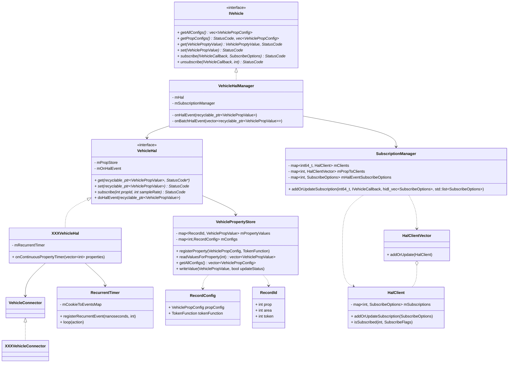

<!-- more -->

## Vhal提供的接口

### 提供的方法

|方法|参数|返回值|
|:--:|:--:|:--:|
|**getAllPropConfigs**||vec\<VehiclePropConfig\> propConfigs|
|**getPropConfigs**|vec\<int32_t\> props|StatusCode status <br/> vec\<VehiclePropConfig\> propConfigs|
|**get**|VehiclePropValue requestedPropValue| StatusCode status<br/>VehiclePropValue propValue|
|**set**|VehiclePropValue propValue|StatusCode status|
|**subscribe**|IVehicleCallback callback<br/> vec\<SubscribeOptions\> options|StatusCode status|
|**unsubscribe**|IVehicleCallback callback </br> int32_t propId|StatusCode status|

### 一些参数与返回值的定义

#### VehicleProperty

`VehicleProperty`定义为enum类型，其中每个property为32位整数：
```cpp
31        27        23               15                                 0
+---------+---------+----------------+----------------------------------+
|  group  |   area  |      type      |               id                 |
+---------+---------+----------------+----------------------------------+
```


#### VehiclePropConfig

```cpp
struct VehiclePropConfig {
    int32_t prop;
    VehiclePropertyAccess access;
    VehiclePropertyChangeMode changeMode;
    vec<VehicleAreaConfig> areaConfigs;
    vec<int32_t> configArray;
    string configString;
    float minSampleRate;
    float maxSampleRate;
};
```
，其中一些字段解释如下：
<table>
<tr>
<td rowspan="4">access</td><td>NONE</td><td>无</td>
</tr>
<tr>
<td>READ</td><td>只读</td>
</tr>
<tr>
<td>WRITE</td><td>只写</td>
</tr>
<tr>
<td>READ_WRITE</td><td>可读写</td>
</tr>
<tr>
<td rowspan="3">changeMode</td><td>STATIC</td><td>不变化，不支持subscribe</td>
</tr>
<tr>
<td>ON_CHANGE</td><td>get返回当前值，值改变时该类型属性必须触发值改变事件</td>
</tr>
<tr>
<td>CONTINUOUS</td><td>subscribe 必须采用一定的sample rate</td>
</tr>

</table>

， `VehicleAreaConfig`的定义如下：
```cpp
struct VehicleAreaConfig {

    int32_t areaId;


    int32_t minInt32Value;
    int32_t maxInt32Value;

    int64_t minInt64Value;
    int64_t maxInt64Value;

    float minFloatValue;
    float maxFloatValue;
};
```

#### VehiclePropValue

```cpp
struct VehiclePropValue {
    int64_t timestamp;

    int32_t areaId;

    int32_t prop;

    VehiclePropertyStatus status;

    struct RawValue {

        vec<int32_t> int32Values;


        vec<float> floatValues;

        vec<int64_t> int64Values;

        vec<uint8_t> bytes;

        string stringValue;
    };

    RawValue value;
};
```
，其中`VehiclePropertyStatus`主要分为三种:
|类型|值|含义|
|:---:|:---:|:---:|
|**AVAILABLE**|0x00|可读写|
|**UNAVAILABLE**|0x01|不可读写，表示某种车辆上从来不具有的属性|
|**ERROR**|0x02|属性出错|

#### IVehicleCallback

```cpp
 interface IVehicleCallback {
 
     //订阅属性的回调
     oneway onPropertyEvent(vec<VehiclePropValue> propValues);
 
     
     //被订阅且SubscribeFlags::EVENTS_FROM_ANDROID == true 
     oneway onPropertySet(VehiclePropValue propValue);
 
     //属性设置错误时的回调
     oneway onPropertySetError(StatusCode errorCode,
                               int32_t propId,
                               int32_t areaId);
 };
```

#### StatusCode

```cpp
enum StatusCode : int32_t {
    OK = 0,

    TRY_AGAIN = 1,

    INVALID_ARG = 2,

    NOT_AVAILABLE = 3,

    ACCESS_DENIED = 4,

    INTERNAL_ERROR = 5,
};
```

## Vhal类图

### HIDL

