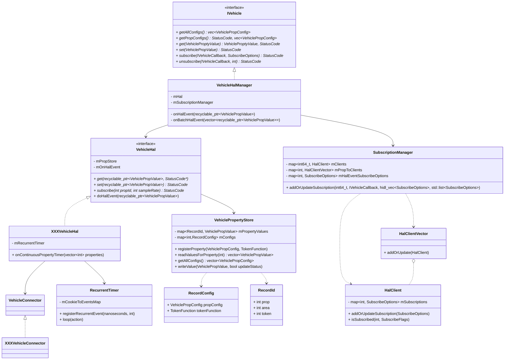
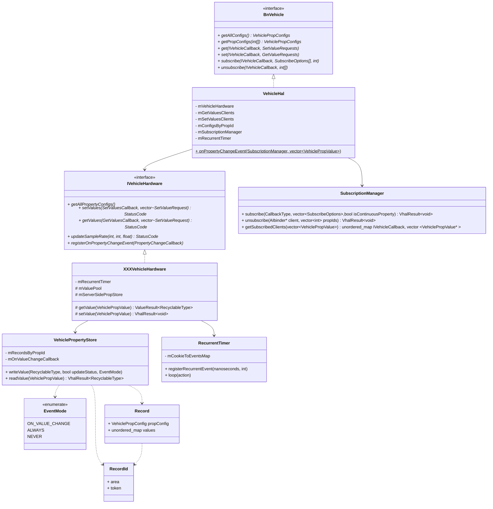

<!-- more -->

## Vhal提供的接口

### 提供的方法

|方法|参数|返回值|
|:--:|:--:|:--:|
|**getAllPropConfigs**||**HIDL**: vec\<VehiclePropConfig\><br/>**AIDL**: VehiclePropConfigs|
|**getPropConfigs**|**HIDL**: vec\<int32_t\> props <br/> **AIDL**: int[] props|**HIDL**: StatusCode, vec\<VehiclePropConfig\> <br/>**AIDL**: VehiclePropConfigs |
|**HIDL**: **get**<br/> **AIDL**: **getValues**|**HIDL**: VehiclePropValue requestedPropValue <br/> **AIDL**: IVehicleCallback callback, GetValueRequests requests| **HIDL**: StatusCode status, VehiclePropValue propValue<br/> |
|**HIDL**: **set**<br/> **AIDL**: **setValues**|**HIDL**: VehiclePropValue propValue<br/> **AIDL**: IVehicleCallback callback, SetValueRequests requests|**HIDL**: StatusCode status |
|**subscribe**|**HIDL**: IVehicleCallback callback, vec\<SubscribeOptions\> options <br/>**AIDL**: IVehicleCallback callback, SubscribeOptions[] options, int maxSharedMemoryFileCount|**HIDL**: StatusCode status|
|**unsubscribe**|**HIDL**: IVehicleCallback callback, int32_t propId<br/> **AIDL**: IVehicleCallback callback, int[] propIds|**HIDL**: StatusCode status|

### 一些参数与返回值的定义

#### VehicleProperty

`VehicleProperty`定义为enum类型，其中每个property为32位整数：
```cpp
31        27        23               15                                 0
+---------+---------+----------------+----------------------------------+
|  group  |   area  |      type      |               id                 |
+---------+---------+----------------+----------------------------------+
```


#### VehiclePropConfig

**HIDL** :
```cpp
struct VehiclePropConfig {
    int32_t prop;
    VehiclePropertyAccess access;
    VehiclePropertyChangeMode changeMode;
    vec<VehicleAreaConfig> areaConfigs;
    vec<int32_t> configArray;
    string configString;
    float minSampleRate;
    float maxSampleRate;
};
```
**AIDL**:
```java
parcelable VehiclePropConfig {

    int prop;

    android.hardware.automotive.vehicle.VehiclePropertyAccess access = android.hardware.automotive.vehicle.VehiclePropertyAccess.NONE;

    android.hardware.automotive.vehicle.VehiclePropertyChangeMode changeMode = android.hardware.automotive.vehicle.VehiclePropertyChangeMode.STATIC;

    android.hardware.automotive.vehicle.VehicleAreaConfig[] areaConfigs;

    int[] configArray;

    @utf8InCpp 
    String configString;

    float minSampleRate;

    float maxSampleRate;
}

parcelable VehiclePropConfigs {
    android.hardware.automotive.vehicle.VehiclePropConfig[] payloads;

    @nullable 
    ParcelFileDescriptor sharedMemoryFd;
}
```
，其中一些字段解释如下：
<table>
<tr>
<td rowspan="4">access</td><td>NONE</td><td>无</td>
</tr>
<tr>
<td>READ</td><td>只读</td>
</tr>
<tr>
<td>WRITE</td><td>只写</td>
</tr>
<tr>
<td>READ_WRITE</td><td>可读写</td>
</tr>
<tr>
<td rowspan="3">changeMode</td><td>STATIC</td><td>不变化，不支持subscribe</td>
</tr>
<tr>
<td>ON_CHANGE</td><td>get返回当前值，值改变时该类型属性必须触发值改变事件</td>
</tr>
<tr>
<td>CONTINUOUS</td><td>subscribe 必须采用一定的sample rate</td>
</tr>

</table>

， `VehicleAreaConfig`的定义如下：

**HIDL**:
```cpp
struct VehicleAreaConfig {

    int32_t areaId;

    int32_t minInt32Value;
    int32_t maxInt32Value;

    int64_t minInt64Value;
    int64_t maxInt64Value;

    float minFloatValue;
    float maxFloatValue;
};
```
**AIDL**:
```java
parcelable VehicleAreaConfig {
    int areaId;

    int minInt32Value;
    int maxInt32Value;

    long minInt64Value;
    long maxInt64Value;

    float minFloatValue;
    float maxFloatValue;

    @nullable 
    long[] supportedEnumValues;
}
```


#### VehiclePropValue

**HIDL**:
```cpp
struct VehiclePropValue {
    int64_t timestamp;

    int32_t areaId;

    int32_t prop;

    VehiclePropertyStatus status;

    struct RawValue {

        vec<int32_t> int32Values;

        vec<float> floatValues;

        vec<int64_t> int64Values;

        vec<uint8_t> bytes;

        string stringValue;
    };

    RawValue value;
};
```

**AIDL**:
```java
parcelable VehiclePropValue {

    long timestamp;

    int areaId;

    int prop;

    android.hardware.automotive.vehicle.VehiclePropertyStatus status = android.hardware.automotive.vehicle.VehiclePropertyStatus.AVAILABLE;

    android.hardware.automotive.vehicle.RawPropValues value;
}

parcelable RawPropValues {

    int[] int32Values = {};

    float[] floatValues;

    long[] int64Values;

    byte[] byteValues;

    @utf8InCpp 
    String stringValue;
}

parcelable VehiclePropValues {

    android.hardware.automotive.vehicle.VehiclePropValue[] payloads;

    long sharedMemoryId;

    @nullable 
    ParcelFileDescriptor sharedMemoryFd;
}
```

，`VehiclePropertyStatus`主要分为三种:

|类型|值|含义|
|:---:|:---:|:---:|
|**AVAILABLE**|0x00|可读写|
|**UNAVAILABLE**|0x01|不可读写，表示某种车辆上从来不具有的属性|
|**ERROR**|0x02|属性出错|

#### IVehicleCallback

**HIDL**:

```cpp
interface IVehicleCallback {

    //订阅属性的回调
    oneway onPropertyEvent(vec<VehiclePropValue> propValues);

    
    //被订阅且SubscribeFlags::EVENTS_FROM_ANDROID == true 
    oneway onPropertySet(VehiclePropValue propValue);

    //属性设置错误时的回调
    oneway onPropertySetError(StatusCode errorCode,
                            int32_t propId,
                            int32_t areaId);
};
```

**AIDL**:
```java
interface IVehicleCallback {
    //由于get，set返回都是通过回调，于是设置了onGetValues和onSetValues两个方法
    oneway void onGetValues(in android.hardware.automotive.vehicle.GetValueResults responses);

    oneway void onSetValues(in android.hardware.automotive.vehicle.SetValueResults responses);
    
    oneway void onPropertyEvent(in android.hardware.automotive.vehicle.VehiclePropValues propValues, int sharedMemoryFileCount);

    oneway void onPropertySetError(in android.hardware.automotive.vehicle.VehiclePropErrors errors);
}
```

#### (Get/Set)Value(Requests/Results) (only AIDL)

```java
parcelable SetValueRequest {

    long requestId;

    android.hardware.automotive.vehicle.VehiclePropValue value;
}

parcelable SetValueRequests {

    android.hardware.automotive.vehicle.SetValueRequest[] payloads;

    @nullable 
    ParcelFileDescriptor sharedMemoryFd;
}

parcelable SetValueResult {

    long requestId;

    android.hardware.automotive.vehicle.StatusCode status = android.hardware.automotive.vehicle.StatusCode.OK;
}

parcelable SetValueResults {

    android.hardware.automotive.vehicle.SetValueResult[] payloads;

    @nullable 
    ParcelFileDescriptor sharedMemoryFd;
}

parcelable GetValueRequest {

    long requestId;

    android.hardware.automotive.vehicle.VehiclePropValue prop;
}

parcelable GetValueRequests {

    android.hardware.automotive.vehicle.GetValueRequest[] payloads;

    @nullable 
    ParcelFileDescriptor sharedMemoryFd;
}

parcelable GetValueResult {

    long requestId;

    android.hardware.automotive.vehicle.StatusCode status = android.hardware.automotive.vehicle.StatusCode.OK;

    @nullable 
    android.hardware.automotive.vehicle.VehiclePropValue prop;
}

parcelable GetValueResults {

    android.hardware.automotive.vehicle.GetValueResult[] payloads;

    @nullable 
    ParcelFileDescriptor sharedMemoryFd;
}
```

#### SubscribeOptions

**HIDL**:
```cpp
struct SubscribeOptions {
    int32_t propId;

    float sampleRate;

    SubscribeFlags flags;
};

enum SubscribeFlags : int32_t {
    UNDEFINED = 0x0,

    EVENTS_FROM_CAR = 0x1,

    EVENTS_FROM_ANDROID = 0x2,
};
```

**AIDL**:
```java
parcelable SubscribeOptions {

    int propId;

    int[] areaIds;

    float sampleRate;
}
```

#### StatusCode

**HIDL**:
```cpp
enum StatusCode : int32_t {
    OK = 0,

    TRY_AGAIN = 1,

    INVALID_ARG = 2,

    NOT_AVAILABLE = 3,

    ACCESS_DENIED = 4,

    INTERNAL_ERROR = 5,
};
```

**AIDL**:
```cpp
enum StatusCode {
    OK = 0,
    TRY_AGAIN = 1,
    INVALID_ARG = 2,
    NOT_AVAILABLE = 3,
    ACCESS_DENIED = 4,
    INTERNAL_ERROR = 5,
    NOT_AVAILABLE_DISABLED = 6,
    NOT_AVAILABLE_SPEED_LOW = 7,
    NOT_AVAILABLE_SPEED_HIGH = 8,
    NOT_AVAILABLE_POOR_VISIBILITY = 9,
    NOT_AVAILABLE_SAFETY = 10,
}
```

### 差异对比

- **get/set:** get和set在AIDL上统一通过`IVehicleCallback`返回， 于是在`IVehicleCallback`中新增了`onGetValues`和`onSetValues`方法，并新增了`(get/set)Value(Request[s]/Result[s])`，用于get和set请求。所有的`StatusCode`返回统一迁移到了`(get/set)ValueResult`中。
- **subscribe/unsubscribe:** 在AIDL的`subscribeOptions`中，新增了`int[] areaIds;`字段并删除了`subscribeFlags`字段。对于AIDL实现来说，订阅可以具体到 (property id, area id) 上，而对于`HIDL`实现，订阅则只能针对property id。在AIDL上，`unsubscribe`支持一次取消多个订阅。

- 对于`VehiclePropConfig`和`VehiclePropValue`，AIDL实现都新增了`VehiclePropConfigs`和`VehiclePropValues`，其中新增了字段`ParcelFileDescriptor sharedMemoryFd;`，用于共享内存。

## Vhal架构

### HIDL



### AIDL

