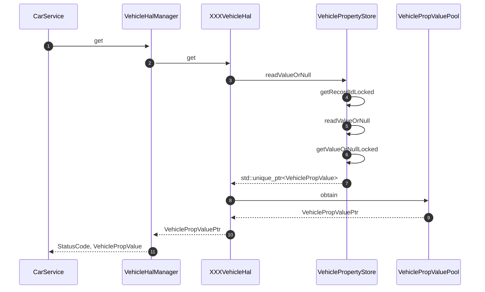
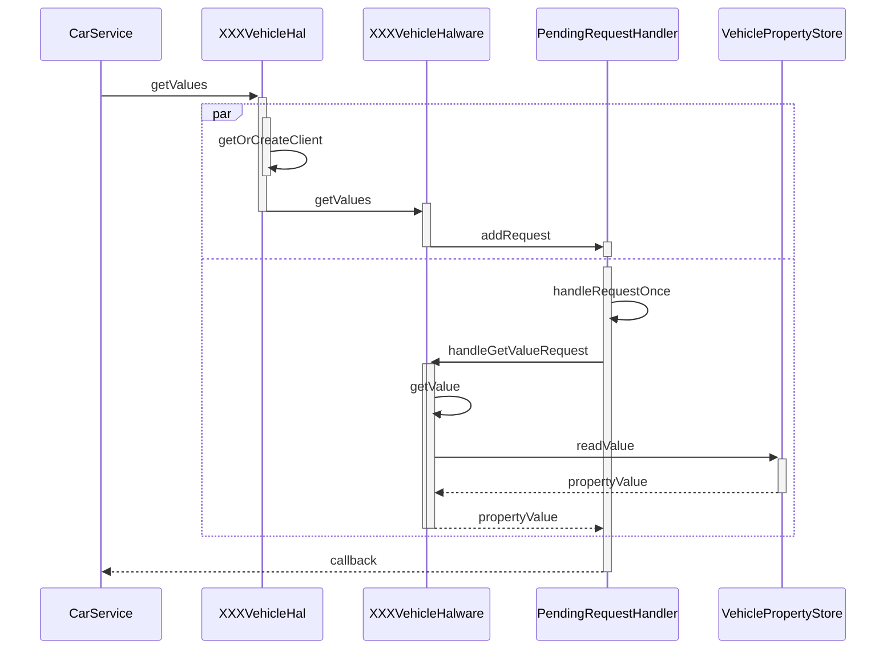
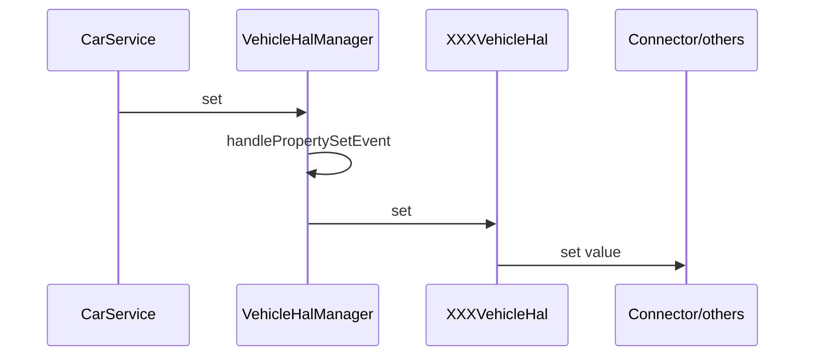
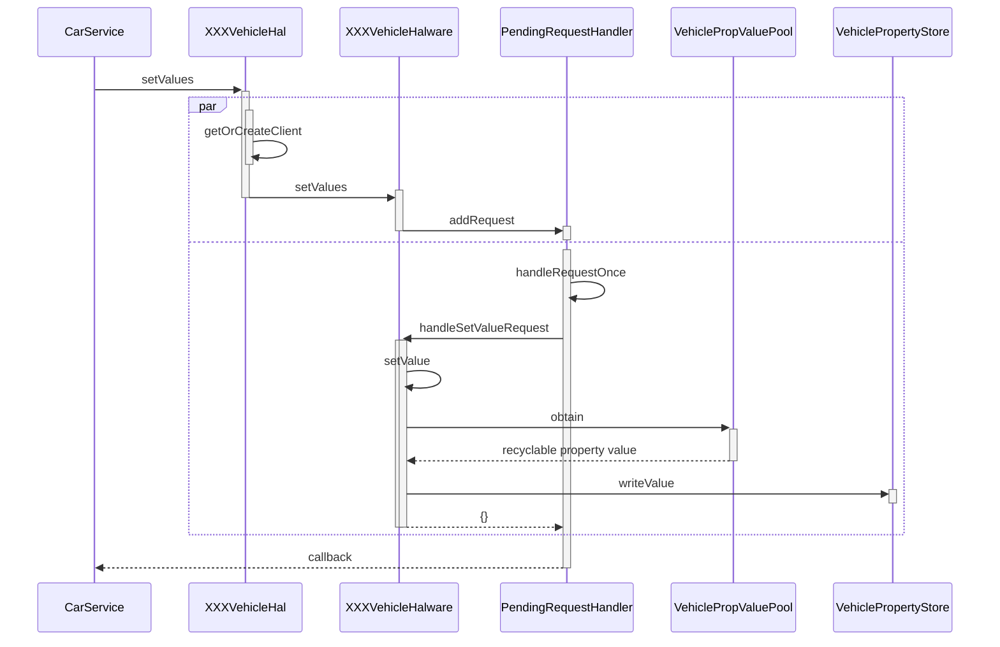

<!-- more -->

## get

### HIDL实现

#### 时序图



#### 具体流程

**step 1** 调用`get`方法，这一步会向下调用`VehicleHal`的`get`方法，并通过`_hidl_cb`返回`StatusCode`和`VehiclePropValue`
```cpp
Return<void> VehicleHalManager::get(const VehiclePropValue& requestedPropValue, get_cb _hidl_cb) {
    //根据配置进行一些检查
    ...
    StatusCode status;

    //调用VehicleHal的get方法
    auto value = mHal->get(requestedPropValue, &status);
    _hidl_cb(status, value.get() ? *value : kEmptyValue);

    return Void();
}
```

**step 2** 这一步会先调用`VehiclePropertyStore`的`readValueOrNull`方法，获取一个指向`VehiclePropertyValue`的唯一指针，然后调用`VehiclePropValuePool::obtain`方法进行对象复用
```cpp
VehicleHal::VehiclePropValuePtr XXXVehicleHal::get(
        const VehiclePropValue& requestedPropValue, StatusCode* outStatus) {
    auto propId = requestedPropValue.prop;
    ...

    auto& pool = *getValuePool();
    VehiclePropValuePtr v = nullptr;

    switch (propId) {
        ...
        default:
            ...
            //从VehiclePropertyStore中读取值
            auto internalPropValue = mPropStore->readValueOrNull(requestedPropValue);
            //通过VehicleObjectPool进行对象复用
            if (internalPropValue != nullptr) {
                v = getValuePool()->obtain(*internalPropValue);
            }

            *outStatus = v != nullptr ? StatusCode::OK : StatusCode::INVALID_ARG;
            break;
    }
    if (v.get()) {
        v->timestamp = elapsedRealtimeNano();
    }
    return v;
}
```

**step 3** 这一步首先会获取record id， record id由property id, area id 和 token三部分组成：
```cpp
std::unique_ptr<VehiclePropValue> VehiclePropertyStore::readValueOrNull(
        const VehiclePropValue& request) const {
    MuxGuard g(mLock);
    //首先找到request对应的record id
    RecordId recId = getRecordIdLocked(request);
    //然后根据record id获取值
    const VehiclePropValue* internalValue = getValueOrNullLocked(recId);
    return internalValue ? std::make_unique<VehiclePropValue>(*internalValue) : nullptr;
}
```

**step 4** 获取record id 时会向本地的configs中查询是否由property id对应的config，如果没有则返回空，否则设置token。
```cpp
VehiclePropertyStore::RecordId VehiclePropertyStore::getRecordIdLocked(
        const VehiclePropValue& valuePrototype) const {
    RecordId recId = {
        .prop = valuePrototype.prop,
        .area = isGlobalProp(valuePrototype.prop) ? 0 : valuePrototype.areaId,
        .token = 0
    };

    auto it = mConfigs.find(recId.prop);
    if (it == mConfigs.end()) return {};

    if (it->second.tokenFunction != nullptr) {
        recId.token = it->second.tokenFunction(valuePrototype);
    }
    return recId;
}
```

**step 5** 获取到record id后，会根据record id调用`getValueOrNullLocked`，获取属性值并返回。

```cpp
std::unique_ptr<VehiclePropValue> VehiclePropertyStore::readValueOrNull(
        int32_t prop, int32_t area, int64_t token) const {
    RecordId recId = {prop, isGlobalProp(prop) ? 0 : area, token };
    MuxGuard g(mLock);
    const VehiclePropValue* internalValue = getValueOrNullLocked(recId);
    return internalValue ? std::make_unique<VehiclePropValue>(*internalValue) : nullptr;
}
```

**step 6** `getValueOrNullLocked`方法会从`mProertyValues`中找到对应的`value`并返回。
```cpp
const VehiclePropValue* VehiclePropertyStore::getValueOrNullLocked(
        const VehiclePropertyStore::RecordId& recId) const  {
    auto it = mPropertyValues.find(recId);
    return it == mPropertyValues.end() ? nullptr : &it->second;
}
```

**step 7** 这一步通过`VehiclePropValuePool::obtain`方法从对象池中返回一个可用的对象。

```cpp
VehiclePropValuePool::RecyclableType VehiclePropValuePool::obtain(
        const VehiclePropValue& src) {
    ...
    VehiclePropertyType type = getPropType(src.prop);
    size_t vecSize = getVehicleRawValueVectorSize(src.value, type);;
    auto dest = obtain(type, vecSize);

    dest->prop = src.prop;
    dest->areaId = src.areaId;
    dest->status = src.status;
    dest->timestamp = src.timestamp;
    copyVehicleRawValue(&dest->value, src.value);

    return dest;
}
```

#### 对象复用
对于`VehiclePropValuePool::obtain`方法，其会通过`type`和`vecSize`从对象池中获取一个可复用的对象：

```cpp
VehiclePropValuePool::RecyclableType VehiclePropValuePool::obtain(
        VehiclePropertyType type, size_t vecSize) {
    return isDisposable(type, vecSize)
            ? obtainDisposable(type, vecSize)
            : obtainRecylable(type, vecSize);
}
```
，会根据`type`和`vecSize`判断是不是可以复用的：

```cpp
bool isDisposable(VehiclePropertyType type, size_t vecSize) const {
    return vecSize > mMaxRecyclableVectorSize || VehiclePropertyType::STRING == type ||
            VehiclePropertyType::MIXED == type;
}
```
，如果vecSize过大，或者其类型为String或者MIXED，则不可复用。

如果对象可以复用，那么这一步就会从`mValueTypePools`中获取一个对象池（没有则创建），然后从对象池中获取一个可以复用的对象：

```cpp
VehiclePropValuePool::RecyclableType VehiclePropValuePool::obtainRecylable(
        VehiclePropertyType type, size_t vecSize) {
    int32_t key = static_cast<int32_t>(type)
                | static_cast<int32_t>(vecSize);

    std::lock_guard<std::mutex> g(mLock);
    auto it = mValueTypePools.find(key);

    if (it == mValueTypePools.end()) {
        auto newPool(std::make_unique<InternalPool>(type, vecSize));
        it = mValueTypePools.emplace(key, std::move(newPool)).first;
    }
    return it->second->obtain();
}
```

如果对象不可以复用，则直接创建一个对象，该对象在被delete时直接销毁：
```cpp
VehiclePropValuePool::RecyclableType VehiclePropValuePool::obtainDisposable(
        VehiclePropertyType valueType, size_t vectorSize) const {
    return RecyclableType {
        createVehiclePropValue(valueType, vectorSize).release(),
        mDisposableDeleter
    };
}
```

查看`ObjectPool`的定义，在进行`obtain`时，其会从`mObjects`中获取一个`unique_ptr`，然后通过`wrap`方法进行包装，而`wrap`方法会给`unique_ptr`新增一个`Deleter`，在对象被销毁时，调用`recycle`方法，这个方法会将对象重新放回到`mObjects`中。
```cpp
template <typename T>
using recyclable_ptr = typename std::unique_ptr<T, Deleter<T>>;

template<typename T>
class ObjectPool {
public:
    ObjectPool() = default;
    virtual ~ObjectPool() = default;

    virtual recyclable_ptr<T> obtain() {
        std::lock_guard<std::mutex> g(mLock);
        ...
        auto o = wrap(mObjects.front().release());
        mObjects.pop_front();

        return o;
    }

    ObjectPool& operator =(const ObjectPool &) = delete;
    ObjectPool(const ObjectPool &) = delete;

protected:
    ...
    
    virtual void recycle(T* o) {
        ...
        mObjects.push_back(std::unique_ptr<T> { o } );
    }

private:
    const Deleter<T>& getDeleter() {
        if (!mDeleter.get()) {
            Deleter<T> *d = new Deleter<T>(std::bind(
                &ObjectPool::recycle, this, std::placeholders::_1));
            mDeleter.reset(d);
        }
        return *mDeleter.get();
    }

    recyclable_ptr<T> wrap(T* raw) {
        return recyclable_ptr<T> { raw, getDeleter() };
    }

private:
    mutable std::mutex mLock;
    std::deque<std::unique_ptr<T>> mObjects;
    std::unique_ptr<Deleter<T>> mDeleter;
};
```
### AIDL实现
#### 时序图


#### 详细步骤
```cpp
ScopedAStatus XXXVehicleHal::getValues(const CallbackType& callback,
                                            const GetValueRequests& requests) {
                                    
    ...
    std::vector<GetValueRequest> hardwareRequests;
    ...

    std::shared_ptr<GetValuesClient> client;
    {
        ...

        client = getOrCreateClient(&mGetValuesClients, callback, mPendingRequestPool);
    }

    ...

    if (StatusCode status =
                mVehicleHardware->getValues(client->getResultCallback(), hardwareRequests);
        status != StatusCode::OK) {
            ...
    }
    return ScopedAStatus::ok();
}
```

```cpp
StatusCode XXXVehicleHardware::getValues(std::shared_ptr<const GetValuesCallback> callback,
                                        const std::vector<GetValueRequest>& requests) const {
    for (auto& request : requests) {
        ...
        mPendingGetValueRequests.addRequest(request, callback);
    }

    return StatusCode::OK;
}
```

```cpp
template <class CallbackType, class RequestType>
void XXXVehicleHardware::PendingRequestHandler<CallbackType, RequestType>::addRequest(
        RequestType request, std::shared_ptr<const CallbackType> callback) {
    mRequests.push({
            request,
            callback,
    });
}
```

```cpp
template <>
void XXXeVehicleHardware::PendingRequestHandler<FakeVehicleHardware::GetValuesCallback,
                                                GetValueRequest>::handleRequestsOnce() {
    std::unordered_map<std::shared_ptr<const GetValuesCallback>, std::vector<GetValueResult>>
            callbackToResults;
    for (const auto& rwc : mRequests.flush()) {
        ...
        auto result = mHardware->handleGetValueRequest(rwc.request);
        ...
    }
    for (const auto& [callback, results] : callbackToResults) {
        ...
        (*callback)(std::move(results));
        ...
    }
}
```

```cpp
GetValueResult XXXVehicleHardware::handleGetValueRequest(const GetValueRequest& request) {
    GetValueResult getValueResult;
    getValueResult.requestId = request.requestId;

    auto result = getValue(request.prop);
    ...
    return getValueResult;
}
```

```cpp
XXXVehicleHardware::ValueResultType FakeVehicleHardware::getValue(
        const VehiclePropValue& value) const {
    ...

    auto readResult = mServerSidePropStore->readValue(value);
    ...

    return std::move(readResult);
}
```

```cpp
VehiclePropertyStore::ValueResultType VehiclePropertyStore::readValue(
        const VehiclePropValue& propValue) const {
    std::scoped_lock<std::mutex> g(mLock);

    int32_t propId = propValue.prop;
    const VehiclePropertyStore::Record* record = getRecordLocked(propId);
    ...

    VehiclePropertyStore::RecordId recId = getRecordIdLocked(propValue, *record);
    return readValueLocked(recId, *record);
}
```

## set

### HIDL实现
#### 时序图


#### 详细步骤

```cpp
Return<StatusCode> VehicleHalManager::set(const VehiclePropValue &value) {
    auto prop = value.prop;
    ...

    handlePropertySetEvent(value);

    auto status = mHal->set(value);

    return Return<StatusCode>(status);
}
```

```cpp
void VehicleHalManager::handlePropertySetEvent(const VehiclePropValue& value) {
    auto clients =
        mSubscriptionManager.getSubscribedClients(value.prop, SubscribeFlags::EVENTS_FROM_ANDROID);
    for (const auto& client : clients) {
        client->getCallback()->onPropertySet(value);
    }
}
```

```cpp
StatusCode XXXVehicleHal::set(const VehiclePropValue &propValue)
{
    constexpr bool updateStatus = false;
    ...
    auto currentPropValue = mPropStore->readValueOrNull(propValue);

    ...

    /**
    * 这里需要实现与硬件的交互
    */

    return StatusCode::OK;
}
```

```cpp
void XXXVehicleHal::onPropertyValue(const VehiclePropValue &value, bool updateStatus)
{
    VehiclePropValuePtr updatedPropValue = getValuePool()->obtain(value);

    if (mPropStore->writeValue(*updatedPropValue, updateStatus))
    {
        getEmulatorOrDie()->doSetValueFromClient(*updatedPropValue);
        doHalEvent(std::move(updatedPropValue));
    }
}
```

### AIDL实现
#### 时序图



#### 详细步骤
```cpp
ScopedAStatus XXXVehicleHal::setValues(const CallbackType& callback,
                                            const SetValueRequests& requests) {
    ...
    std::vector<SetValueRequest> hardwareRequests;
    ...
    std::unordered_set<int64_t> hardwareRequestIds;
    for (const auto& request : hardwareRequests) {
        hardwareRequestIds.insert(request.requestId);
    }

    std::shared_ptr<SetValuesClient> client;
    {
        ...
        client = getOrCreateClient(&mSetValuesClients, callback, mPendingRequestPool);
    }

    ...

    if (StatusCode status =
                mVehicleHardware->setValues(client->getResultCallback(), hardwareRequests);
        status != StatusCode::OK) {
            ...
    }

    return ScopedAStatus::ok();
}
```

```cpp
StatusCode XXXVehicleHardware::setValues(std::shared_ptr<const SetValuesCallback> callback,
                                        const std::vector<SetValueRequest>& requests) {
    for (auto& request : requests) {
        mPendingSetValueRequests.addRequest(request, callback);
    }

    return StatusCode::OK;
}
```

```cpp
void XXXVehicleHardware::PendingRequestHandler<FakeVehicleHardware::SetValuesCallback,
                                                SetValueRequest>::handleRequestsOnce() {
    std::unordered_map<std::shared_ptr<const SetValuesCallback>, std::vector<SetValueResult>>
            callbackToResults;
    for (const auto& rwc : mRequests.flush()) {
        ...
        auto result = mHardware->handleSetValueRequest(rwc.request);
        ...

    }
    for (const auto& [callback, results] : callbackToResults) {
        ...
        (*callback)(std::move(results));
        ...
    }
}
```

```cpp
SetValueResult XXXVehicleHardware::handleSetValueRequest(const SetValueRequest& request) {
    SetValueResult setValueResult;
    setValueResult.requestId = request.requestId;

    if (auto result = setValue(request.value); !result.ok()) {
        ...
    } else {
        ...
    }

    return setValueResult;
}
```

```cpp
VhalResult<void> XXXVehicleHardware::setValue(const VehiclePropValue& value) {
    ...

    auto updatedValue = mValuePool->obtain(value);
    int64_t timestamp = elapsedRealtimeNano();
    updatedValue->timestamp = timestamp;

    auto writeResult = mServerSidePropStore->writeValue(std::move(updatedValue));
    ...

    return {};
}
```