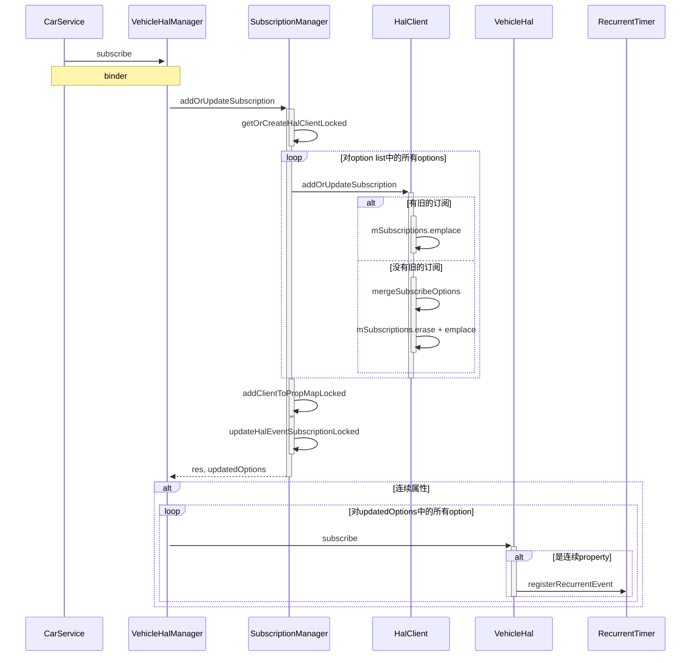
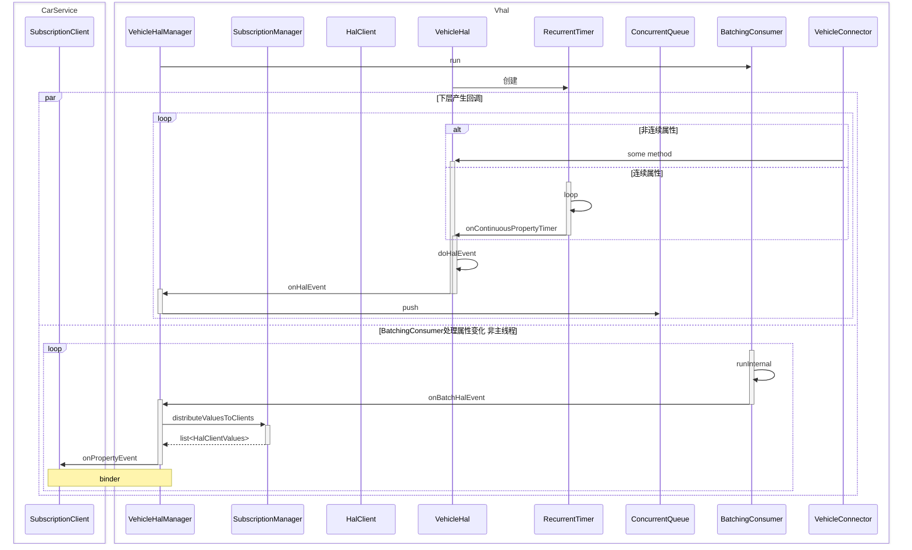
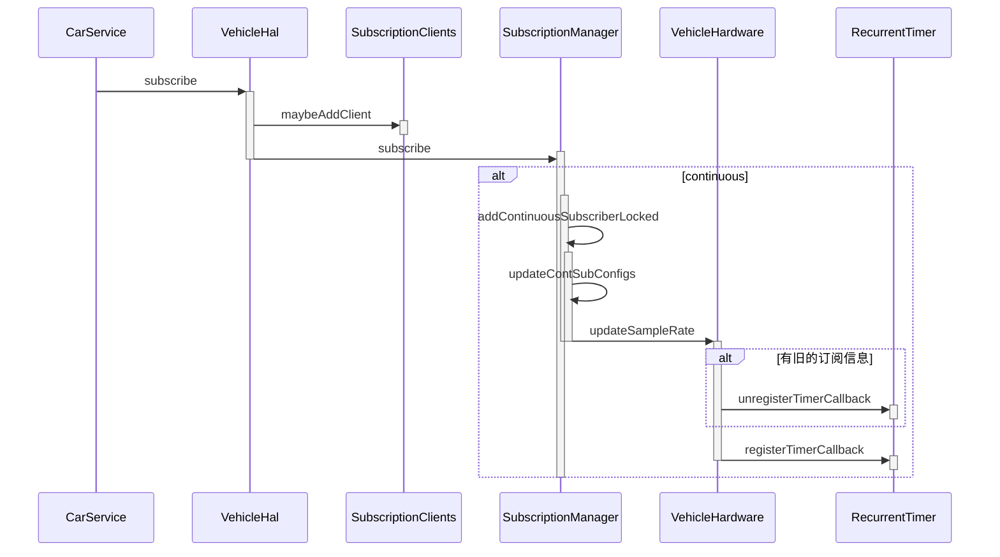
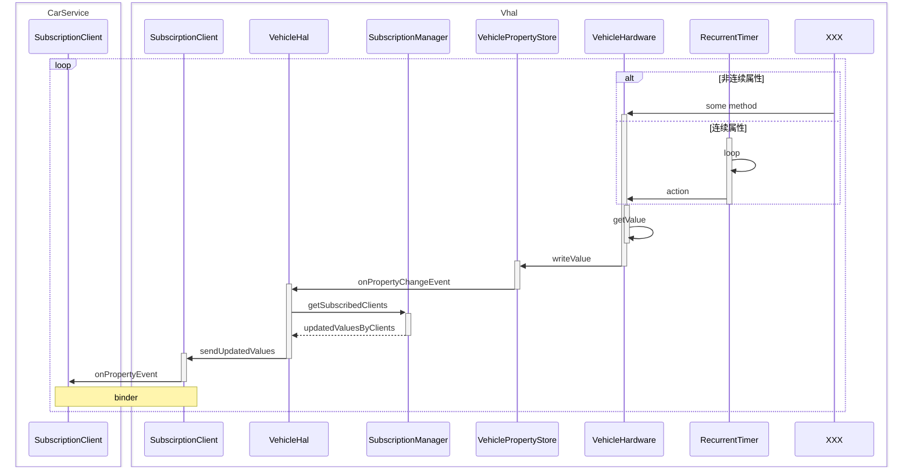

<!-- more -->

- [x] HIDL 结构
- [x] HIDL 订阅
- [x] HIDL 回调
- [ ] AIDL 结构
- [x] AIDL 订阅
- [ ] AIDL 回调

# HIDL版本的vhal subscribe

## 涉及到的模块


|模块|作用|
|:--:|:--:|
|`VehicleHalManager`|主要提供向使用Vhal的其他进程提供接口|
|`VehicleHal`|VehicleHal会向下层接收property属性的变化，也会将订阅信息转发到下层|
|`SubscriptionManager`|用于管理订阅的信息，会将callback转化为一个client，记录其在每个property上的订阅情况<br/>用一个map保存property id 到client的对应关系|
|`VehiclePropertyStore`|在内存建立property value的缓存，对每个propert id, area id 和 token，都由一个对应的property value|
|`RecurrentTimer`|一个定时器，用于对连续属性的订阅，定时对值进行采样|
|`BatchingConsumer`|消费产生的property value，按照一个时间窗口将属性值批量返回给上层|
|`ConcurrentQueue`|存放待消费的property value的队列|

## subscribe的流程

### 订阅属性



**step 1** 调用`VehicleHalManager`的`subscribe`方法：
```cpp
Return<StatusCode> VehicleHalManager::subscribe(const sp<IVehicleCallback> &callback,
                                                const hidl_vec<SubscribeOptions> &options) {
    hidl_vec<SubscribeOptions> verifiedOptions(options);

    //做一些订阅选项的检查
    ...

    //向SubscriptionManager中更新订阅信息
    std::list<SubscribeOptions> updatedOptions;
    auto res = mSubscriptionManager.addOrUpdateSubscription(getClientId(callback),
                                                            callback, verifiedOptions,
                                                            &updatedOptions);
    ...

    //向VehicleHal传递订阅信息
    for (auto opt : updatedOptions) {
        mHal->subscribe(opt.propId, opt.sampleRate);
    }

    return StatusCode::OK;
}
```
，该方法首先会去检查订阅选项，然后向`SubscriptionManager`中更新订阅的信息。

**step 2** 调用`SubscriptionManager::addOrUpdateSubscription`方法：

```cpp
StatusCode SubscriptionManager::addOrUpdateSubscription(
        ClientId clientId,
        const sp<IVehicleCallback> &callback,
        const hidl_vec<SubscribeOptions> &optionList,
        std::list<SubscribeOptions>* outUpdatedSubscriptions) {
    outUpdatedSubscriptions->clear();

    MuxGuard g(mLock);

    ...
    //根据clientId和callback获取HalClient对象
    const sp<HalClient>& client = getOrCreateHalClientLocked(clientId, callback);
    ...

    for (size_t i = 0; i < optionList.size(); i++) {
        const SubscribeOptions& opts = optionList[i];
        ...
        //向HalClient中注册订阅信息
        client->addOrUpdateSubscription(opts);

        //将Client添加到property的订阅列表中
        addClientToPropMapLocked(opts.propId, client);

        if (SubscribeFlags::EVENTS_FROM_CAR & opts.flags) {
            SubscribeOptions updated;
            //更新传入的订阅选项列表
            if (updateHalEventSubscriptionLocked(opts, &updated)) {
                outUpdatedSubscriptions->push_back(updated);
            }
        }
    }

    return StatusCode::OK;
}
```

，这一步首先会调用`HalCient::addOrUpdateSubscription`方法，更新`HalClient`中的订阅信息，然后会将`Client`加入到对应的property的订阅列表中，最后更新传入的`outUpdateSubscriptions`。

**step 3** 执行`getOrCreateHalClientLocked`方法：
```cpp
sp<HalClient> SubscriptionManager::getOrCreateHalClientLocked(
        ClientId clientId, const sp<IVehicleCallback>& callback) {
    auto it = mClients.find(clientId);

    if (it == mClients.end()) {
        uint64_t cookie = reinterpret_cast<uint64_t>(clientId);
        ...
        //绑定binder死亡事件
        auto res = callback->linkToDeath(mCallbackDeathRecipient, cookie);
        ...
        sp<HalClient> client = new HalClient(callback);
        mClients.insert({clientId, client});
        return client;
    } else {
        return it->second;
    }
}
```
，这一步会将`callback`包装成一个`HalClient`对象，并插入`mClients`中。


**step 4** 执行`HalClient::addOrupdateSubscription`方法：

```cpp
//mSubscriptions的定义
std::map<int32_t, SubscribeOptions> mSubscriptions;

void HalClient::addOrUpdateSubscription(const SubscribeOptions &opts)  {
    ...
    auto it = mSubscriptions.find(opts.propId);
    //如果没有旧的订阅则直接插入新的订阅
    if (it == mSubscriptions.end()) {
        mSubscriptions.emplace(opts.propId, opts);
    } else {
        const SubscribeOptions& oldOpts = it->second;
        SubscribeOptions updatedOptions;
        //否则先合并新的和旧的订阅，然后插入
        if (mergeSubscribeOptions(oldOpts, opts, &updatedOptions)) {
            mSubscriptions.erase(it); 
            mSubscriptions.emplace(opts.propId, updatedOptions);
        }
    }
}
```
，这一步会从`mSubscriptions`中查询对应的property是否有旧的订阅。`mSubscriptions`是property id和`SubscribeOptions`的map。如果没有就将订阅信息插入到`mSubscriptions`中，否则执行`mergeSubscribeOptions`方法：
```cpp
bool mergeSubscribeOptions(const SubscribeOptions &oldOpts,
                            const SubscribeOptions &newOpts,
                            SubscribeOptions *outResult) {
    //设置监听频率为两者之间最大的一个
    float updatedRate = std::max(oldOpts.sampleRate, newOpts.sampleRate);
    //设置订阅标志为两者的并集
    SubscribeFlags updatedFlags = SubscribeFlags(oldOpts.flags | newOpts.flags);

    bool updated = (updatedRate > oldOpts.sampleRate) || (updatedFlags != oldOpts.flags);
    if (updated) {
        *outResult = oldOpts;
        outResult->sampleRate = updatedRate;
        outResult->flags = updatedFlags;
    }

    return updated;
}
```
，这一步根据新旧两个订阅，设置监听频率为两者的最大值，并设置订阅标志为两者的并集。执行完合并后，删除旧的订阅信息，并将合并后的信息插入到`mSubscriptions`中。

**step 5** 执行`SubscriptionManager::addClientToPropMapLocked`方法：
```cpp
//SubscriptionManager.h
class HalClientVector : private SortedVector<sp<HalClient>> , public RefBase {
public:
    virtual ~HalClientVector() {}

    inline void addOrUpdate(const sp<HalClient> &client) {
        SortedVector::add(client);
    }
    ...
};

std::map<int32_t, sp<HalClientVector>> mPropToClients;


//SubscriptionManager.cpp
void SubscriptionManager::addClientToPropMapLocked(
        int32_t propId, const sp<HalClient> &client) {
    auto it = mPropToClients.find(propId);
    sp<HalClientVector> propClients;
    //如果propId下没有HalClientVector，则创建
    if (it == mPropToClients.end()) {
        propClients = new HalClientVector();
        mPropToClients.insert(std::make_pair(propId, propClients));
    } else {
        propClients = it->second;
    }
    //插入client
    propClients->addOrUpdate(client);
}
```
，根据定义，`mPropToClients`是property id到 `HalClientVector`的map，且`HalClientVector`是`HalClient`组成的一个有序列表。`addClientToPropMapLocked`方法会向对应property id下的`HalClient`数组中插入`HalClient`。

**step 6** 执行`updateHalEventSubscriptionOptionsLocked`方法：
```cpp
std::map<int32_t, SubscribeOptions> mHalEventSubscriptionLocked;

bool SubscriptionManager::updateHalEventSubscriptionLocked(
        const SubscribeOptions &opts, SubscribeOptions *outUpdated) {
    bool updated = false;
    auto it = mHalEventSubscribeOptions.find(opts.propId);
    if (it == mHalEventSubscribeOptions.end()) {
        *outUpdated = opts;
        mHalEventSubscribeOptions.emplace(opts.propId, opts);
        updated = true;
    } else {
        const SubscribeOptions& oldOpts = it->second;

        if (mergeSubscribeOptions(oldOpts, opts, outUpdated)) {
            mHalEventSubscribeOptions.erase(opts.propId);
            mHalEventSubscribeOptions.emplace(opts.propId, *outUpdated);
            updated = true;
        }
    }

    return updated;
}
```
，与`HalClient`中相似，这一步会从`mHalEventSubscribeOptions`中找到property id对应的旧`SubscribeOptions`，如果没找到则直接插入，否则对新旧两个`SubscribeOptions`进行合并，在执行完`updateHalEventSubscriptionLocked`方法后，会更新`outUpdatedSubscriptions`，用于给`VehicleHalManager`后续的步骤使用：
```cpp
outUpdatedSubscriptions->push_back(updated);
```

**step 7** 执行`XXXVehicleHal::subscribe`方法：
```cpp
StatusCode XXXVehicleHal::subscribe(int32_t property, float sampleRate)
{
    ...
    if (isContinuousProperty(property))
    {
        mRecurrentTimer.registerRecurrentEvent(hertzToNanoseconds(sampleRate), property);
    }
    return StatusCode::OK;
}
```
，这一步会判断property是否是一个连续变化的property，如果是，则调用`RecurrentTimer::registerRecurrentEvent`方法。

**alt step 8** 执行`registerRecurrentEvent`方法：
```cpp
std::unordered_map<int32_t, RecurrentEvent> mCookieToEventsMap;

struct RecurrentEvent {
    Nanos interval;
    int32_t cookie;
    TimePoint absoluteTime; 
    ...
};

void registerRecurrentEvent(std::chrono::nanoseconds interval, int32_t cookie) {

    TimePoint now = Clock::now();
    TimePoint absoluteTime = now - Nanos(now.time_since_epoch().count() % interval.count());

    {
        std::lock_guard<std::mutex> g(mLock);
        //插入新的RecurrentEvent
        mCookieToEventsMap[cookie] = { interval, cookie, absoluteTime };
    }
    ...
}
```
，这一步向`mCookieToEventsMap`中插入了一个`RecurrentEvent`对象。

### 属性回调



对于连续属性，在订阅属性时，会向`RecurrentTimer`中插入一个`RecurrentEvent`。在Vhal启动时，`XXXVehicleHal`的构造函数执行了如下代码：
```cpp
mRecurrentTimer(std::bind(&XXXVehicleHal::onContinuousPropertyTimer, this,
                                                          std::placeholders::_1)),
```
，这一步会将执行`RecurrentTimer`的构造函数：
```cpp
RecurrentTimer(const Action& action) : mAction(action) {
    mTimerThread = std::thread(&RecurrentTimer::loop, this, action);
}
```
，这一步开启了一个线程执行`Recurrent::loop`方法，用于触发连续属性的回调。

**step 1** 查看`RecurrentTimer`的`loop`方法：
```cpp
void loop(const Action& action) {
    static constexpr auto kInvalidTime = TimePoint(Nanos::max());

    std::vector<int32_t> cookies;

    while (!mStopRequested) {
        auto now = Clock::now();
        auto nextEventTime = kInvalidTime;
        cookies.clear();

        {
            std::unique_lock<std::mutex> g(mLock);

            for (auto&& it : mCookieToEventsMap) {
                RecurrentEvent& event = it.second;
                //判断是否触发事件
                if (event.absoluteTime <= now) {
                    event.updateNextEventTime(now);
                    cookies.push_back(event.cookie);
                }

                //设置下一次触发时间
                if (nextEventTime > event.absoluteTime) {
                    nextEventTime = event.absoluteTime;
                }
            }
        }

        //触发事件
        if (cookies.size() != 0) {
            action(cookies);
        }

        //等待下一次触发时间
        std::unique_lock<std::mutex> g(mLock);
        mCond.wait_until(g, nextEventTime);  // nextEventTime can be nanoseconds::max()
    }
}
```
，方法会根据所有事件的`absoluteTime`决定是否触发事件以及下一次触发事件的时间，然后执行`action`方法，并等待下一次触发时间。
而`action`方法由`XXXVehicleHal`构造`RecurrentTimer`时绑定，为`XXXVehicleHal::onContinuousPropertyTimer`方法。

**step 2** 执行`onContinuousPropertyTimer`方法：
```cpp
void XXXVehicleHal::onContinuousPropertyTimer(const std::vector<int32_t> &properties)
{
    VehiclePropValuePtr v;

    auto &pool = *getValuePool();

    for (int32_t property : properties)
    {
        if (isContinuousProperty(property))
        {
            auto internalPropValue = mPropStore->readValueOrNull(property);
            if (internalPropValue != nullptr)
            {
                v = pool.obtain(*internalPropValue);
            }
        }
        ...

        if (v.get())
        {
            v->timestamp = elapsedRealtimeNano();
            doHalEvent(std::move(v));
        }
    }
}
```
，这一步会从`VehiclePropertyStore`中读取property的值，并调用`doHalEvent`方法。

**step 3** 执行`doHalEvent`方法：
```cpp
void doHalEvent(VehiclePropValuePtr v)
{
    mOnHalEvent(std::move(v));
}
```
，调用了`mOnHalEvent`，`mOnHalEvent`在`VehicleHalManager`创建`XXXVehicleHal`时绑定：
```cpp
// VehicleHal.h
void init(
    VehiclePropValuePool *valueObjectPool,
    const HalEventFunction &onHalEvent,
    const HalErrorFunction &onHalError)
{
    mValuePool = valueObjectPool;
    mOnHalEvent = onHalEvent;
    mOnHalPropertySetError = onHalError;

    onCreate();
}

//VehicleHalManager.h
mHal->init(&mValueObjectPool,
            std::bind(&VehicleHalManager::onHalEvent, this, _1),
            std::bind(&VehicleHalManager::onHalPropertySetError, this,
                    _1, _2, _3));
```
，即该步调用`VehicleHalManager::onHalEvent`方法。


**step 4** 执行`onHalEvent`方法：
```cpp
void VehicleHalManager::onHalEvent(VehiclePropValuePtr v) {
    mEventQueue.push(std::move(v));
}
```
，这一步向`mEventQueue`中插入了一个更新的property。


在前面的步骤中，通过一个定时器，从`VehiclePropertyStore`中读取了新的property值，并将更新的property值插入到了`mEventQueue`中。在`VehicleHalManager`的`init`方法中，执行了如下命令：
```cpp
mBatchingConsumer.run(&mEventQueue,
                    kHalEventBatchingTimeWindow,
                    std::bind(&VehicleHalManager::onBatchHalEvent,
                                this, _1));
```
，这一步调用了`BatchingConsumer`的`run`方法，用于消费`mEventQueue`中的值。

**par step 1** 执行`BatchingConsumer`的`run`方法：
```cpp
void run(ConcurrentQueue<T>* queue,
        std::chrono::nanoseconds batchInterval,
        const OnBatchReceivedFunc& func) {
    mQueue = queue;
    mBatchInterval = batchInterval;

    mWorkerThread = std::thread(
        &BatchingConsumer<T>::runInternal, this, func);
}
```
，这一步启动了一个线程，用于执行`runInternal`方法

**par step 2** 执行`runInternal`方法：
```cpp
void runInternal(const OnBatchReceivedFunc& onBatchReceived) {
    if (mState.exchange(State::RUNNING) == State::INIT) {
        while (State::RUNNING == mState) {
            //等待队列不为空
            mQueue->waitForItems();
            ...
            //等待窗口时间
            std::this_thread::sleep_for(mBatchInterval);
            ...
            //从ConcurrentQueue中读取数据
            std::vector<T> items = mQueue->flush();

            //执行onBatchReceived方法
            if (items.size() > 0) {
                onBatchReceived(items);
            }
        }
    }

    mState = State::STOPPED;
}
```
，这一步等待队列中存在数据并等待一个窗口的时间，然后执行传入的`onBatchReceived`方法。`onBatchReceived`方法在调用`run`方法中指定，为`VehicleHalManager::onBatchHalEvent`。

**par step 3** 执行`VehicleHalManager::onBatchHalEvent`方法：
```cpp
void VehicleHalManager::onBatchHalEvent(std::vector<VehiclePropValuePtr>& values) {
    const auto& clientValues =
        mSubscriptionManager.distributeValuesToClients(values, SubscribeFlags::EVENTS_FROM_CAR);
    ...
    for (const auto& propValue: values) {
            VehiclePropValue* v = propValue.get();
            ...
    }
    for (const HalClientValues& cv : clientValues) {
        auto vecSize = cv.values.size();
        hidl_vec<VehiclePropValue> vec;
        //进行一些复用
        ...
        auto status = cv.client->getCallback()->onPropertyEvent(vec);
        ...
    }
}
```
，这一步首先会调用`SubscriptionManager`的`distributeValuesToClients`方法，得到应该分发给每个client的property值，然后调用每个client对应的callback的`onPropertyEvent`方法将property值传递回调用方。

**par step 4**
```cpp
std::list<HalClientValues> SubscriptionManager::distributeValuesToClients(
        std::vector<recyclable_ptr<VehiclePropValue>>& propValues,
        SubscribeFlags flags) {
    std::map<sp<HalClient>, std::list<VehiclePropValue*>> clientValuesMap;

    {
        //首先通过property获取到订阅property的HalClient
        MuxGuard g(mLock);
        for (const auto& propValue: propValues) {
            VehiclePropValue* v = propValue.get();
            auto clients = getSubscribedClientsLocked(v->prop, flags);
            for (const auto& client : clients) {
                clientValuesMap[client].push_back(v);
            }
        }
    }

    //将每个HalClient和对应的property列表打包成HalClientValues对象
    std::list<HalClientValues> clientValues;
    for (const auto& entry : clientValuesMap) {
        clientValues.push_back(HalClientValues {
            .client = entry.first,
            .values = entry.second
        });
    }

    return clientValues;
}
```
，这一步会先通过`getSubscribedClientsLocked`方法：
```cpp
std::list<sp<HalClient>> SubscriptionManager::getSubscribedClientsLocked(
    int32_t propId, SubscribeFlags flags) const {
    std::list<sp<HalClient>> subscribedClients;

    sp<HalClientVector> propClients = getClientsForPropertyLocked(propId);
    if (propClients.get() != nullptr) {
        for (size_t i = 0; i < propClients->size(); i++) {
            const auto& client = propClients->itemAt(i);
            if (client->isSubscribed(propId, flags)) {
                subscribedClients.push_back(client);
            }
        }
    }

    return subscribedClients;
}
```
，而这一步会先调用`getClientsForPropertyLocked`方法，根据property id，获取HalClientVector对象，然后根据`SubscribeFlags::EVENTS_FROM_CAR`的flag判断client是否订阅了property。`getClientsForPropertyLocked`方法如下：
```cpp
sp<HalClientVector> SubscriptionManager::getClientsForPropertyLocked(
        int32_t propId) const {
    auto it = mPropToClients.find(propId);
    return it == mPropToClients.end() ? nullptr : it->second;
}
```
，从`mPropToClients`中找到property id对应的HalClientVector。

**par step 4** 执行完`distributeValuesToClients`后，根据每个`HalClientValues`，会调用其对应的`HalClient`的`IVehicleCallback`的`onPropertyEvent`方法，这是一个binder调用，根据`IVehicleCallback.hal`的定义：
```cpp
oneway onPropertyEvent(vec<VehiclePropValue> propValues);
```

# AIDL版本的vhal subscribe

## 涉及的模块


|模块|作用|
|:--:|:--:|
|**VehicleHal**|与HIDL实现的`VehicleHalManager`类似|
|**VehicleHardware**|与HIDL实现的`VehicleHal`类似|
|**SubscriptionManager**|作用保持不变，在是实现上使用(property id, area id)与clients的map取代了property id和clients并在client中用property id 和 options map 记录 area的map|
|**VehiclePropertyStore**|在AIDL实现中，`VehiclePropertyStore`在订阅回调中负责回调VehicleHal的回调函数；在实现上，使用了property id -> record: ( record id: {area, token} -> value)的嵌套map取代 record id: { property id , area ,token} -> value的单个map|
|**RecurrentTimer**|功能保持不变，内部采用优先队列优化了计算第一个事件的逻辑|

## subscribe的流程

### 订阅property



**step 1** 执行`XXXVehicleHal::subscribe`方法：
```cpp
ScopedAStatus XXXVehicleHal::subscribe(const CallbackType& callback,
                                            const std::vector<SubscribeOptions>& options,
                                            [[maybe_unused]] int32_t maxSharedMemoryFileCount) {
    //进行一些检查
    ...
    //分成continuous和on change两种类型
    std::vector<SubscribeOptions> onChangeSubscriptions;
    std::vector<SubscribeOptions> continuousSubscriptions;
    for (const auto& option : options) {
        ...

        if (config.changeMode == VehiclePropertyChangeMode::CONTINUOUS) {
            optionCopy.sampleRate = getDefaultSampleRateHz(
                    optionCopy.sampleRate, config.minSampleRate, config.maxSampleRate);
            continuousSubscriptions.push_back(std::move(optionCopy));
        } else {
            onChangeSubscriptions.push_back(std::move(optionCopy));
        }
    }

    {
        ...
        //向mSubscriptionClients中添加属性
        mSubscriptionClients->maybeAddClient(callback);

        //向SubscriptionManager中订阅属性
        if (!onChangeSubscriptions.empty()) {
            auto result = mSubscriptionManager->subscribe(callback, onChangeSubscriptions,
                                                        /*isContinuousProperty=*/false);
            ...
        }
        if (!continuousSubscriptions.empty()) {
            auto result = mSubscriptionManager->subscribe(callback, continuousSubscriptions,
                                                        /*isContinuousProperty=*/true);
            ...
        }
    }
    return ScopedAStatus::ok();
}
```
，这一步会先根据传入的option将订阅分成continuous和on change两种类型，然后添加到`mSubscriptionClients`中并分类型加入到`SubscriptionManager`中。

**step 2** 这一步执行`maybeAddClient`方法：
```cpp
std::shared_ptr<SubscriptionClient> XXXVehicleHal::SubscriptionClients::maybeAddClient(
        const CallbackType& callback) {
    std::scoped_lock<std::mutex> lockGuard(mLock);
    return getOrCreateClient(&mClients, callback, mPendingRequestPool);
}
```
，`SubscriptionClients`是`VehicleHal`的一个内部类，存在private类型的成员：
```cpp
std::unordered_map<const AIBinder*, std::shared_ptr<SubscriptionClient>> mClients
        GUARDED_BY(mLock);
std::shared_ptr<PendingRequestPool> mPendingRequestPool;
```
，这一步对继续调用`getOrCreateClient`方法：
```cpp
template <class T>
std::shared_ptr<T> DefaultVehicleHal::getOrCreateClient(
        std::unordered_map<const AIBinder*, std::shared_ptr<T>>* clients,
        const CallbackType& callback, std::shared_ptr<PendingRequestPool> pendingRequestPool) {
    const AIBinder* clientId = callback->asBinder().get();
    if (clients->find(clientId) == clients->end()) {
        (*clients)[clientId] = std::make_shared<T>(pendingRequestPool, callback);
    }
    return (*clients)[clientId];
}
```
，会从`mClients`中查询是否有`clientId`对应的记录，如果没有则创建一个`SubscriptionClient`对象：
```cpp
SubscriptionClient::SubscriptionClient(std::shared_ptr<PendingRequestPool> requestPool,
                                        std::shared_ptr<IVehicleCallback> callback)
    : ConnectedClient(requestPool, callback) {
    ...
    auto requestPoolCopy = mRequestPool;
    const void* clientId = reinterpret_cast<const void*>(this);
    mResultCallback = std::make_shared<const IVehicleHardware::GetValuesCallback>(
            [clientId, callback, requestPoolCopy](std::vector<GetValueResult> results) {
                onGetValueResults(clientId, callback, requestPoolCopy, results);
            });
}
```

**step 3** 在向`mClients`中添加完client后，执行`SubscriptionManager::subscribe`方法：
```cpp
VhalResult<void> SubscriptionManager::subscribe(const std::shared_ptr<IVehicleCallback>& callback,
                                                const std::vector<SubscribeOptions>& options,
                                                bool isContinuousProperty) {
    std::scoped_lock<std::mutex> lockGuard(mLock);

    //进行一些检查
    ...

    //添加订阅
    ClientIdType clientId = callback->asBinder().get();

    for (const auto& option : options) {
        int32_t propId = option.propId;
        const std::vector<int32_t>& areaIds = option.areaIds;
        for (int32_t areaId : areaIds) {
            PropIdAreaId propIdAreaId = {
                    .propId = propId,
                    .areaId = areaId,
            };
            //对于连续属性，执行
            if (isContinuousProperty) {
                if (auto result = addContinuousSubscriberLocked(clientId, propIdAreaId,
                                                                option.sampleRate);
                    !result.ok()) {
                    return result;
                }
            }
            //插入到client 到property id, area id 的map中
            mSubscribedPropsByClient[clientId].insert(propIdAreaId);
            //插入到propertyid, area id 到clients的map中
            mClientsByPropIdArea[propIdAreaId][clientId] = callback;
        }
    }
    return {};
}
```
，方法对options中的(propertyid, areaid)对，进行如下操作：
1. 如果是连续属性，执行`addContinuousSubscriberLocked`方法。
2. 插入到`mSubscribedPropsByClient`中`clientId`对应的位置上，`mSubscribedPropByClient`的定义如下：
```cpp
std::unordered_map<ClientIdType, std::unordered_set<PropIdAreaId, PropIdAreaIdHash>>
        mSubscribedPropsByClient GUARDED_BY(mLock);
```
3. 将`callback`插入到相应位置的map的`clientId`的对应的位置上，`mClientsByPropIdArea`的定义如下：
```cpp
std::unordered_map<PropIdAreaId, std::unordered_map<ClientIdType, CallbackType>,
                    PropIdAreaIdHash>
        mClientsByPropIdArea GUARDED_BY(mLock);
```

**alt step 4** 执行`addContinuousSubscriberLocked`方法：
```cpp
VhalResult<void> SubscriptionManager::addContinuousSubscriberLocked(
        const ClientIdType& clientId, const PropIdAreaId& propIdAreaId, float sampleRateHz) {
    ContSubConfigs newConfig = mContSubConfigsByPropIdArea[propIdAreaId];
    newConfig.addClient(clientId, sampleRateHz);
    return updateContSubConfigs(propIdAreaId, newConfig);
}
```
，获取或者创建了一个新的`ContSubConfigs`对象`newConfig`并向其中添加了client和以及对应的采样频率，然后执行`updateContSubConfigs`方法。`ContSubConfigs`的定义如下：
```cpp
class ContSubConfigs final {
public:
    using ClientIdType = const AIBinder*;

    void addClient(const ClientIdType& clientId, float sampleRateHz);
    void removeClient(const ClientIdType& clientId);
    float getMaxSampleRateHz() const;

private:
    float mMaxSampleRateHz = 0.;
    std::unordered_map<ClientIdType, float> mSampleRateHzByClient;

    void refreshMaxSampleRateHz();
};
```
，而`mContSubConfigsByPropIdArea`的定义如下：
```cpp
std::unordered_map<PropIdAreaId, ContSubConfigs, PropIdAreaIdHash> mContSubConfigsByPropIdArea
        GUARDED_BY(mLock);
```
，是`PropIdAreaId`到`ContSubconfigs`的一个hash map。

**alt step 5** 执行`updateContSubConfigs`方法：
```cpp
VhalResult<void> SubscriptionManager::updateContSubConfigs(const PropIdAreaId& propIdAreaId,
                                                            const ContSubConfigs& newConfig) {
    ...
    //新的采样频率为该config下最高的采样频率
    float newRateHz = newConfig.getMaxSampleRateHz();
    int32_t propId = propIdAreaId.propId;
    int32_t areaId = propIdAreaId.areaId;
    //向下层传递更新采样频率的信息
    if (auto status = mVehicleHardware->updateSampleRate(propId, areaId, newRateHz);
        status != StatusCode::OK) {
        ...
    }
    mContSubConfigsByPropIdArea[propIdAreaId] = newConfig;
    return {};
}
```
，该步会先更新采样频率为同(property id, area id)下的最高值，并向`XXXVehicleHardware`传递采样频率更新的信息。

**alt step 6** 执行`XXXVehicleHardware::updateSampleRate`方法：
```cpp
StatusCode FakeVehicleHardware::updateSampleRate(int32_t propId, int32_t areaId, float sampleRate) {
    std::scoped_lock<std::mutex> lockGuard(mLock);

    PropIdAreaId propIdAreaId{
            .propId = propId,
            .areaId = areaId,
    };
    //移除action
    if (mRecurrentActions.find(propIdAreaId) != mRecurrentActions.end()) {
        mRecurrentTimer->unregisterTimerCallback(mRecurrentActions[propIdAreaId]);
    }
    ...
    int64_t interval = static_cast<int64_t>(1'''. / sampleRate);
    //创建新的action
    auto action = std::make_shared<RecurrentTimer::Callback>(...);
    //注册action
    mRecurrentTimer->registerTimerCallback(interval, action);
    mRecurrentActions[propIdAreaId] = action;
    return StatusCode::OK;
}
```
，这一步会先从`RecurrentTimer`中移除`action`并创建一个新的action注册到`RecurrentTimer`中并加入到`mRecurrentActions`中，用于添加新的定时任务。

**alt alt step 7** 执行`RecurrentTimer::unregisterTimerCallback`方法：
```cpp
void RecurrentTimer::unregisterTimerCallback(std::shared_ptr<RecurrentTimer::Callback> callback) {
    {
        std::scoped_lock<std::mutex> lockGuard(mLock);

        auto it = mCallbacks.find(callback);
        ...
        markOutdatedLocked(it->second);
        mCallbacks.erase(it);
    }

    mCond.notify_one();
}

void RecurrentTimer::markOutdatedLocked(RecurrentTimer::CallbackInfo* info) {
    info->outdated = true;
    info->callback = nullptr;
    removeInvalidCallbackLocked();
}

void RecurrentTimer::removeInvalidCallbackLocked() {
    while (mCallbackQueue.size() != 0 && mCallbackQueue[0]->outdated) {
        std::pop_heap(mCallbackQueue.begin(), mCallbackQueue.end(), CallbackInfo::cmp);
        mCallbackQueue.pop_back();
    }
}
```
，这一步会先从`mCallbacks`中找到`callback`对应的项并移除，然后通过`markOutdatedLocked`方法，将`CallbackInfo`的信息设置为过期并设置callback为空，然后调用`removeInvalidCallbackLocked`方法移除过期的`CallbackInfo`。

**alt step 7** 执行`registerTimerCallback`方法：
```cpp
void RecurrentTimer::registerTimerCallback(int64_t intervalInNano,
                                            std::shared_ptr<RecurrentTimer::Callback> callback) {
    {
        std::scoped_lock<std::mutex> lockGuard(mLock);

        //创建一个新的CallbackInfo
        int64_t nextTime = ceil(uptimeNanos() / intervalInNano) * intervalInNano;

        std::unique_ptr<CallbackInfo> info = std::make_unique<CallbackInfo>();
        info->callback = callback;
        info->interval = intervalInNano;
        info->nextTime = nextTime;

        ...
        mCallbacks[callback] = info.get();
        //向mCallbackQueue中插入CallbackInfo
        mCallbackQueue.push_back(std::move(info));
        std::push_heap(mCallbackQueue.begin(), mCallbackQueue.end(), CallbackInfo::cmp);
    }
    mCond.notify_one();
}
```
，这一步会创建一个新的`CallbackInfo`并插入到`mCallbackQueue`中。`mCallbackQueue`的定义如下：
```cpp
std::vector<std::unique_ptr<CallbackInfo>> mCallbackQueue GUARDED_BY(mLock);
```
，可以看到这一步使用了`std::push_heap`方法，用来对`mCallbackQueue`进行一次堆排序。

### 属性的回调



在`RecurrentTimer`的构造函数中：
```cpp
RecurrentTimer::RecurrentTimer() {
    mThread = std::thread(&RecurrentTimer::loop, this);
}
```
，创建了一个线程，用于执行其`loop`方法，连续属性的回调从此方法开始。

**step 1** 查看`loop`方法的内容：
```cpp
void RecurrentTimer::loop() {
    std::vector<std::shared_ptr<Callback>> callbacksToRun;
    while (true) {
        {
            //等待mCallbackQueue不为空或者停止信号
            ...

            //等待下一个事件的触发时间
            int64_t interval;
            ...
            int64_t nextTime = mCallbackQueue[0]->nextTime;
            int64_t now = uptimeNanos();

            if (nextTime > now) {
                interval = nextTime - now;
            } else {
                interval = 0;
            }

            if (mCond.wait_for(uniqueLock, std::chrono::nanoseconds(interval), [this] {
                    ScopedLockAssertion lockAssertion(mLock);
                    return mStopRequested;
                })) {
                return;
            }

            //获取现在需要处理的事件列表
            now = uptimeNanos();
            callbacksToRun.clear();
            while (mCallbackQueue.size() > 0) {
                int64_t nextTime = mCallbackQueue[0]->nextTime;
                if (nextTime > now) {
                    break;
                }

                callbacksToRun.push_back(getNextCallbackLocked(now));
            }
        }

        //执行事件处理
        for (size_t i = 0; i < callbacksToRun.size(); i++) {
            (*callbacksToRun[i])();
        }
    }
}
```
，与HIDL实现类似，方法会等待下一个事件的触发时间，然后将需要触发的回调加入到`callbacksToRun`中。不同的是，在AIDL实现中，使用了堆来存储所有的`CallbackInfo`（类似于HIDL实现的`RecurrentEvent`），这样，通过
```cpp
int64_t nextTime = mCallbackQueue[0]->nextTime;
```
，就可以获得最近的一个需要触发的事件的时间。

对每个`callbacksToRun`中的回调，执行`(*callbacksToRun[i])();`，call back为在`XXXVehicleHardware::updateSampleRate`中创建的`action`。

**step 2** 查看创建的`action`：
```cpp
auto action = std::make_shared<RecurrentTimer::Callback>([this, propId, areaId] {
    //读取property值
    auto result = getValue(VehiclePropValue{
            .prop = propId,
            .areaId = areaId,
    });
    ...
    //更新值的时间戳，并向VehiclePropertyStore中写入并触发回调
    result.value()->timestamp = elapsedRealtimeNano();
    mServerSidePropStore->writeValue(std::move(result.value()), /*updateStatus=*/true,
                                    VehiclePropertyStore::EventMode::ALWAYS);
});
```
，这一步会先读取property的值，更新值的时间戳后，将值重新写回到`VehiclePropertyStore`中，并设置`EventMode::ALWAYS`用于触发回调。

**step 3** 执行`getValue`方法：
```cpp
XXXVehicleHardware::ValueResultType XXXVehicleHardware::getValue(
        const VehiclePropValue& value) const {
    ...

    auto readResult = mServerSidePropStore->readValue(value);
    
    ...

    return std::move(readResult);
}
```
，会从`VehiclePropertyStore`中读取数据。

**step 4** 执行`VehiclePropertyStore::writeValue`方法：
```cpp
VhalResult<void> VehiclePropertyStore::writeValue(VehiclePropValuePool::RecyclableType propValue,
                                                bool updateStatus,
                                                VehiclePropertyStore::EventMode eventMode) {
    std::scoped_lock<std::mutex> g(mLock);

    int32_t propId = propValue->prop;

    VehiclePropertyStore::Record* record = getRecordLocked(propId);
    ...

    record->values[recId] = std::move(propValue);

    ...

    if ((eventMode == EventMode::ALWAYS || valueUpdated) && mOnValueChangeCallback != nullptr) {
        mOnValueChangeCallback(*(record->values[recId]));
    }
    return {};
}
```
，可以看到，当`EventMode`为`ALWAYS`时，会回调`mOnValueChangeCallback`方法。`mOnValueChangeCallback`方法在`XXXVehicleHal`的构造函数中绑定：
```cpp
mVehicleHardware->registerOnPropertyChangeEvent(
        std::make_unique<IVehicleHardware::PropertyChangeCallback>(
                [subscriptionManagerCopy](std::vector<VehiclePropValue> updatedValues) {
                    onPropertyChangeEvent(subscriptionManagerCopy, updatedValues);
                }));
```

**step 5** 执行`XXXVehicleHal::onPropertyChangeEvent`方法:
```cpp
void XXXVehicleHal::onPropertyChangeEvent(
        const std::weak_ptr<SubscriptionManager>& subscriptionManager,
        const std::vector<VehiclePropValue>& updatedValues) {
    auto manager = subscriptionManager.lock();
    ...
    //从SubscriptionManager中获取SubscriptionClient
    auto updatedValuesByClients = manager->getSubscribedClients(updatedValues);
    for (const auto& [callback, valuePtrs] : updatedValuesByClients) {
        std::vector<VehiclePropValue> values;
        for (const VehiclePropValue* valuePtr : valuePtrs) {
            values.push_back(*valuePtr);
        }
        SubscriptionClient::sendUpdatedValues(callback, std::move(values));
    }
}
```
，这一步会先从`SubscriptionManager`中找到对应的`SubscriptionClient`列表，然后对每个`SubscriptionClient`执行`sendUpdatedValues`方法。

**step 6** 执行`SubscriptionClient::sendUpdatedValues`方法：
```cpp
void SubscriptionClient::sendUpdatedValues(std::shared_ptr<IVehicleCallback> callback,
                                            std::vector<VehiclePropValue>&& updatedValues) {
    ...

    if (ScopedAStatus callbackStatus =
                callback->onPropertyEvent(vehiclePropValues, sharedMemoryFileCount);
        !callbackStatus.isOk()) {
        ...
    }
}
```
，这一步会调用callback的 `onPropertyEvent`方法
