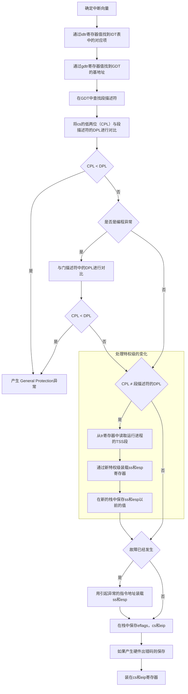

## 中断与异常

### 中断
异步中断（异常）：由其他硬件设备产生
同步中断（中断）：由CPU控制单元产生

每一个中断或者异常都由一个0~255之间的整数表示，称为中断向量

### 中断分类
1. 可屏蔽中断 （清空IF标志位可以屏蔽可屏蔽中断）
2. 非屏蔽中断

### 异常分类
1. 处理器探测异常
    - 故障
    - 陷阱
    - 异常中止
2. 编程异常

### 中断描述符表（IDT）

中断描述符表为一个系统表，与每一个中断或异常向量相关联，用于描述每个向量对应的异常处理程序的入口

#### 任务门描述符

其中保存中断信号发生时需要取代当前进程的另一个进程的TSS选择符

#### 中断门描述符

其中保存中断信号发生时需要转移到的段的选择符以及段内偏移量，当控制权转移到合适的段时，清除IF标志，关闭会发生的可屏蔽中断

#### 陷阱门描述符

转移到段后不会清空IF标志

### 中断和异常的处理逻辑

